# californiavendingcompany Design System

You are building UI for **californiavendingcompany**. Light-themed, warm palette, sans-serif typography (generalSans), compact density on a 4px grid, expressive motion.

## Visual Reference

**IMPORTANT**: Study ALL screenshots below before writing any UI. Match colors, typography, spacing, layout, and motion exactly as shown.

### Homepage

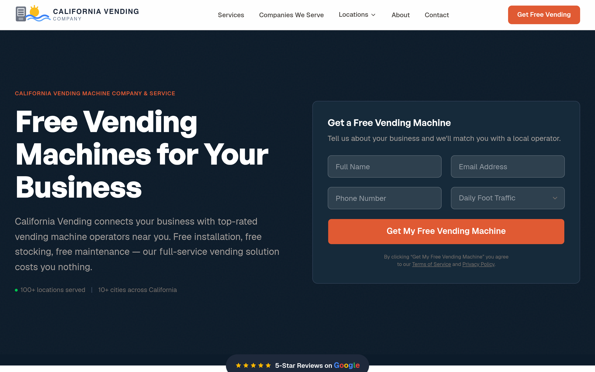

### Scroll Journey (Cinematic Visual States)

> These screenshots capture the website at different scroll depths. The design changes dramatically as you scroll — each frame shows a different cinematic state. Replicate these exact visual transitions.

#### 0% — Hero / Above the fold


#### 17% — Mid-page at 17% scroll


#### 33% — Mid-page at 33% scroll


#### 50% — Mid-page at 50% scroll


#### 67% — Mid-page at 67% scroll


#### 83% — Mid-page at 83% scroll


#### 100% — Footer / End of page


> Read `references/DESIGN.md` for full token details. Read `references/ANIMATIONS.md` for motion specs. Read `references/LAYOUT.md` for layout structure. Read `references/COMPONENTS.md` for component patterns.

## Ultra Reference Files

This package includes extended documentation. **Read these files before implementing:**

| File | Contents |
|------|----------|
| `references/DESIGN.md` | Full design system tokens, colors, typography, spacing |
| `references/VISUAL_GUIDE.md` | **START HERE** — Master visual guide with all screenshots embedded |
| `references/ANIMATIONS.md` | CSS keyframes, scroll triggers, motion library stack, video specs |
| `references/LAYOUT.md` | Flex/grid containers, page structure, spacing relationships |
| `references/COMPONENTS.md` | DOM component patterns, HTML structure, class fingerprints |
| `references/INTERACTIONS.md` | Hover/focus states with before/after style diffs |
| `screens/scroll/` | 7 scroll journey screenshots showing cinematic states |

### Animation Stack Detected

- **Web Animations API (1 active)** — animation

## Design Philosophy

- **Layered depth** — use shadow tokens to create a sense of physical layering. Each elevation level has a specific shadow.
- **Gradient accents** — gradients are used thoughtfully for emphasis, not decoration.
- **Type pairing** — generalSans for body/UI text, GeistSans for headings/display. Never introduce a third typeface.
- **compact density** — 4px base grid. Every dimension is a multiple of 4.
- **warm palette** — the color temperature runs warm, matching the sans-serif typography.
- **Restrained accent** — `#e40014` is the only pop of color. Used exclusively for CTAs, links, focus rings, and active states.
- **Expressive motion** — animations are an integral part of the experience. Use spring physics and layout animations.

## Color System

### Core Palette

| Role | Token | Hex | Use |
|------|-------|-----|-----|
| Background | `--background` | `#ffffff` | Page/app background |
| Surface | `--surface` | `#0c0a09` | Cards, panels, modals |
| Text Primary | `--text-primary` | `#1d293d` | Headings, body text |
| Text Muted | `--text-muted` | `#78716c` | Captions, placeholders |
| Accent | `--accent` | `#e40014` | CTAs, links, focus rings |
| Border | `--border` | `#44403c` | Dividers, card borders |

### Status Colors

| Status | Hex | Use |
|--------|-----|-----|
| Success | `#7bf1a8` | Confirmations, positive trends |
| Warning | `#fbbc04` | Caution states, pending items |
| Danger | `#e05a33` | Errors, destructive actions |

### Extended Palette

- **border:** `#e7e5e4` — Light surface or highlight color
- `#fef2ee` — Light surface or highlight color
- `#c94e2b` — Warm accent — hover glow or decorative highlight
- `#0c1b2a` — Deep background layer or shadow color
- **color-green-950:** `#032e15` — Deep background layer or shadow color
- **color-black:** `#000000` — Deep background layer or shadow color
- **color-green-200:** `#b9f8cf`
- **color-green-400:** `#05df72`

### CSS Variable Tokens

```css
--background: #fafaf9;
--foreground: #1e293b;
--card: #fff;
--card-foreground: #0c0a09;
--popover: #fff;
--popover-foreground: #0c0a09;
--primary: #e05a33;
--primary-foreground: #fff;
--secondary: #f5f5f4;
--secondary-foreground: #0c0a09;
--muted: #f5f5f4;
--muted-foreground: #78716c;
--accent: #f5f5f4;
--accent-foreground: #0c0a09;
--destructive: #dc2626;
--border: #e7e5e4;
--sidebar-foreground: #0c0a09;
--sidebar-primary: #e05a33;
--sidebar-primary-foreground: #fff;
--sidebar-accent: #f5f5f4;
```

## Typography

### Font Stack

- **generalSans** — Heading 1, Heading 2, Heading 3
- **GeistSans** — Body, Caption
- **GeistMono** — Code

### Font Sources

```css
@font-face {
  font-family: "GeistSans";
  src: url("fonts/GeistSans-100.woff2") format("woff2");
  font-weight: 100;
}
@font-face {
  font-family: "GeistMono";
  src: url("fonts/GeistMono-100.woff2") format("woff2");
  font-weight: 100;
}
@font-face {
  font-family: "generalSans";
  src: url("fonts/generalSans-Regular.woff2") format("woff2");
  font-weight: 400;
}
@font-face {
  font-family: "generalSans";
  src: url("fonts/generalSans-700.woff2") format("woff2");
  font-weight: 700;
}
```

### Type Scale

| Role | Family | Size | Weight |
|------|--------|------|--------|
| Heading 1 | generalSans | 64px | 700 |
| Heading 2 | generalSans | 48px | 700 |
| Heading 3 | generalSans | 40px | 700 |
| Body | GeistSans | 22px | 400 |
| Caption | GeistSans | 14px | 400 |
| Code | GeistMono | 14px | 400 |

### Typography Rules

- Body/UI: **generalSans**, Headings: **GeistSans** — these are the only display fonts
- Max 3-4 font sizes per screen
- Headings: weight 600-700, body: weight 400
- Use color and opacity for text hierarchy, not additional font sizes
- Line height: 1.5 for body, 1.2 for headings

## Spacing & Layout

### Base Grid: 4px

Every dimension (margin, padding, gap, width, height) must be a multiple of **4px**.

### Spacing Scale

`2, 4, 6, 8, 10, 12, 16, 20, 24, 32, 40, 48` px

### Spacing as Meaning

| Spacing | Use |
|---------|-----|
| 4-8px | Tight: related items (icon + label, avatar + name) |
| 12-16px | Medium: between groups within a section |
| 24-32px | Wide: between distinct sections |
| 48px+ | Vast: major page section breaks |

### Border Radius

Scale: `8px, 11.2px`
Default: `11.2px`

### Container

Max-width: `1280px`, centered with auto margins.

### Breakpoints

| Name | Value |
|------|-------|
| sm | 40rem |
| md | 48rem |
| lg | 64rem |

Mobile-first: design for small screens, layer on responsive overrides.

## Component Patterns

### Card

```css
.card {
  background: #0c0a09;
  border: 1px solid #44403c;
  border-radius: 11.2px;
  padding: 16px;
  box-shadow: rgba(0, 0, 0, 0) 0px 0px 0px 0px, rgba(0, 0, 0, 0) 0px 0px 0px 0px, rgba(0, 0, 0, 0) 0px 0px 0px 0px, rgba(0, 0, 0, 0) 0px 0px 0px 0px, rgba(0, 0, 0, 0.1) 0px 1px 3px 0px, rgba(0, 0, 0, 0.1) 0px 1px 2px -1px;
}
```

```html
<div class="card">
  <h3>Card Title</h3>
  <p>Card content goes here.</p>
</div>
```

### Button

```css
/* Primary */
.btn-primary {
  background: #e40014;
  color: #1d293d;
  border-radius: 11.2px;
  padding: 8px 16px;
  font-weight: 500;
  transition: opacity 150ms ease;
}
.btn-primary:hover { opacity: 0.9; }

/* Ghost */
.btn-ghost {
  background: transparent;
  border: 1px solid #44403c;
  color: #1d293d;
  border-radius: 11.2px;
  padding: 8px 16px;
}
```

```html
<button class="btn-primary">Get Started</button>
<button class="btn-ghost">Learn More</button>
```

### Input

```css
.input {
  background: #ffffff;
  border: 1px solid #44403c;
  border-radius: 11.2px;
  padding: 8px 12px;
  color: #1d293d;
  font-size: 14px;
}
.input:focus { border-color: #e40014; outline: none; }
```

```html
<input class="input" type="text" placeholder="Search..." />
```

### Badge / Chip

```css
.badge {
  display: inline-flex;
  align-items: center;
  padding: 4px 8px;
  border-radius: 9999px;
  font-size: 12px;
  font-weight: 500;
  background: #0c0a09;
  color: #78716c;
}
```

```html
<span class="badge">New</span>
<span class="badge">Beta</span>
```

### Modal / Dialog

```css
.modal-backdrop { background: rgba(0, 0, 0, 0.6); }
.modal {
  background: #0c0a09;
  border: 1px solid #44403c;
  border-radius: 11.2px;
  padding: 24px;
  max-width: 480px;
  width: 90vw;
  box-shadow: rgba(0, 0, 0, 0) 0px 0px 0px 0px, rgba(0, 0, 0, 0) 0px 0px 0px 0px, rgba(0, 0, 0, 0) 0px 0px 0px 0px, rgba(0, 0, 0, 0) 0px 0px 0px 0px, rgba(0, 0, 0, 0.1) 0px 1px 3px 0px, rgba(0, 0, 0, 0.1) 0px 1px 2px -1px;
}
```

```html
<div class="modal-backdrop">
  <div class="modal">
    <h2>Dialog Title</h2>
    <p>Dialog content.</p>
    <button class="btn-primary">Confirm</button>
    <button class="btn-ghost">Cancel</button>
  </div>
</div>
```

### Table

```css
.table { width: 100%; border-collapse: collapse; }
.table th {
  text-align: left;
  padding: 8px 12px;
  font-weight: 500;
  font-size: 12px;
  color: #78716c;
  text-transform: uppercase;
  letter-spacing: 0.05em;
  border-bottom: 1px solid #44403c;
}
.table td {
  padding: 12px;
  border-bottom: 1px solid #44403c;
}
```

```html
<table class="table">
  <thead><tr><th>Name</th><th>Status</th><th>Date</th></tr></thead>
  <tbody>
    <tr><td>Item One</td><td>Active</td><td>Jan 1</td></tr>
    <tr><td>Item Two</td><td>Pending</td><td>Jan 2</td></tr>
  </tbody>
</table>
```

### Navigation

```css
.nav {
  display: flex;
  align-items: center;
  gap: 8px;
  padding: 12px 16px;
  border-bottom: 1px solid #44403c;
}
.nav-link {
  color: #78716c;
  padding: 8px 12px;
  border-radius: 11.2px;
  transition: color 150ms;
}
.nav-link:hover { color: #1d293d; }
.nav-link.active { color: #e40014; }
```

```html
<nav class="nav">
  <a href="/" class="nav-link active">Home</a>
  <a href="/about" class="nav-link">About</a>
  <a href="/pricing" class="nav-link">Pricing</a>
  <button class="btn-primary" style="margin-left: auto">Get Started</button>
</nav>
```

### Extracted Components

These components were found in the codebase:

**Button** (`html`)

**Input** (`html`)

**Navigation** (`html`)

## Page Structure

The following page sections were detected:

- **Navigation** — Top navigation bar (6 items)
- **Hero** — Hero section (detected from heading structure)
- **Faq** — FAQ/accordion section
- **Footer** — Page footer with links and info (21 items)

When building pages, follow this section order and structure.

## Animation & Motion

This project uses **expressive motion**. Animations are part of the design language.

### CSS Animations

- `pulse`
- `enter`
- `exit`
- `accordion-down`
- `accordion-up`

### Motion Tokens

- **Duration scale:** `.1s`, `.15s`, `.2s`, `.3s`, `150ms`
- **Easing functions:** `ease-out`
- **Animated properties:** `top`

### Motion Guidelines

- **Duration:** Use values from the duration scale above. Short (.1s) for micro-interactions, long (150ms) for page transitions
- **Easing:** Use `ease-out` as the default easing curve
- **Direction:** Elements enter from bottom/right, exit to top/left
- **Reduced motion:** Always respect `prefers-reduced-motion` — disable animations when set

## Depth & Elevation

### Shadow Tokens

- Raised (cards, buttons): `rgba(0, 0, 0, 0) 0px 0px 0px 0px, rgba(0, 0, 0, 0) 0px 0px 0px 0px, rgba(0, 0, 0, 0) 0px 0px 0px 0px, rgba(0, 0, 0, 0) 0px 0px 0px 0px, rgba(0, 0, 0, 0.1) 0px 1px 3px 0px, rgba(0, 0, 0, 0.1) 0px 1px 2px -1px`

### Z-Index Scale

`0, 10, 50, 100`

Use these exact values — never invent z-index values.

## Anti-Patterns (Never Do)

- **No blur effects** — no backdrop-blur, no filter: blur()
- **No zebra striping** — tables and lists use borders for separation
- **No invented colors** — every hex value must come from the palette above
- **No arbitrary spacing** — every dimension is a multiple of 4px
- **No extra fonts** — only generalSans and GeistSans and GeistMono are allowed
- **No arbitrary border-radius** — use the scale: 8px, 11.2px
- **No opacity for disabled states** — use muted colors instead
- **No pill shapes** — this design doesn't use rounded-full / 9999px radius

## Workflow

1. **Read** `references/DESIGN.md` before writing any UI code
2. **Pick colors** from the Color System section — never invent new ones
3. **Set typography** — generalSans, GeistSans, GeistMono only, using the type scale
4. **Build layout** on the 4px grid — check every margin, padding, gap
5. **Match components** to patterns above before creating new ones
6. **Apply elevation** — use shadow tokens
7. **Validate** — every value traces back to a design token. No magic numbers.

## Brand Spec

- **Favicon:** `/favicon.ico`
- **Site URL:** `https://californiavendingcompany.com/`
- **Brand color:** `#e40014`
- **Brand typeface:** generalSans

## Quick Reference

```
Background:     #ffffff
Surface:        #0c0a09
Text:           #1d293d / #78716c
Accent:         #e40014
Border:         #44403c
Font:           generalSans
Spacing:        4px grid
Radius:         11.2px
Components:     6 detected
```

## When to Trigger

Activate this skill when:
- Creating new components, pages, or visual elements for californiavendingcompany
- Writing CSS, Tailwind classes, styled-components, or inline styles
- Building page layouts, templates, or responsive designs
- Reviewing UI code for design consistency
- The user mentions "californiavendingcompany" design, style, UI, or theme
- Generating mockups, wireframes, or visual prototypes

---

# Full Reference Files

> Every output file is embedded below. Claude has full design system context from /skills alone.

## Design System Tokens (DESIGN.md)

# californiavendingcompany DESIGN.md

> Auto-generated design system — reverse-engineered via static analysis by skillui.
> Frameworks: None detected
> Colors: 20 · Fonts: 3 · Components: 6
> Icon library: not detected · State: not detected
> Primary theme: light · Dark mode toggle: no · Motion: expressive

## Visual Reference

**Match this design exactly** — study colors, fonts, spacing, and component shapes before writing any UI code.


---

## 1. Visual Theme & Atmosphere

This is a **light-themed** interface with a warm, approachable feel. The light background emphasizes content clarity. Typography pairs **GeistSans** for display/headings with **generalSans** for body text, creating clear visual hierarchy through type contrast. Spacing follows a **4px base grid** (compact density), with scale: 2, 4, 6, 8, 10, 12, 16, 20px. The accent color **#e40014** anchors interactive elements (buttons, links, focus rings). Motion is expressive — spring physics, layout animations, and staggered reveals are part of the visual language.

---

## 2. Color Palette & Roles

| Token | Hex | Role | Use |
|---|---|---|---|
| tw-ring-offset-color | `#ffffff` | background | Page background, darkest surface |
| card-foreground | `#0c0a09` | surface | Card and panel backgrounds |
| color-green-50 | `#f0fdf4` | surface | Card and panel backgrounds |
| color-slate-800 | `#1d293d` | text-primary | Headings and body text |
| muted-foreground | `#78716c` | text-muted | Captions, placeholders, secondary info |
| text-muted | `#a8a29e` | text-muted | Captions, placeholders, secondary info |
| border | `#44403c` | border | Dividers, card borders, outlines |
| color-red-600 | `#e40014` | accent | CTAs, links, focus rings, active states |
| primary | `#e05a33` | danger | Error states, destructive actions |
| color-green-300 | `#7bf1a8` | success | Success states, positive indicators |
| color-amber-400 | `#fbbc04` | warning | Warning states, caution indicators |
| info | `#0c1b2a` | info | Informational highlights |
| border | `#e7e5e4` | unknown | Palette color |
| unknown | `#fef2ee` | unknown | Palette color |
| unknown | `#c94e2b` | unknown | Palette color |
| color-green-950 | `#032e15` | unknown | Palette color |
| color-black | `#000000` | unknown | Palette color |
| color-green-200 | `#b9f8cf` | unknown | Palette color |
| color-green-400 | `#05df72` | unknown | Palette color |
| color-green-500 | `#00c758` | unknown | Palette color |

### CSS Variable Tokens

```css
--tw-border-style: solid;
--tw-border-style: dashed;
--background: #fafaf9;
--foreground: #1e293b;
--card: #fff;
--card-foreground: #0c0a09;
--popover: #fff;
--popover-foreground: #0c0a09;
--primary: #e05a33;
--primary-foreground: #fff;
--secondary: #f5f5f4;
--secondary-foreground: #0c0a09;
--muted: #f5f5f4;
--muted-foreground: #78716c;
--accent: #f5f5f4;
--accent-foreground: #0c0a09;
--destructive: #dc2626;
--border: #e7e5e4;
--sidebar-foreground: #0c0a09;
--sidebar-primary: #e05a33;
```


---

## 3. Typography Rules

**Font Stack:**
- **generalSans** — Heading 1, Heading 2, Heading 3
- **GeistSans** — Body, Caption
- **GeistMono** — Code

**Font Sources:**

```css
@font-face {
  font-family: "GeistSans";
  src: url("fonts/GeistSans-100.woff2") format("woff2");
  font-weight: 100;
}
@font-face {
  font-family: "GeistMono";
  src: url("fonts/GeistMono-100.woff2") format("woff2");
  font-weight: 100;
}
@font-face {
  font-family: "generalSans";
  src: url("fonts/generalSans-Regular.woff2") format("woff2");
  font-weight: 400;
}
@font-face {
  font-family: "generalSans";
  src: url("fonts/generalSans-700.woff2") format("woff2");
  font-weight: 700;
}
```

| Role | Font | Size | Weight |
|---|---|---|---|
| Heading 1 | generalSans | 64px | 700 |
| Heading 2 | generalSans | 48px | 700 |
| Heading 3 | generalSans | 40px | 700 |
| Body | GeistSans | 22px | 400 |
| Caption | GeistSans | 14px | 400 |
| Code | GeistMono | 14px | 400 |

**Typographic Rules:**
- Limit to 3 font families max per screen
- Use **generalSans** for body/UI text, **GeistSans** for display/headings
- Maintain consistent hierarchy: no more than 3-4 font sizes per screen
- Headings use bold (600-700), body uses regular (400)
- Line height: 1.5 for body text, 1.2 for headings
- Use color and opacity for secondary hierarchy, not additional font sizes


---

## 4. Component Stylings

### Layout (1)

**Footer** — `html`

### Navigation (1)

**Navigation** — `html`

### Data Display (1)

**List** — `html`

### Data Input (2)

**Button** — `html`
- Animation: 

**Input** — `html`
- State: :focus, :placeholder

### Media (1)

**Icon** — `html`


---

## 5. Layout Principles

- **Base spacing unit:** 4px
- **Spacing scale:** 2, 4, 6, 8, 10, 12, 16, 20, 24, 32, 40, 48
- **Border radius:** 8px, 11.2px
- **Max content width:** 1280px

**Spacing as Meaning:**
| Spacing | Use |
|---|---|
| 4-8px | Tight: related items within a group |
| 12-16px | Medium: between groups |
| 24-32px | Wide: between sections |
| 48px+ | Vast: major section breaks |


---

## 6. Depth & Elevation

### Raised — cards, buttons, interactive elements

- `rgba(0, 0, 0, 0) 0px 0px 0px 0px, rgba(0, 0, 0, 0) 0px 0px 0px 0px, rgba(0, 0, 0, 0) 0px 0px 0px 0px, rgba(0, 0, 0, 0) 0px 0px 0px 0px, rgba(0, 0, 0, 0.1) 0px 1px 3px 0px, rgba(0, 0, 0, 0.1) 0px 1px 2px -1px`

### Z-Index Scale

`0, 10, 50, 100`


---

## 7. Animation & Motion

This project uses **expressive motion**. Animations are an integral part of the experience.

### CSS Animations

- `@keyframes pulse`
- `@keyframes enter`
- `@keyframes exit`
- `@keyframes accordion-down`
- `@keyframes accordion-up`

### Animated Components

- **Button**: 

### Motion Guidelines

- Duration: 150-300ms for micro-interactions, 300-500ms for page transitions
- Easing: `ease-out` for enters, `ease-in` for exits
- Always respect `prefers-reduced-motion`


---

## 8. Do's and Don'ts

### Do's

- Use `#e40014` for interactive elements (buttons, links, focus rings)
- Use `#ffffff` as the primary page background
- Pair **generalSans** (body) with **GeistSans** (display) — these are the only allowed fonts
- Follow the **4px** spacing grid for all margins, padding, and gaps
- Use the defined shadow tokens for elevation — see Section 6
- Use border-radius from the scale: 8px, 11.2px
- Reuse existing components from Section 4 before creating new ones

### Don'ts

- Don't introduce colors outside this palette — extend the design tokens first
- Don't introduce additional font families beyond generalSans and GeistSans and GeistMono
- Don't use arbitrary spacing values — stick to multiples of 4px
- Don't create custom box-shadow values outside the system tokens
- Don't use arbitrary border-radius values — pick from the defined scale
- Don't duplicate component patterns — check Section 4 first
- Don't use backdrop-blur or blur effects

### Anti-Patterns (detected from codebase)

- No blur or backdrop-blur effects
- No zebra striping on tables/lists


---

## 9. Responsive Behavior

| Name | Value | Source |
|---|---|---|
| sm | 40rem | css |
| md | 48rem | css |
| lg | 64rem | css |

**Approach:** Use `@media (min-width: ...)` queries matching the breakpoints above.


---

## 10. Agent Prompt Guide

Use these as starting points when building new UI:

### Build a Card

```
Background: #0c0a09
Border: 1px solid #44403c
Radius: 11.2px
Padding: 16px
Font: generalSans
Use shadow tokens from Section 6.
```

### Build a Button

```
Primary: bg #e40014, text white
Ghost: bg transparent, border #44403c
Padding: 8px 16px
Radius: 11.2px
Hover: opacity 0.9 or lighter shade
Focus: ring with #e40014
```

### Build a Page Layout

```
Background: #ffffff
Max-width: 1280px, centered
Grid: 4px base
Responsive: mobile-first, breakpoints from Section 9
```

### Build a Stats Card

```
Surface: #0c0a09
Label: #78716c (muted, 12px, uppercase)
Value: #1d293d (primary, 24-32px, bold)
Status: use success/warning/danger from Section 2
```

### Build a Form

```
Input bg: #ffffff
Input border: 1px solid #44403c
Focus: border-color #e40014
Label: #78716c 12px
Spacing: 16px between fields
Radius: 11.2px
```

### General Component

```
1. Read DESIGN.md Sections 2-6 for tokens
2. Colors: only from palette
3. Font: generalSans, type scale from Section 3
4. Spacing: 4px grid
5. Components: match patterns from Section 4
6. Elevation: shadow tokens
```

## Visual Guide — Screenshots (VISUAL_GUIDE.md)

# californiavendingcompany — Visual Guide

> Master visual reference. Study every screenshot carefully before implementing any UI.
> Match colors, layout, typography, spacing, and motion states exactly.

**Motion Stack:** **Web Animations API (1 active)**

## Scroll Journey

The page has cinematic scroll animations. Each screenshot below shows the exact visual state at that scroll depth.
**Replicate these transitions precisely** — the design changes dramatically as you scroll.

### Hero — Above the fold

*Scroll position: 0px of 4788px total*


### 17% scroll depth

*Scroll position: 661px of 4788px total*


### 33% scroll depth

*Scroll position: 1283px of 4788px total*


### 50% scroll depth

*Scroll position: 1944px of 4788px total*


### 67% scroll depth

*Scroll position: 2605px of 4788px total*


### 83% scroll depth

*Scroll position: 3227px of 4788px total*


### Footer — End of page

*Scroll position: 3888px of 4788px total*


## Full Page Screenshots

### California Vending Machine Company | Free Vending Machine Service

*URL: `https://californiavendingcompany.com/`*


### Vending Machine Services | Free Vending Solutions | California Vending — California Vending Machine Company

*URL: `https://californiavendingcompany.com/services`*


### Companies We Serve | Vending Machines for Every Business | California Vending — California Vending Machine Company

*URL: `https://californiavendingcompany.com/companies-we-serve`*


### About Us | California Vending — California Vending Machine Company

*URL: `https://californiavendingcompany.com/about`*


### Contact Us | Get a Free Vending Machine Quote | California Vending — California Vending Machine Company

*URL: `https://californiavendingcompany.com/contact`*


## Section Screenshots

Clipped sections showing individual components in context.

### Section 1 — `section`

*1440×697px*


### Section 2 — `section`

*1280×601px*


### Section 1 — `section`

*1440×359px*


### Section 2 — `section`

*1280×880px*


### Section 1 — `section`

*1440×359px*


### Section 2 — `section`

*1440×496px*


### Section 1 — `section`

*1440×441px*


### Section 2 — `section`

*1280×526px*


### Section 1 — `section`

*1440×359px*


### Section 2 — `section`

*1280×649px*


## Animations & Motion (ANIMATIONS.md)

# Animation Reference

> Cinematic motion design extracted from live DOM. Follow these specs exactly to recreate the experience.

## Motion Technology Stack

| Library | Type | Notes |
|---------|------|-------|
| **Web Animations API (1 active)** | animation |  |

## Scroll Journey

The page is **4788px** tall. Each frame below shows what the user sees at that scroll depth.

> **Use these screenshots to understand WHAT animates, WHEN it animates, and HOW it moves.**

### 0% — Top / Hero
Scroll position: 0px


### 17% — Opening Section
Scroll position: 661px


### 33% — First Feature Section
Scroll position: 1283px


### 50% — Mid-Page
Scroll position: 1944px


### 67% — Lower Content
Scroll position: 2605px


### 83% — Near Footer
Scroll position: 3227px


### 100% — Bottom / Footer
Scroll position: 3888px


## Scroll Animation Patterns

| Pattern | Library | Element Count | Duration | Delay | Easing |
|---------|---------|---------------|----------|-------|--------|
| parallax / sticky scroll | CSS | 1 | — | — | — |

### CSS Implementation

## CSS Keyframes (5 extracted)

### `@keyframes pulse`

```css
@keyframes pulse {
  50% {
    opacity: 0.5;
  }
}
```

> Opacity fade

### `@keyframes enter`

```css
@keyframes enter {
  0% {
    opacity: var(--tw-enter-opacity,1);
    transform: translate3d(var(--tw-enter-translate-x,0),var(--tw-enter-translate-y,0),0)scale3d(var(--tw-enter-scale,1),var(--tw-enter-scale,1),var(--tw-enter-scale,1))rotate(var(--tw-enter-rotate,0));
    filter: blur(var(--tw-enter-blur,0));
  }
}
```

> Fade + motion enter animation · Filter effect (blur/brightness)

### `@keyframes exit`

```css
@keyframes exit {
  100% {
    opacity: var(--tw-exit-opacity,1);
    transform: translate3d(var(--tw-exit-translate-x,0),var(--tw-exit-translate-y,0),0)scale3d(var(--tw-exit-scale,1),var(--tw-exit-scale,1),var(--tw-exit-scale,1))rotate(var(--tw-exit-rotate,0));
    filter: blur(var(--tw-exit-blur,0));
  }
}
```

> Fade + motion enter animation · Filter effect (blur/brightness)

### `@keyframes accordion-down`

```css
@keyframes accordion-down {
  0% {
    height: 0px;
  }
  100% {
    height: var(--radix-accordion-content-height,var(--accordion-panel-height,auto));
  }
}
```

> Dimension expand/collapse

### `@keyframes accordion-up`

```css
@keyframes accordion-up {
  0% {
    height: var(--radix-accordion-content-height,var(--accordion-panel-height,auto));
  }
  100% {
    height: 0px;
  }
}
```

> Dimension expand/collapse

## Motion Tokens (CSS Variables)

### Duration Tokens

```css
--default-transition-duration: .15s;
```

### Easing Tokens

```css
--default-transition-timing-function: cubic-bezier(.4, 0, .2, 1);
--ease-in-out: cubic-bezier(.4, 0, .2, 1);
```

### Delay Tokens

```css
--tw-animation-delay: 0s;
```

### Animation Tokens

```css
--tw-animation-iteration-count: 1;
--tw-animation-fill-mode: none;
--tw-animation-direction: normal;
```

## Global Transition Declarations

These `transition` values were extracted from CSS rules across the site:

```css
transition: top 0.15s ease-out;
```

## How to Recreate This Motion Design

### Step 1 — Install Dependencies

```bash
```

### Step 2 — Scroll-Reveal Pattern

Elements that animate into view follow this pattern:

```css
/* Initial hidden state */
.reveal {
  opacity: 0;
  transform: translateY(40px);
  transition: opacity .15s cubic-bezier(.4, 0, .2, 1),
              transform .15s cubic-bezier(.4, 0, .2, 1);
}
.reveal.visible {
  opacity: 1;
  transform: translateY(0);
}
```

### Step 3 — Key Motion Principles

- **Duration scale:** `.15s` · `0.15s` — use these values, never invent new durations
- **Always add** `@media (prefers-reduced-motion: reduce) { * { animation-duration: 0.01ms !important; transition-duration: 0.01ms !important; } }`

### Step 4 — Scroll Journey Reference

Match what happens at each scroll position:

- **0%** (`0px`) → `screens/scroll/scroll-000.png`
- **17%** (`661px`) → `screens/scroll/scroll-017.png`
- **33%** (`1283px`) → `screens/scroll/scroll-033.png`
- **50%** (`1944px`) → `screens/scroll/scroll-050.png`
- **67%** (`2605px`) → `screens/scroll/scroll-067.png`
- **83%** (`3227px`) → `screens/scroll/scroll-083.png`
- **100%** (`3888px`) → `screens/scroll/scroll-100.png`

## Layout & Grid (LAYOUT.md)

# Layout Reference

> Auto-extracted from live DOM. Use this to understand how the site is structured spatially.

## Spacing System

**Base grid:** 4px

**Scale:** `2, 4, 6, 8, 10, 12, 16, 20, 24, 32, 40, 48, 64, 80, 96` px

| Spacing | Semantic Use |
|---------|-------------|
| 4px | Tight — within a component |
| 8px | Medium — between sibling items |
| 16px | Wide — between sections |
| 32px | Vast — major section breaks |

## Flex Layouts

| Element | Direction | Justify | Align | Gap | Children |
|---------|-----------|---------|-------|-----|----------|
| `body.flex.min-h-full` | column | — | — | — | 32 |
| `nav.mx-auto.flex` | row | space-between | center | — | 4 |
| `div.relative.flex` | row | center | — | — | 1 |
| `div.inline-flex.items-center` | row | — | center | 8px | 2 |
| `div.flex.flex-col` | column | — | — | — | 6 |
| `button.flex.w-full` | column | — | center | 12px | 2 |
| `button.flex.w-full` | column | — | center | 12px | 2 |
| `button.flex.w-full` | column | — | center | 12px | 2 |
| `button.flex.w-full` | column | — | center | 12px | 2 |
| `button.flex.w-full` | column | — | center | 12px | 2 |
| `button.flex.w-full` | column | — | center | 12px | 2 |
| `button.flex.w-full` | column | — | center | 12px | 2 |
| `button.flex.w-full` | column | center | center | 12px | 2 |
| `ul.mt-4.flex` | column | — | — | 10px | 5 |
| `ul.mt-4.flex` | column | — | — | 10px | 10 |

## Grid Layouts

| Element | Template Columns | Gap | Children |
|---------|-----------------|-----|----------|
| `div.mt-12.grid` | `384px 384px 384px` | 32px | 3 |
| `div.mt-10.grid` | `292px 292px 292px 292px` | 16px | 8 |
| `div.grid.grid-cols-2` | `280px 280px 280px 280px` | 32px | 4 |
| `div.grid.items-center` | `576px 576px` | 64px | 2 |
| `div.mt-12.grid` | `389.328px 389.328px 389.344px` | 24px | 6 |

## Structural Containers

### `<header>` (`header.sticky.top-0`)

```
display:          block
children:         1
```

### `<main>` (`main#main.flex-1`)

```
display:          block
children:         8
```

### `<footer>` (`footer.border-t.border-stone-200`)

```
display:          block
children:         1
```

### `<nav>` (`nav.mx-auto.flex`)

```
display:          flex
flex-direction:   row
justify-content:  space-between
align-items:      center
padding:          0px 32px
max-width:        1280px
children:         4
```

### `<section>` (`section.relative.overflow-hidden`)

```
display:          block
children:         2
```

### `<section>` (`section.mx-auto.w-full`)

```
display:          block
padding:          80px 32px
max-width:        1280px
children:         2
```

### `<section>` (`section.bg-stone-50`)

```
display:          block
children:         1
```

### `<section>` (`section.mx-auto.w-full`)

```
display:          block
padding:          80px 32px
max-width:        1280px
children:         3
```

### `<section>` (`section.mx-auto.w-full`)

```
display:          block
padding:          80px 32px
max-width:        1280px
children:         2
```

### `<section>` (`section.bg-[#0C1B2A]`)

```
display:          block
children:         1
```

### `<section>` (`section.mx-auto.w-full`)

```
display:          block
padding:          128px 32px
max-width:        1280px
children:         1
```

### `<section>` (`section.mx-auto.w-full`)

```
display:          block
padding:          80px 32px
max-width:        1280px
children:         2
```

## Layout Rules

- **Container max-width:** `1280px` — always center with `margin: auto`
- Primary layout system: **Flexbox**
- Secondary layout system: **CSS Grid** (used for card grids and multi-column layouts)
- Every spacing value must be a multiple of **4px**
- Never use arbitrary margin/padding values outside the spacing scale

## Component Patterns (COMPONENTS.md)

# Component Reference

> Repeated DOM patterns detected by structural analysis. Each component appeared 3+ times.

## Detected Components

| Component | Category | Instances | Key Classes |
|-----------|----------|-----------|-------------|
| **Div** | unknown | 8× |  |
| **Bg White** | unknown | 6× | `.bg-white`, `.border`, `.border-stone-200` |
| **Bg Brand Subtle** | card | 6× | `.bg-brand-subtle`, `.flex`, `.h-10` |
| **Font Heading** | unknown | 6× | `.font-heading`, `.font-semibold`, `.mt-4` |
| **Leading Relaxed** | unknown | 6× | `.leading-relaxed`, `.mt-2`, `.text-sm` |
| **Font Semibold** | unknown | 6× | `.font-semibold`, `.text-[#1E293B]`, `.text-sm` |
| **Bg White** | button | 6× | `.bg-white`, `.border`, `.border-stone-200` |
| **Not Last:Border B** | unknown | 6× | `.not-last:border-b` |
| **Flex** | unknown | 6× | `.flex` |
| ****:Data [Slot=Accordion Trigger Icon]:Ml Auto** | button | 6× | `.**:data-[slot=accordion-trigger-icon]:ml-auto`, `.**:data-[slot=accordion-trigger-icon]:size-4`, `.**:data-[slot=accordion-trigger-icon]:text-muted-foreground` |
| **Aria Invalid:Border Destructive** | unknown | 3× | `.aria-invalid:border-destructive`, `.aria-invalid:ring-3`, `.aria-invalid:ring-destructive/20` |
| **Max W [1280px]** | unknown | 3× | `.max-w-[1280px]`, `.mx-auto`, `.px-4` |
| **Text Center** | unknown | 3× | `.text-center` |
| **Font Bold** | unknown | 3× | `.font-bold`, `.font-heading`, `.leading-[1.2]` |
| **Max W 2xl** | unknown | 3× | `.max-w-2xl`, `.mt-4`, `.mx-auto` |
| **Bg White** | unknown | 3× | `.bg-white`, `.border`, `.border-stone-200` |
| **Bg Brand Subtle** | card | 3× | `.bg-brand-subtle`, `.flex`, `.h-12` |
| **Font Heading** | unknown | 3× | `.font-heading`, `.font-semibold`, `.leading-[1.3]` |
| **Leading Relaxed** | unknown | 3× | `.leading-relaxed`, `.mt-3`, `.text-stone-500` |
| **Flex** | unknown | 3× | `.flex`, `.flex-col`, `.gap-2.5` |

## Cards

### Bg Brand Subtle

**Instances found:** 6

**CSS classes:** `.bg-brand-subtle` `.flex` `.h-10` `.items-center` `.justify-center` `.rounded-lg`

**HTML structure:**

```html
<div class="flex h-10 w-10 items-center justify-center rounded-lg bg-brand-subtle"><svg xmlns="http://www.w3.org/2000/svg" width="24" height="24" viewBox="0 0 24 24" fill="none" stroke="currentColor" stroke-width="2" stroke-linecap="round" stroke-linejoin="round" class="lucide lucide-dollar-sign h-5 w-5 text-brand" aria-hidden="true"><line x1="12" x2="12" y1="2" y2="22"></line><path d="M17 5H9.5a3.5 3.5 0 0 0 0 7h5a3.5 3.5 0 0 1 0 7H6"></path></svg></div>
```

**Base styles (from design tokens):**

```css
.bg-brand-subtle {
  background: #0c0a09;
  border: 1px solid #44403c;
  border-radius: 11.2px;
  padding: 8px;
}```

### Bg Brand Subtle

**Instances found:** 3

**CSS classes:** `.bg-brand-subtle` `.flex` `.h-12` `.items-center` `.justify-center` `.mx-auto`

**HTML structure:**

```html
<div class="mx-auto flex h-12 w-12 items-center justify-center rounded-lg bg-brand-subtle"><svg xmlns="http://www.w3.org/2000/svg" width="24" height="24" viewBox="0 0 24 24" fill="none" stroke="currentColor" stroke-width="2" stroke-linecap="round" stroke-linejoin="round" class="lucide lucide-clipboard-list h-6 w-6 text-brand" aria-hidden="true"><rect width="8" height="4" x="8" y="2" rx="1" ry="1"></rect><path d="M16 4h2a2 2 0 0 1 2 2v14a2 2 0 0 1-2 2H6a2 2 0 0 1-2-2V6a2 2 0 0 1 2-2h2"></path><path d="M12 11h4"></path><path d="M12 16h4"></path><path d="M8 11h.01"></path><path d="M8 16h.01"></pa
```

**Base styles (from design tokens):**

```css
.bg-brand-subtle {
  background: #0c0a09;
  border: 1px solid #44403c;
  border-radius: 11.2px;
  padding: 8px;
}```

## Buttons

### Bg White

**Instances found:** 6

**CSS classes:** `.bg-white` `.border` `.border-stone-200` `.duration-150` `.flex` `.flex-col`

**HTML structure:**

```html
<button type="button" class="flex w-full flex-col items-center gap-3 rounded-xl border p-6 text-center transition-colors duration-150 border-stone-200 bg-white hover:border-brand hover:bg-brand-subtle"><svg xmlns="http://www.w3.org/2000/svg" width="24" height="24" viewBox="0 0 24 24" fill="none" stroke="currentColor" stroke-width="2" stroke-linecap="round" stroke-linejoin="round" class="lucide lucide-warehouse h-8 w-8 text-[#1E293B]" aria-hidden="true"><path d="M18 21V10a1 1 0 0 0-1-1H7a1 1 0 0 0-1 1v11"></path><path d="M22 19a2 2 0 0 1-2 2H4a2 2 0 0 1-2-2V8a2 2 0 0 1 1.132-1.803l7.95-3.974a2 
```

**Base styles (from design tokens):**

```css
.bg-white {
  background: #e40014;
  color: #1d293d;
  border-radius: 11.2px;
  padding: 4px 8px;
  cursor: pointer;
}```

### **:Data [Slot=Accordion Trigger Icon]:Ml Auto

**Instances found:** 6

**CSS classes:** `.**:data-[slot=accordion-trigger-icon]:ml-auto` `.**:data-[slot=accordion-trigger-icon]:size-4` `.**:data-[slot=accordion-trigger-icon]:text-muted-foreground` `.border` `.border-transparent` `.disabled:opacity-50`

**HTML structure:**

```html
<button type="button" aria-controls="radix-_R_2d6autb_" aria-expanded="false" data-state="closed" data-orientation="vertical" id="radix-_R_d6autb_" data-slot="accordion-trigger" class="group/accordion-trigger relative flex flex-1 items-start justify-between rounded-lg border border-transparent py-2.5 transition-all outline-none focus-visible:border-ring focus-visible:ring-3 focus-visible:ring-ring/50 focus-visible:after:border-ring disabled:pointer-events-none disabled:opacity-50 **:data-[slot=accordion-trigger-icon]:ml-auto **:data-[slot=accordion-trigger-icon]:size-4 **:data-[slot=accordion-
```

**Base styles (from design tokens):**

```css
.**:data-[slot=accordion-trigger-icon]:ml-auto {
  background: #e40014;
  color: #1d293d;
  border-radius: 11.2px;
  padding: 4px 8px;
  cursor: pointer;
}```

## Other Components

### Div

**Instances found:** 8

**HTML structure:**

```html
<div class="" style="opacity:0;transform:translateY(20px)"><button type="button" class="flex w-full flex-col items-center gap-3 rounded-xl border p-6 text-center transition-colors duration-150 border-brand bg-brand-subtle"><svg xmlns="http://www.w3.org/2000/svg" width="24" height="24" viewBox="0 0 24 24" fill="none" stroke="currentColor" stroke-width="2" stroke-linecap="round" stroke-linejoin="round" class="lucide lucide-building2 lucide-building-2 h-8 w-8 text-[#1E293B]" aria-hidden="true"><path d="M10 12h4"></path><path d="M10 8h4"></path><path d="M14 21v-3a2 2 0 0 0-4 0v3"></path><path d="M
```

**Base styles (from design tokens):**

```css
.div {
  background: #0c0a09;
  padding: 4px;
}```

### Bg White

**Instances found:** 6

**CSS classes:** `.bg-white` `.border` `.border-stone-200` `.p-6` `.rounded-xl`

**HTML structure:**

```html
<div class="rounded-xl border border-stone-200 bg-white p-6" style="opacity:0;transform:translateY(20px)"><div class="flex h-10 w-10 items-center justify-center rounded-lg bg-brand-subtle"><svg xmlns="http://www.w3.org/2000/svg" width="24" height="24" viewBox="0 0 24 24" fill="none" stroke="currentColor" stroke-width="2" stroke-linecap="round" stroke-linejoin="round" class="lucide lucide-dollar-sign h-5 w-5 text-brand" aria-hidden="true"><line x1="12" x2="12" y1="2" y2="22"></line><path d="M17 5H9.5a3.5 3.5 0 0 0 0 7h5a3.5 3.5 0 0 1 0 7H6"></path></svg></div><h3 class="mt-4 font-heading text-l
```

**Base styles (from design tokens):**

```css
.bg-white {
  background: #0c0a09;
  padding: 4px;
}```

### Font Heading

**Instances found:** 6

**CSS classes:** `.font-heading` `.font-semibold` `.mt-4` `.text-[#1E293B]` `.text-lg`

**HTML structure:**

```html
<h3 class="mt-4 font-heading text-lg font-semibold text-[#1E293B]">100% Free for Your Location</h3>
```

**Base styles (from design tokens):**

```css
.font-heading {
  background: #0c0a09;
  padding: 4px;
}```

### Leading Relaxed

**Instances found:** 6

**CSS classes:** `.leading-relaxed` `.mt-2` `.text-sm` `.text-stone-500`

**HTML structure:**

```html
<p class="mt-2 text-sm leading-relaxed text-stone-500">No installation fees, no monthly costs, no contracts. Vending operators cover all expenses because they earn from product sales.</p>
```

**Base styles (from design tokens):**

```css
.leading-relaxed {
  background: #0c0a09;
  padding: 4px;
}```

### Font Semibold

**Instances found:** 6

**CSS classes:** `.font-semibold` `.text-[#1E293B]` `.text-sm`

**HTML structure:**

```html
<span class="text-sm font-semibold text-[#1E293B]">Offices</span>
```

**Base styles (from design tokens):**

```css
.font-semibold {
  background: #0c0a09;
  padding: 4px;
}```

### Not Last:Border B

**Instances found:** 6

**CSS classes:** `.not-last:border-b`

**HTML structure:**

```html
<div data-state="closed" data-orientation="vertical" data-slot="accordion-item" class="not-last:border-b"><h3 data-orientation="vertical" data-state="closed" class="flex"><button type="button" aria-controls="radix-_R_2d6autb_" aria-expanded="false" data-state="closed" data-orientation="vertical" id="radix-_R_d6autb_" data-slot="accordion-trigger" class="group/accordion-trigger relative flex flex-1 items-start justify-between rounded-lg border border-transparent py-2.5 transition-all outline-none focus-visible:border-ring focus-visible:ring-3 focus-visible:ring-ring/50 focus-visible:after:borde
```

**Base styles (from design tokens):**

```css
.not-last:border-b {
  background: #0c0a09;
  padding: 4px;
}```

### Flex

**Instances found:** 6

**CSS classes:** `.flex`

**HTML structure:**

```html
<h3 data-orientation="vertical" data-state="closed" class="flex"><button type="button" aria-controls="radix-_R_2d6autb_" aria-expanded="false" data-state="closed" data-orientation="vertical" id="radix-_R_d6autb_" data-slot="accordion-trigger" class="group/accordion-trigger relative flex flex-1 items-start justify-between rounded-lg border border-transparent py-2.5 transition-all outline-none focus-visible:border-ring focus-visible:ring-3 focus-visible:ring-ring/50 focus-visible:after:border-ring disabled:pointer-events-none disabled:opacity-50 **:data-[slot=accordion-trigger-icon]:ml-auto **:d
```

**Base styles (from design tokens):**

```css
.flex {
  background: #0c0a09;
  padding: 4px;
}```

### Aria Invalid:Border Destructive

**Instances found:** 3

**CSS classes:** `.aria-invalid:border-destructive` `.aria-invalid:ring-3` `.aria-invalid:ring-destructive/20` `.bg-white/10` `.border` `.border-white/20`

**HTML structure:**

```html
<input data-slot="input" class="h-12 w-full min-w-0 overflow-hidden text-ellipsis rounded-lg border px-4 py-3 text-base transition-colors outline-none file:inline-flex file:h-8 file:border-0 file:bg-transparent file:text-base file:font-medium file:text-foreground focus-visible:border-ring focus-visible:ring-3 focus-visible:ring-ring/50 disabled:pointer-events-none disabled:cursor-not-allowed disabled:bg-input/50 disabled:opacity-50 aria-invalid:border-destructive aria-invalid:ring-3 aria-invalid:ring-destructive/20 dark:bg-input/30 dark:disabled:bg-input/80 dark:aria-invalid:border-destructive
```

**Base styles (from design tokens):**

```css
.aria-invalid:border-destructive {
  background: #0c0a09;
  padding: 4px;
}```

### Max W [1280px]

**Instances found:** 3

**CSS classes:** `.max-w-[1280px]` `.mx-auto` `.px-4` `.py-20` `.w-full`

**HTML structure:**

```html
<section class="mx-auto w-full max-w-[1280px] px-4 py-20 md:px-6 lg:px-8"><div class="text-center" style="opacity:0;transform:translateY(20px)"><p class="text-xs font-semibold uppercase tracking-[0.06em] text-brand-text">How It Works</p><h2 class="mt-3 font-heading text-[28px] font-bold leading-[1.2] tracking-[-0.01em] text-[#1E293B] md:text-[40px]">How Our Vending Machine Service Works</h2><p class="mx-auto mt-4 max-w-2xl text-stone-500">Getting a vending machine in California …</p></div><div class="mt-12 grid gap-8 md:grid-cols-3"><div class="rounded-xl border border-stone-200 bg-white p-8 t
```

**Base styles (from design tokens):**

```css
.max-w-[1280px] {
  background: #0c0a09;
  padding: 4px;
}```

### Text Center

**Instances found:** 3

**CSS classes:** `.text-center`

**HTML structure:**

```html
<div class="text-center" style="opacity:0;transform:translateY(20px)"><p class="text-xs font-semibold uppercase tracking-[0.06em] text-brand-text">How It Works</p><h2 class="mt-3 font-heading text-[28px] font-bold leading-[1.2] tracking-[-0.01em] text-[#1E293B] md:text-[40px]">How Our Vending Machine Service Works</h2><p class="mx-auto mt-4 max-w-2xl text-stone-500">Getting a vending machine in California …</p></div>
```

**Base styles (from design tokens):**

```css
.text-center {
  background: #0c0a09;
  padding: 4px;
}```

### Font Bold

**Instances found:** 3

**CSS classes:** `.font-bold` `.font-heading` `.leading-[1.2]` `.mt-3` `.text-[#1E293B]` `.text-[28px]`

**HTML structure:**

```html
<h2 class="mt-3 font-heading text-[28px] font-bold leading-[1.2] tracking-[-0.01em] text-[#1E293B] md:text-[40px]">How Our Vending Machine Service Works</h2>
```

**Base styles (from design tokens):**

```css
.font-bold {
  background: #0c0a09;
  padding: 4px;
}```

### Max W 2xl

**Instances found:** 3

**CSS classes:** `.max-w-2xl` `.mt-4` `.mx-auto` `.text-stone-500`

**HTML structure:**

```html
<p class="mx-auto mt-4 max-w-2xl text-stone-500">Getting a vending machine in <!-- -->California<!-- --> has never been easier. No complicated contracts, no costs, no hassle — just full-service vending.</p>
```

**Base styles (from design tokens):**

```css
.max-w-2xl {
  background: #0c0a09;
  padding: 4px;
}```

### Bg White

**Instances found:** 3

**CSS classes:** `.bg-white` `.border` `.border-stone-200` `.p-8` `.rounded-xl` `.text-center`

**HTML structure:**

```html
<div class="rounded-xl border border-stone-200 bg-white p-8 text-center" style="opacity:0;transform:translateY(20px)"><div class="mx-auto flex h-12 w-12 items-center justify-center rounded-lg bg-brand-subtle"><svg xmlns="http://www.w3.org/2000/svg" width="24" height="24" viewBox="0 0 24 24" fill="none" stroke="currentColor" stroke-width="2" stroke-linecap="round" stroke-linejoin="round" class="lucide lucide-clipboard-list h-6 w-6 text-brand" aria-hidden="true"><rect width="8" height="4" x="8" y="2" rx="1" ry="1"></rect><path d="M16 4h2a2 2 0 0 1 2 2v14a2 2 0 0 1-2 2H6a2 2 0 0 1-2-2V6a2 2 0 0 1
```

**Base styles (from design tokens):**

```css
.bg-white {
  background: #0c0a09;
  padding: 4px;
}```

### Font Heading

**Instances found:** 3

**CSS classes:** `.font-heading` `.font-semibold` `.leading-[1.3]` `.mt-5` `.text-[#1E293B]` `.text-[22px]`

**HTML structure:**

```html
<h3 class="mt-5 font-heading text-[22px] font-semibold leading-[1.3] text-[#1E293B]">1. Request</h3>
```

**Base styles (from design tokens):**

```css
.font-heading {
  background: #0c0a09;
  padding: 4px;
}```

### Leading Relaxed

**Instances found:** 3

**CSS classes:** `.leading-relaxed` `.mt-3` `.text-stone-500`

**HTML structure:**

```html
<p class="mt-3 text-stone-500 leading-relaxed">Tell us about your location — type, size, and what your people want. It takes less than 2 minutes.</p>
```

**Base styles (from design tokens):**

```css
.leading-relaxed {
  background: #0c0a09;
  padding: 4px;
}```

### Flex

**Instances found:** 3

**CSS classes:** `.flex` `.flex-col` `.gap-2.5` `.mt-4`

**HTML structure:**

```html
<ul class="mt-4 flex flex-col gap-2.5"><li><a class="text-sm text-stone-400 transition-colors hover:text-white" href="/services/snack-vending">Snack Vending</a></li><li><a class="text-sm text-stone-400 transition-colors hover:text-white" href="/services/beverage-vending">Beverage Vending</a></li><li><a class="text-sm text-stone-400 transition-colors hover:text-white" href="/services/micro-markets">Micro-Markets</a></li><li><a class="text-sm text-stone-400 transition-colors hover:text-white" href="/services/coffee-vending">Coffee Vending</a></li><li><a class="text-sm text-stone-400 transition-c
```

**Base styles (from design tokens):**

```css
.flex {
  background: #0c0a09;
  padding: 4px;
}```

## Component Rules

- Match class names exactly from the patterns above
- Each component instance must be visually identical to others of its type
- Do not add extra wrappers or change the DOM structure
- Use `#44403c` for all dividers within components
- Use `#e40014` for all interactive/active states

## Interactions & States (INTERACTIONS.md)

# Interaction Reference

> Micro-interactions extracted from live DOM. Recreate these exactly for authentic feel.

## Coverage

| Component Type | Count | States Captured |
|----------------|-------|----------------|
| Button | 3 | default, hover, focus |
| Link | 3 | default, hover, focus |
| Input | 3 | default, hover, focus |

## Transition System

These transition declarations were extracted from interactive elements:

```css
transition: color 0.15s cubic-bezier(0.4, 0, 0.2, 1), background-color 0.15s cubic-bezier(0.4, 0, 0.2, 1), border-color 0.15s cubic-bezier(0.4, 0, 0.2, 1), outline-color 0.15s cubic-bezier(0.4, 0, 0.2, 1), text-decoration-color 0.15s cubic-bezier(0.4, 0, 0.2, 1), fill 0.15s cubic-bezier(0.4, 0, 0.2, 1), stroke 0.15s cubic-bezier(0.4, 0, 0.2, 1), --tw-gradient-from 0.15s cubic-bezier(0.4, 0, 0.2, 1), --tw-gradient-via 0.15s cubic-bezier(0.4, 0, 0.2, 1), --tw-gradient-to 0.15s cubic-bezier(0.4, 0, 0.2, 1);
transition: 0.15s cubic-bezier(0.4, 0, 0.2, 1);
transition: all;
```

Apply these to all interactive elements. Never invent new durations or easings.

## Button Interactions

### Button 1 — `Locations`

**States:**

- Default: `../screens/states/button-1-default.png`
- Hover: `../screens/states/button-1-hover.png`
- Focus: `../screens/states/button-1-focus.png`

**On hover:**

```css
/* color: rgb(68, 64, 60) → */ color: rgb(30, 41, 59);
```

**On focus:**

```css
/* outline: oklab(0.635283 0.141142 0.105069 / 0.5) none 3px → */ outline: oklab(0.635283 0.141142 0.105069 / 0.5) auto 1px;
```

**Transition:** `color 0.15s cubic-bezier(0.4, 0, 0.2, 1), background-color 0.15s cubic-bezier(0.4, 0, 0.2, 1), border-color 0.15s cubic-bezier(0.4, 0, 0.2, 1), outline-color 0.15s cubic-bezier(0.4, 0, 0.2, 1), text-decoration-color 0.15s cubic-bezier(0.4, 0, 0.2, 1), fill 0.15s cubic-bezier(0.4, 0, 0.2, 1), stroke 0.15s cubic-bezier(0.4, 0, 0.2, 1), --tw-gradient-from 0.15s cubic-bezier(0.4, 0, 0.2, 1), --tw-gradient-via 0.15s cubic-bezier(0.4, 0, 0.2, 1), --tw-gradient-to 0.15s cubic-bezier(0.4, 0, 0.2, 1)`

### Button 2 — `Daily Foot Traffic`

**States:**

- Default: `../screens/states/button-2-default.png`
- Hover: `../screens/states/button-2-hover.png`
- Focus: `../screens/states/button-2-focus.png`

**On focus:**

```css
/* border-color: oklab(0.999994 0.0000455678 0.0000200868 / 0.2) → */ border-color: rgb(224, 90, 51);
/* box-shadow: none → */ box-shadow: rgba(0, 0, 0, 0) 0px 0px 0px 0px, rgba(0, 0, 0, 0) 0px 0px 0px 0px, rgba(0, 0, 0, 0) 0px 0px 0px 0px, oklab(0.635283 0.141142 0.105069 / 0.5) 0px 0px 0px 3px, rgba(0, 0, 0, 0) 0px 0px 0px 0px;
/* outline: oklab(0.635283 0.141142 0.105069 / 0.5) none 3px → */ outline: oklab(0.635283 0.141142 0.105069 / 0.5) none 1px;
```

**Transition:** `color 0.15s cubic-bezier(0.4, 0, 0.2, 1), background-color 0.15s cubic-bezier(0.4, 0, 0.2, 1), border-color 0.15s cubic-bezier(0.4, 0, 0.2, 1), outline-color 0.15s cubic-bezier(0.4, 0, 0.2, 1), text-decoration-color 0.15s cubic-bezier(0.4, 0, 0.2, 1), fill 0.15s cubic-bezier(0.4, 0, 0.2, 1), stroke 0.15s cubic-bezier(0.4, 0, 0.2, 1), --tw-gradient-from 0.15s cubic-bezier(0.4, 0, 0.2, 1), --tw-gradient-via 0.15s cubic-bezier(0.4, 0, 0.2, 1), --tw-gradient-to 0.15s cubic-bezier(0.4, 0, 0.2, 1)`

### Button 3 — `Get My Free Vending Machine`

**States:**

- Default: `../screens/states/button-3-default.png`
- Hover: `../screens/states/button-3-hover.png`
- Focus: `../screens/states/button-3-focus.png`

**On hover:**

```css
/* background-color: rgb(224, 90, 51) → */ background-color: rgb(201, 78, 43);
```

**On focus:**

```css
/* border-color: rgba(0, 0, 0, 0) → */ border-color: rgb(224, 90, 51);
/* box-shadow: none → */ box-shadow: rgba(0, 0, 0, 0) 0px 0px 0px 0px, rgba(0, 0, 0, 0) 0px 0px 0px 0px, rgba(0, 0, 0, 0) 0px 0px 0px 0px, oklab(0.635283 0.141142 0.105069 / 0.5) 0px 0px 0px 3px, rgba(0, 0, 0, 0) 0px 0px 0px 0px;
/* outline: oklab(0.635283 0.141142 0.105069 / 0.5) none 3px → */ outline: oklab(0.635283 0.141142 0.105069 / 0.5) none 1px;
```

**Transition:** `0.15s cubic-bezier(0.4, 0, 0.2, 1)`

## Link Interactions

### Link 1 — `CALIFORNIA VENDING
COMPANY`

**States:**

- Default: `../screens/states/link-1-default.png`
- Hover: `../screens/states/link-1-hover.png`
- Focus: `../screens/states/link-1-focus.png`

**On focus:**

```css
/* outline: oklab(0.635283 0.141142 0.105069 / 0.5) none 3px → */ outline: oklab(0.635283 0.141142 0.105069 / 0.5) auto 1px;
```

**Transition:** `all`

### Link 2 — `Services`

**States:**

- Default: `../screens/states/link-2-default.png`
- Hover: `../screens/states/link-2-hover.png`
- Focus: `../screens/states/link-2-focus.png`

**On hover:**

```css
/* color: rgb(68, 64, 60) → */ color: rgb(30, 41, 59);
```

**On focus:**

```css
/* outline: oklab(0.635283 0.141142 0.105069 / 0.5) none 3px → */ outline: oklab(0.635283 0.141142 0.105069 / 0.5) auto 1px;
```

**Transition:** `color 0.15s cubic-bezier(0.4, 0, 0.2, 1), background-color 0.15s cubic-bezier(0.4, 0, 0.2, 1), border-color 0.15s cubic-bezier(0.4, 0, 0.2, 1), outline-color 0.15s cubic-bezier(0.4, 0, 0.2, 1), text-decoration-color 0.15s cubic-bezier(0.4, 0, 0.2, 1), fill 0.15s cubic-bezier(0.4, 0, 0.2, 1), stroke 0.15s cubic-bezier(0.4, 0, 0.2, 1), --tw-gradient-from 0.15s cubic-bezier(0.4, 0, 0.2, 1), --tw-gradient-via 0.15s cubic-bezier(0.4, 0, 0.2, 1), --tw-gradient-to 0.15s cubic-bezier(0.4, 0, 0.2, 1)`

### Link 3 — `Companies We Serve`

**States:**

- Default: `../screens/states/link-3-default.png`
- Hover: `../screens/states/link-3-hover.png`
- Focus: `../screens/states/link-3-focus.png`

**On hover:**

```css
/* color: rgb(68, 64, 60) → */ color: rgb(30, 41, 59);
```

**On focus:**

```css
/* outline: oklab(0.635283 0.141142 0.105069 / 0.5) none 3px → */ outline: oklab(0.635283 0.141142 0.105069 / 0.5) auto 1px;
```

**Transition:** `color 0.15s cubic-bezier(0.4, 0, 0.2, 1), background-color 0.15s cubic-bezier(0.4, 0, 0.2, 1), border-color 0.15s cubic-bezier(0.4, 0, 0.2, 1), outline-color 0.15s cubic-bezier(0.4, 0, 0.2, 1), text-decoration-color 0.15s cubic-bezier(0.4, 0, 0.2, 1), fill 0.15s cubic-bezier(0.4, 0, 0.2, 1), stroke 0.15s cubic-bezier(0.4, 0, 0.2, 1), --tw-gradient-from 0.15s cubic-bezier(0.4, 0, 0.2, 1), --tw-gradient-via 0.15s cubic-bezier(0.4, 0, 0.2, 1), --tw-gradient-to 0.15s cubic-bezier(0.4, 0, 0.2, 1)`

## Input Interactions

### Input 1 — `Full Name`

**States:**

- Default: `../screens/states/input-1-default.png`
- Hover: `../screens/states/input-1-hover.png`
- Focus: `../screens/states/input-1-focus.png`

**On focus:**

```css
/* border-color: oklab(0.999994 0.0000455678 0.0000200868 / 0.2) → */ border-color: rgb(224, 90, 51);
/* box-shadow: none → */ box-shadow: rgba(0, 0, 0, 0) 0px 0px 0px 0px, rgba(0, 0, 0, 0) 0px 0px 0px 0px, rgba(0, 0, 0, 0) 0px 0px 0px 0px, oklab(0.635283 0.141142 0.105069 / 0.5) 0px 0px 0px 3px, rgba(0, 0, 0, 0) 0px 0px 0px 0px;
/* outline: oklab(0.635283 0.141142 0.105069 / 0.5) none 3px → */ outline: oklab(0.635283 0.141142 0.105069 / 0.5) none 1px;
```

**Transition:** `color 0.15s cubic-bezier(0.4, 0, 0.2, 1), background-color 0.15s cubic-bezier(0.4, 0, 0.2, 1), border-color 0.15s cubic-bezier(0.4, 0, 0.2, 1), outline-color 0.15s cubic-bezier(0.4, 0, 0.2, 1), text-decoration-color 0.15s cubic-bezier(0.4, 0, 0.2, 1), fill 0.15s cubic-bezier(0.4, 0, 0.2, 1), stroke 0.15s cubic-bezier(0.4, 0, 0.2, 1), --tw-gradient-from 0.15s cubic-bezier(0.4, 0, 0.2, 1), --tw-gradient-via 0.15s cubic-bezier(0.4, 0, 0.2, 1), --tw-gradient-to 0.15s cubic-bezier(0.4, 0, 0.2, 1)`

### Input 2 — `Email Address`

**States:**

- Default: `../screens/states/input-2-default.png`
- Hover: `../screens/states/input-2-hover.png`
- Focus: `../screens/states/input-2-focus.png`

**On focus:**

```css
/* border-color: oklab(0.999994 0.0000455678 0.0000200868 / 0.2) → */ border-color: rgb(224, 90, 51);
/* box-shadow: none → */ box-shadow: rgba(0, 0, 0, 0) 0px 0px 0px 0px, rgba(0, 0, 0, 0) 0px 0px 0px 0px, rgba(0, 0, 0, 0) 0px 0px 0px 0px, oklab(0.635283 0.141142 0.105069 / 0.5) 0px 0px 0px 3px, rgba(0, 0, 0, 0) 0px 0px 0px 0px;
/* outline: oklab(0.635283 0.141142 0.105069 / 0.5) none 3px → */ outline: oklab(0.635283 0.141142 0.105069 / 0.5) none 1px;
```

**Transition:** `color 0.15s cubic-bezier(0.4, 0, 0.2, 1), background-color 0.15s cubic-bezier(0.4, 0, 0.2, 1), border-color 0.15s cubic-bezier(0.4, 0, 0.2, 1), outline-color 0.15s cubic-bezier(0.4, 0, 0.2, 1), text-decoration-color 0.15s cubic-bezier(0.4, 0, 0.2, 1), fill 0.15s cubic-bezier(0.4, 0, 0.2, 1), stroke 0.15s cubic-bezier(0.4, 0, 0.2, 1), --tw-gradient-from 0.15s cubic-bezier(0.4, 0, 0.2, 1), --tw-gradient-via 0.15s cubic-bezier(0.4, 0, 0.2, 1), --tw-gradient-to 0.15s cubic-bezier(0.4, 0, 0.2, 1)`

### Input 3 — `Phone Number`

**States:**

- Default: `../screens/states/input-3-default.png`
- Hover: `../screens/states/input-3-hover.png`
- Focus: `../screens/states/input-3-focus.png`

**On focus:**

```css
/* border-color: oklab(0.999994 0.0000455678 0.0000200868 / 0.2) → */ border-color: rgb(224, 90, 51);
/* box-shadow: none → */ box-shadow: rgba(0, 0, 0, 0) 0px 0px 0px 0px, rgba(0, 0, 0, 0) 0px 0px 0px 0px, rgba(0, 0, 0, 0) 0px 0px 0px 0px, oklab(0.635283 0.141142 0.105069 / 0.5) 0px 0px 0px 3px, rgba(0, 0, 0, 0) 0px 0px 0px 0px;
/* outline: oklab(0.635283 0.141142 0.105069 / 0.5) none 3px → */ outline: oklab(0.635283 0.141142 0.105069 / 0.5) none 1px;
```

**Transition:** `color 0.15s cubic-bezier(0.4, 0, 0.2, 1), background-color 0.15s cubic-bezier(0.4, 0, 0.2, 1), border-color 0.15s cubic-bezier(0.4, 0, 0.2, 1), outline-color 0.15s cubic-bezier(0.4, 0, 0.2, 1), text-decoration-color 0.15s cubic-bezier(0.4, 0, 0.2, 1), fill 0.15s cubic-bezier(0.4, 0, 0.2, 1), stroke 0.15s cubic-bezier(0.4, 0, 0.2, 1), --tw-gradient-from 0.15s cubic-bezier(0.4, 0, 0.2, 1), --tw-gradient-via 0.15s cubic-bezier(0.4, 0, 0.2, 1), --tw-gradient-to 0.15s cubic-bezier(0.4, 0, 0.2, 1)`

## Interaction Rules

- Accent color `#e40014` is used for focus rings, active states, and hover highlights
- Hover effects include **color transitions** — use the extracted values, not approximations
- Focus states use **outline** (not box-shadow) — always match the extracted focus ring
- Transition durations in use: `0.15s`
- Always respect `prefers-reduced-motion` — set all transitions to `0s` when enabled

## Design Tokens — JSON Files

### tokens/colors.json
```json
{
  "$schema": "https://design-tokens.github.io/community-group/format/",
  "core": {
    "text-primary": {
      "value": "#1d293d",
      "role": "text-primary",
      "name": "color-slate-800"
    },
    "background": {
      "value": "#ffffff",
      "role": "background",
      "name": "tw-ring-offset-color"
    },
    "text-muted": {
      "value": "#a8a29e",
      "role": "text-muted"
    },
    "surface": {
      "value": "#f0fdf4",
      "role": "surface",
      "name": "color-green-50"
    },
    "border": {
      "value": "#44403c",
      "role": "border"
    },
    "accent": {
      "value": "#e40014",
      "role": "accent",
      "name": "color-red-600"
    }
  },
  "status": {
    "danger": {
      "value": "#e05a33",
      "role": "danger",
      "name": "primary"
    },
    "success": {
      "value": "#7bf1a8",
      "role": "success",
      "name": "color-green-300"
    },
    "warning": {
      "value": "#fbbc04",
      "role": "warning",
      "name": "color-amber-400"
    }
  },
  "extended": {
    "border": {
      "value": "#e7e5e4",
      "role": "unknown",
      "name": "border"
    },
    "color-fef2ee": {
      "value": "#fef2ee",
      "role": "unknown"
    },
    "color-c94e2b": {
      "value": "#c94e2b",
      "role": "unknown"
    },
    "color-0c1b2a": {
      "value": "#0c1b2a",
      "role": "info"
    },
    "color-green-950": {
      "value": "#032e15",
      "role": "unknown",
      "name": "color-green-950"
    },
    "color-black": {
      "value": "#000000",
      "role": "unknown",
      "name": "color-black"
    },
    "color-green-200": {
      "value": "#b9f8cf",
      "role": "unknown",
      "name": "color-green-200"
    },
    "color-green-400": {
      "value": "#05df72",
      "role": "unknown",
      "name": "color-green-400"
    },
    "color-green-500": {
      "value": "#00c758",
      "role": "unknown",
      "name": "color-green-500"
    }
  },
  "meta": {
    "theme": "light",
    "extracted": "2026-06-26"
  }
}
```

### tokens/spacing.json
```json
{
  "base": {
    "value": "4px",
    "description": "Grid unit — all spacing must be multiples of this"
  },
  "unit": "px",
  "scale": {
    "xs": {
      "value": "2px",
      "px": 2
    },
    "sm": {
      "value": "4px",
      "px": 4
    },
    "md": {
      "value": "6px",
      "px": 6
    },
    "lg": {
      "value": "8px",
      "px": 8
    },
    "xl": {
      "value": "10px",
      "px": 10
    },
    "2xl": {
      "value": "12px",
      "px": 12
    },
    "3xl": {
      "value": "16px",
      "px": 16
    },
    "4xl": {
      "value": "20px",
      "px": 20
    },
    "5xl": {
      "value": "24px",
      "px": 24
    },
    "6xl": {
      "value": "32px",
      "px": 32
    }
  },
  "multipliers": {
    "1x": {
      "value": "4px",
      "raw": 4
    },
    "2x": {
      "value": "8px",
      "raw": 8
    },
    "3x": {
      "value": "12px",
      "raw": 12
    },
    "4x": {
      "value": "16px",
      "raw": 16
    },
    "5x": {
      "value": "20px",
      "raw": 20
    },
    "6x": {
      "value": "24px",
      "raw": 24
    },
    "7x": {
      "value": "28px",
      "raw": 28
    },
    "8x": {
      "value": "32px",
      "raw": 32
    },
    "9x": {
      "value": "36px",
      "raw": 36
    },
    "10x": {
      "value": "40px",
      "raw": 40
    },
    "11x": {
      "value": "44px",
      "raw": 44
    },
    "12x": {
      "value": "48px",
      "raw": 48
    },
    "13x": {
      "value": "52px",
      "raw": 52
    },
    "14x": {
      "value": "56px",
      "raw": 56
    },
    "15x": {
      "value": "60px",
      "raw": 60
    },
    "16x": {
      "value": "64px",
      "raw": 64
    }
  },
  "meta": {
    "totalValues": 15,
    "min": 2,
    "max": 96
  }
}
```

### tokens/typography.json
```json
{
  "families": [
    "generalSans",
    "GeistSans",
    "GeistMono"
  ],
  "scale": {
    "heading-1": {
      "fontFamily": "generalSans",
      "fontSize": "64px",
      "fontWeight": "700",
      "lineHeight": null,
      "source": "css"
    },
    "heading-2": {
      "fontFamily": "generalSans",
      "fontSize": "48px",
      "fontWeight": "700",
      "lineHeight": null,
      "source": "css"
    },
    "heading-3": {
      "fontFamily": "generalSans",
      "fontSize": "40px",
      "fontWeight": "700",
      "lineHeight": null,
      "source": "css"
    },
    "body": {
      "fontFamily": "GeistSans",
      "fontSize": "22px",
      "fontWeight": "400",
      "lineHeight": null,
      "source": "css"
    },
    "caption": {
      "fontFamily": "GeistSans",
      "fontSize": "14px",
      "fontWeight": "400",
      "lineHeight": null,
      "source": "css"
    },
    "code": {
      "fontFamily": "GeistMono",
      "fontSize": "14px",
      "fontWeight": "400",
      "lineHeight": null,
      "source": "css"
    }
  },
  "fontFaces": [
    {
      "family": "GeistSans",
      "src": "https://californiavendingcompany.com/_next/static/media/Geist_Variable-s.p.0-te~ja_gpvcf.woff2",
      "format": "woff2",
      "weight": "100"
    },
    {
      "family": "GeistMono",
      "src": "https://californiavendingcompany.com/_next/static/media/GeistMono_Variable.p.17jn9btb_52pq.woff2",
      "format": "woff2",
      "weight": "100"
    },
    {
      "family": "generalSans",
      "src": "https://californiavendingcompany.com/_next/static/media/GeneralSans_Regular-s.p.0aqd04_idyb6d.woff2",
      "format": "woff2",
      "weight": "400"
    },
    {
      "family": "generalSans",
      "src": "https://californiavendingcompany.com/_next/static/media/GeneralSans_Medium-s.p.0rb3ehjtk_okh.woff2",
      "format": "woff2",
      "weight": "500"
    },
    {
      "family": "generalSans",
      "src": "https://californiavendingcompany.com/_next/static/media/GeneralSans_Semibold-s.p.0hfk9k1kkjsdy.woff2",
      "format": "woff2",
      "weight": "600"
    },
    {
      "family": "generalSans",
      "src": "https://californiavendingcompany.com/_next/static/media/GeneralSans_Bold-s.p.0-mpnqa_q7f0-.woff2",
      "format": "woff2",
      "weight": "700"
    }
  ],
  "rules": {
    "maxSizesPerScreen": 4,
    "headingWeightRange": "600-700",
    "bodyWeight": 400,
    "lineHeightBody": 1.5,
    "lineHeightHeading": 1.2
  }
}
```

## Bundled Fonts (fonts/)

The following font files are bundled in the `fonts/` directory:

- `fonts/GeistMono-100.woff2`
- `fonts/GeistSans-100.woff2`
- `fonts/generalSans-500.woff2`
- `fonts/generalSans-600.woff2`
- `fonts/generalSans-700.woff2`
- `fonts/generalSans-Regular.woff2`

Use these local font files in `@font-face` declarations instead of fetching from Google Fonts.

## Screenshots Inventory (screens/)

> Study all screenshots carefully before implementing any UI. Match every visual detail exactly.

### Scroll Journey (screens/scroll/)

*Cinematic scroll states — page visual at each scroll depth*


### Full Page Screenshots (screens/pages/)

*Full-page screenshots of each crawled URL*


### Section Clips (screens/sections/)

*Clipped individual sections and components*


### Interaction States (screens/states/)

*Hover, focus, and active state captures*


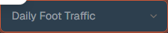

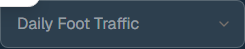

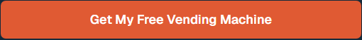


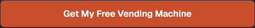


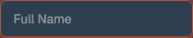

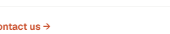


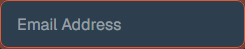

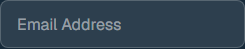


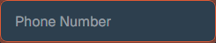

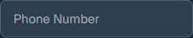


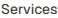


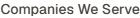


### Screenshot Index (screens/INDEX.md)

# Screenshot Index

## Scroll Journey

> Shows the cinematic state at each point of the page

| Scroll | Y Position | File |
|--------|-----------|------|
| 0% | 0px | `screens/scroll/scroll-000.png` |
| 17% | 661px | `screens/scroll/scroll-017.png` |
| 33% | 1283px | `screens/scroll/scroll-033.png` |
| 50% | 1944px | `screens/scroll/scroll-050.png` |
| 67% | 2605px | `screens/scroll/scroll-067.png` |
| 83% | 3227px | `screens/scroll/scroll-083.png` |
| 100% | 3888px | `screens/scroll/scroll-100.png` |

## Pages

| Page | URL | File |
|------|-----|------|
| California Vending Machine Company | Free Vending Machine Service | `https://californiavendingcompany.com/` | `screens/pages/home.png` |
| Vending Machine Services | Free Vending Solutions | California Vending — California Vending Machine Company | `https://californiavendingcompany.com/services` | `screens/pages/services.png` |
| Companies We Serve | Vending Machines for Every Business | California Vending — California Vending Machine Company | `https://californiavendingcompany.com/companies-we-serve` | `screens/pages/companies-we-serve.png` |
| About Us | California Vending — California Vending Machine Company | `https://californiavendingcompany.com/about` | `screens/pages/about.png` |
| Contact Us | Get a Free Vending Machine Quote | California Vending — California Vending Machine Company | `https://californiavendingcompany.com/contact` | `screens/pages/contact.png` |

## Sections

| Page | Section | File |
|------|---------|------|
| home | #1 (section) | `screens/sections/home-section-1.png` |
| home | #2 (section) | `screens/sections/home-section-2.png` |
| services | #1 (section) | `screens/sections/services-section-1.png` |
| services | #2 (section) | `screens/sections/services-section-2.png` |
| companies-we-serve | #1 (section) | `screens/sections/companies-we-serve-section-1.png` |
| companies-we-serve | #2 (section) | `screens/sections/companies-we-serve-section-2.png` |
| about | #1 (section) | `screens/sections/about-section-1.png` |
| about | #2 (section) | `screens/sections/about-section-2.png` |
| contact | #1 (section) | `screens/sections/contact-section-1.png` |
| contact | #2 (section) | `screens/sections/contact-section-2.png` |

## Homepage Screenshots (screenshots/)


