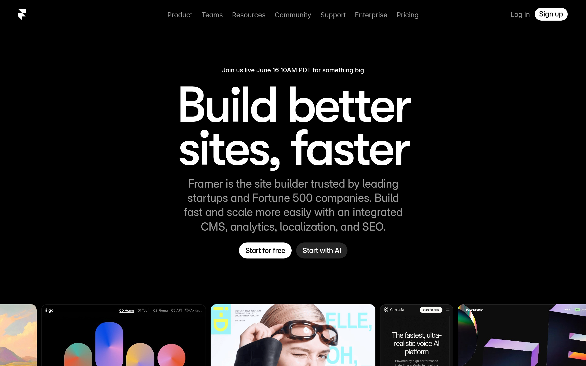

# framer DESIGN.md

> Auto-generated design system — reverse-engineered via static analysis by skillui.
> Frameworks: None detected
> Colors: 20 · Fonts: 3 · Components: 6
> Icon library: not detected · State: not detected
> Primary theme: light · Dark mode toggle: no · Motion: expressive

## Visual Reference

**Match this design exactly** — study colors, fonts, spacing, and component shapes before writing any UI code.



---

## 1. Visual Theme & Atmosphere

This is a **light-themed** interface with a cool, approachable feel. The light background emphasizes content clarity. Typography pairs **Geist** for display/headings with **Inter Tight** for body text, creating clear visual hierarchy through type contrast. Spacing follows a **4px base grid** (compact density), with scale: 2, 4, 6, 8, 10, 12, 14, 16px. The accent color **#8855ff** anchors interactive elements (buttons, links, focus rings). Motion is expressive — spring physics, layout animations, and staggered reveals are part of the visual language.

---

## 2. Color Palette & Roles

| Token | Hex | Role | Use |
|---|---|---|---|
| framer-link-current-text-color | `#ffffff` | background | Page background, darkest surface |
| framer-text-color | `#000000` | text-primary | Headings and body text |
| framer-link-text-color | `#999999` | text-muted | Captions, placeholders, secondary info |
| button-text | `#333333` | border | Dividers, card borders, outlines |
| framer-fresco-tint-color | `#8855ff` | accent | CTAs, links, focus rings, active states |
| framer-fresco-errorTint-color | `#ff3366` | danger | Error states, destructive actions |
| framer-fresco-warningTint-color | `#ffbb00` | warning | Warning states, caution indicators |
| selection-background-color | `#0099ff` | info | Informational highlights |
| framer-fresco-panelBackground-color | `#1f1f1f` | unknown | Palette color |
| background-secondary | `#eeeeee` | unknown | Palette color |
| text-subtitle | `#888888` | unknown | Palette color |
| framer-fresco-panelChevron-color | `#666666` | unknown | Palette color |
| framer-fresco-menuBackground-color | `#121212` | unknown | Palette color |
| text | `#cccccc` | unknown | Palette color |
| circle-border | `#444444` | unknown | Palette color |
| text-input | `#777777` | unknown | Palette color |
| framer-fresco-panelPressedState-color | `#aaaaaa` | unknown | Palette color |
| framer-fresco-comboBoxClearButton-color | `#bbbbbb` | unknown | Palette color |
| framer-fresco-analyticsAbTestVariant2-color | `#9869fd` | unknown | Palette color |
| framer-fresco-segmentedControlDivider-color | `#555555` | unknown | Palette color |

### CSS Variable Tokens

```css
--selection-background-color: #0099ff4d;
--framer-text-background-color: initial;
--framer-text-background-radius: initial;
--framer-text-background-corner-shape: initial;
--framer-text-background-padding: initial;
--border-bottom-width: 1px;
--border-left-width: 1px;
--border-right-width: 1px;
--border-style: solid;
--border-top-width: 1px;
--border-bottom-width: 1px;
--border-color: #ffffff14;
--border-left-width: 0px;
--border-right-width: 0px;
--border-style: solid;
--border-top-width: 0px;
--border-bottom-width: 0px;
--border-color: #1a1a1a;
--border-left-width: 0px;
--border-right-width: 1px;
```


---

## 3. Typography Rules

**Font Stack:**
- **Inter Tight** — Heading 1, Heading 2
- **Geist** — Body, Caption
- **Azeret Mono** — Code

**Font Sources:**

```css
@font-face {
  font-family: "Geist";
  src: url("fonts/Geist-Bold.ttf") format("truetype");
  font-weight: 700;
}
@font-face {
  font-family: "Geist";
  src: url("fonts/Geist-Regular.ttf") format("truetype");
  font-weight: 400;
}
@font-face {
  font-family: "Inter Tight";
  src: url("fonts/InterTight-Bold.ttf") format("truetype");
  font-weight: 700;
}
@font-face {
  font-family: "Inter Tight";
  src: url("fonts/InterTight-Regular.ttf") format("truetype");
  font-weight: 400;
}
@font-face {
  font-family: "Mona Sans";
  src: url("fonts/MonaSans-Bold.ttf") format("truetype");
  font-weight: 700;
}
@font-face {
  font-family: "Mona Sans";
  src: url("fonts/MonaSans-Regular.ttf") format("truetype");
  font-weight: 400;
}
@font-face {
  font-family: "Space Grotesk";
  src: url("fonts/SpaceGrotesk-Bold.ttf") format("truetype");
  font-weight: 700;
}
@font-face {
  font-family: "Space Grotesk";
  src: url("fonts/SpaceGrotesk-Regular.ttf") format("truetype");
  font-weight: 400;
}
@font-face {
  font-family: "Azeret Mono";
  src: url("fonts/AzeretMono-Bold.ttf") format("truetype");
  font-weight: 700;
}
@font-face {
  font-family: "Azeret Mono";
  src: url("fonts/AzeretMono-Regular.ttf") format("truetype");
  font-weight: 400;
}
@font-face {
  font-family: "Geist Mono";
  src: url("fonts/GeistMono-Bold.ttf") format("truetype");
  font-weight: 700;
}
@font-face {
  font-family: "Geist Mono";
  src: url("fonts/GeistMono-Regular.ttf") format("truetype");
  font-weight: 400;
}
@font-face {
  font-family: "JetBrains Mono";
  src: url("fonts/JetBrainsMono-Bold.ttf") format("truetype");
  font-weight: 700;
}
@font-face {
  font-family: "JetBrains Mono";
  src: url("fonts/JetBrainsMono-Regular.ttf") format("truetype");
  font-weight: 400;
}
@font-face {
  font-family: "VT323";
  src: url("fonts/VT323-Regular.ttf") format("truetype");
  font-weight: 400;
}
@font-face {
  font-family: "Geist Variable";
  src: url("fonts/GeistVariable-Regular.woff2") format("woff2");
  font-weight: 400;
}
@font-face {
  font-family: "Geist Mono Variable";
  src: url("fonts/GeistMonoVariable-Regular.woff2") format("woff2");
  font-weight: 400;
}
@font-face {
  font-family: "Luxurious Script";
  src: url("fonts/LuxuriousScript-Regular.ttf") format("truetype");
  font-weight: 400;
}
@font-face {
  font-family: "GT Walsheim Medium";
  src: url("fonts/GTWalsheimMedium-500.woff2") format("woff2");
  font-weight: 500;
}
@font-face {
  font-family: "GT Walsheim Framer Medium";
  src: url("fonts/GTWalsheimFramerMedium-500.woff2") format("woff2");
  font-weight: 500;
}
@font-face {
  font-family: "Inter Medium";
  src: url("fonts/InterMedium-500.woff2") format("woff2");
  font-weight: 500;
}
@font-face {
  font-family: "GT Walsheim Bold";
  src: url("fonts/GTWalsheimBold-700.woff2") format("woff2");
  font-weight: 700;
}
@font-face {
  font-family: "GT Walsheim Bold Oblique";
  src: url("fonts/GTWalsheimBoldOblique-700.woff2") format("woff2");
  font-weight: 700;
}
@font-face {
  font-family: "GT Walsheim Medium Oblique";
  src: url("fonts/GTWalsheimMediumOblique-500.woff2") format("woff2");
  font-weight: 500;
}
@font-face {
  font-family: "GT Walsheim Black";
  src: url("fonts/GTWalsheimBlack-800.woff2") format("woff2");
  font-weight: 800;
}
@font-face {
  font-family: "Inter Framer SemiBold";
  src: url("fonts/InterFramerSemiBold-600.woff2") format("woff2");
  font-weight: 600;
}
@font-face {
  font-family: "Inter Framer Regular";
  src: url("fonts/InterFramerRegular-Regular.woff2") format("woff2");
  font-weight: 400;
}
@font-face {
  font-family: "GT Walsheim Regular";
  src: url("fonts/GTWalsheimRegular-Regular.woff2") format("woff2");
  font-weight: 400;
}
@font-face {
  font-family: "Mono Spec Variable";
  src: url("fonts/MonoSpecVariable-500.woff2") format("woff2");
  font-weight: 500;
}
@font-face {
  font-family: "Lazzer Variable";
  src: url("fonts/LazzerVariable-Regular.woff2") format("woff2");
  font-weight: 400;
}
@font-face {
  font-family: "T1 Korium 5Kg";
  src: url("fonts/T1Korium5Kg-Regular.woff2") format("woff2");
  font-weight: 400;
}
@font-face {
  font-family: "Inter Marketing Medium";
  src: url("fonts/InterMarketingMedium-500.woff2") format("woff2");
  font-weight: 500;
}
@font-face {
  font-family: "Inter SemiBold";
  src: url("fonts/InterSemiBold-600.woff2") format("woff2");
  font-weight: 600;
}
@font-face {
  font-family: "Söhne Breit Fett";
  src: url("fonts/SöhneBreitFett-800.woff2") format("woff2");
  font-weight: 800;
}
@font-face {
  font-family: "Universal Sans Text 400";
  src: url("fonts/UniversalSansText400-Regular.woff2") format("woff2");
  font-weight: 400;
}
@font-face {
  font-family: "Inter Framer SemiBold Italic";
  src: url("fonts/InterFramerSemiBoldItalic-600.woff2") format("woff2");
  font-weight: 600;
}
@font-face {
  font-family: "Inter Framer Italic";
  src: url("fonts/InterFramerItalic-Regular.woff2") format("woff2");
  font-weight: 400;
}
@font-face {
  font-family: "Input Mono Regular";
  src: url("fonts/InputMonoRegular-Regular.ttf") format("truetype");
  font-weight: 400;
}
@font-face {
  font-family: "Input Mono Bold";
  src: url("fonts/InputMonoBold-700.ttf") format("truetype");
  font-weight: 700;
}
@font-face {
  font-family: "Input Mono Black";
  src: url("fonts/InputMonoBlack-800.ttf") format("truetype");
  font-weight: 800;
}
@font-face {
  font-family: "Inter Variable";
  src: url("fonts/InterVariable-Regular.woff2") format("woff2");
  font-weight: 400;
}
@font-face {
  font-family: "Inter";
  src: url("fonts/Inter-Bold.ttf") format("truetype");
  font-weight: 700;
}
@font-face {
  font-family: "Inter";
  src: url("fonts/Inter-Regular.ttf") format("truetype");
  font-weight: 400;
}
@font-face {
  font-family: "Inter Display";
  src: url("fonts/InterDisplay-Regular.woff2") format("woff2");
  font-weight: 400;
}
@font-face {
  font-family: "Inter Display";
  src: url("fonts/InterDisplay-700.woff2") format("woff2");
  font-weight: 700;
}
@font-face {
  font-family: "Panchang";
  src: url("fonts/Panchang-700.woff2") format("woff2");
  font-weight: 700;
}
@font-face {
  font-family: "Satoshi";
  src: url("fonts/Satoshi-Regular.woff2") format("woff2");
  font-weight: 400;
}
@font-face {
  font-family: "Satoshi";
  src: url("fonts/Satoshi-700.woff2") format("woff2");
  font-weight: 700;
}
@font-face {
  font-family: "Switzer";
  src: url("fonts/Switzer-700.woff2") format("woff2");
  font-weight: 700;
}
@font-face {
  font-family: "Chillax";
  src: url("fonts/Chillax-700.woff2") format("woff2");
  font-weight: 700;
}
@font-face {
  font-family: "Manrope";
  src: url("fonts/Manrope-Bold.ttf") format("truetype");
  font-weight: 700;
}
@font-face {
  font-family: "Manrope";
  src: url("fonts/Manrope-Regular.ttf") format("truetype");
  font-weight: 400;
}
@font-face {
  font-family: "Azeret Mono Variable";
  src: url("fonts/AzeretMonoVariable-Regular.woff2") format("woff2");
  font-weight: 400;
}
@font-face {
  font-family: "Open Runde";
  src: url("fonts/OpenRunde-600.woff2") format("woff2");
  font-weight: 600;
}
@font-face {
  font-family: "Libre Caslon Condensed";
  src: url("fonts/LibreCaslonCondensed-Regular.woff2") format("woff2");
  font-weight: 400;
}
@font-face {
  font-family: "Utara Variable";
  src: url("fonts/UtaraVariable-1000.woff2") format("woff2");
  font-weight: 1000;
}
@font-face {
  font-family: "DT Nightingale";
  src: url("fonts/DTNightingale-300.woff2") format("woff2");
  font-weight: 300;
}
```

| Role | Font | Size | Weight |
|---|---|---|---|
| Heading 1 | Inter Tight | 61.5px | 700 |
| Heading 2 | Inter Tight | 26px | 700 |
| Body | Geist | var(--framer-fresco-base-font-size,12px) | 400 |
| Caption | Geist | calc(var(--framer-blockquote-font-size,var(--framer-font-size,16px))*var(--framer-font-size-scale,1)) | 400 |
| Code | Azeret Mono | 14px | 400 |

**Typographic Rules:**
- Limit to 3 font families max per screen
- Use **Inter Tight** for body/UI text, **Geist** for display/headings
- Maintain consistent hierarchy: no more than 3-4 font sizes per screen
- Headings use bold (600-700), body uses regular (400)
- Line height: 1.5 for body text, 1.2 for headings
- Use color and opacity for secondary hierarchy, not additional font sizes


---

## 4. Component Stylings

### Layout (1)

**Footer** — `html`

### Navigation (1)

**Navigation** — `html`

### Data Input (2)

**Button** — `html`
- Animation: 

**Input** — `html`
- State: :focus, :placeholder

### Media (2)

**Image** — `html`

**Icon** — `html`


---

## 5. Layout Principles

- **Base spacing unit:** 4px
- **Spacing scale:** 2, 4, 6, 8, 10, 12, 14, 16, 18, 20, 22, 24
- **Border radius:** inherit, 1em, 1.5px, 2px, 4px, 5px, 6px, 8px, 10px, 12px, 13px, 15px, 18px, 20px, 21px, 99px, 100px, 1000px
- **Max content width:** 1200px

**Spacing as Meaning:**
| Spacing | Use |
|---|---|
| 4-8px | Tight: related items within a group |
| 12-16px | Medium: between groups |
| 24-32px | Wide: between sections |
| 48px+ | Vast: major section breaks |


---

## 6. Depth & Elevation

### Flat — subtle depth hints

- `0 0 0 2px #090909`
- `inset 0 0 0 2px #ffffff05`
- `0 0 0 1px #ffffff1a`

### Raised — cards, buttons, interactive elements

- `0 3px 6px #0000004d,0 0 0 1px #ffffff0f`
- `0 4px 8px #09f3`
- `0 1px 2px #0099ff26,0 2px 4px #09f3`

### Floating — dropdowns, popovers, modals

- `0 10px 10px #0000004d`
- `-10px 10px 20px 10px #0009`
- `0 5px 10px #00000040`

### Overlay — full-screen overlays, top-level dialogs

- `0 20px 30px #000000a6`
- `0 20px 30px #00000080`
- `var(--framer-fresco-popover-shadow,0px 10px 30px 0px rgba(0,0,0,.1),0px 1px 4px 0px rgba(0,0,0,.02))`

### Z-Index Scale

`0, 1, 2, 3, 4, 5, 6, 7, 8, 9, 10, 11, 22, 28, 29, 31, 2500`


---

## 7. Animation & Motion

This project uses **expressive motion**. Animations are an integral part of the experience.

### CSS Animations

- `@keyframes __framer-blink-input`
- `@keyframes check-a1gfspwd`
- `@keyframes scale-in-s1vo07bb`
- `@keyframes tooltip-enter-s1wvirx`
- `@keyframes tooltip-exit-s1jngqm9`
- `@keyframes autofill-tarvkue`
- `@keyframes enter-m1vb3zu0`
- `@keyframes svgSpin-s1cboakm`

### Animated Components

- **Button**: 

### Motion Guidelines

- Duration: 150-300ms for micro-interactions, 300-500ms for page transitions
- Easing: `ease-out` for enters, `ease-in` for exits
- Always respect `prefers-reduced-motion`


---

## 8. Do's and Don'ts

### Do's

- Use `#8855ff` for interactive elements (buttons, links, focus rings)
- Use `#ffffff` as the primary page background
- Pair **Inter Tight** (body) with **Geist** (display) — these are the only allowed fonts
- Follow the **4px** spacing grid for all margins, padding, and gaps
- Use the defined shadow tokens for elevation — see Section 6
- Use border-radius from the scale: inherit, 1em, 1.5px, 2px, 4px
- Reuse existing components from Section 4 before creating new ones

### Don'ts

- Don't introduce colors outside this palette — extend the design tokens first
- Don't introduce additional font families beyond Inter Tight and Geist and Azeret Mono
- Don't use arbitrary spacing values — stick to multiples of 4px
- Don't create custom box-shadow values outside the system tokens
- Don't use arbitrary border-radius values — pick from the defined scale
- Don't duplicate component patterns — check Section 4 first
- Don't use backdrop-blur or blur effects

### Anti-Patterns (detected from codebase)

- No blur or backdrop-blur effects
- No zebra striping on tables/lists


---

## 9. Responsive Behavior

| Name | Value | Source |
|---|---|---|
| xs | 430px | css |
| lg | 809px | css |
| lg | 809.98px | css |
| lg | 810px | css |
| xl | 1100px | css |
| xl | 1199px | css |
| xl | 1199.98px | css |
| xl | 1200px | css |
| 2xl | 1759.98px | css |
| 2xl | 1760px | css |

**Approach:** Use `@media (min-width: ...)` queries matching the breakpoints above.


---

## 10. Agent Prompt Guide

Use these as starting points when building new UI:

### Build a Card

```
Background: #ffffff
Border: 1px solid #333333
Radius: 12px
Padding: 16px
Font: Inter Tight
Use shadow tokens from Section 6.
```

### Build a Button

```
Primary: bg #8855ff, text white
Ghost: bg transparent, border #333333
Padding: 8px 16px
Radius: 12px
Hover: opacity 0.9 or lighter shade
Focus: ring with #8855ff
```

### Build a Page Layout

```
Background: #ffffff
Max-width: 1200px, centered
Grid: 4px base
Responsive: mobile-first, breakpoints from Section 9
```

### Build a Stats Card

```
Surface: #ffffff
Label: #999999 (muted, 12px, uppercase)
Value: #000000 (primary, 24-32px, bold)
Status: use success/warning/danger from Section 2
```

### Build a Form

```
Input bg: #ffffff
Input border: 1px solid #333333
Focus: border-color #8855ff
Label: #999999 12px
Spacing: 16px between fields
Radius: 12px
```

### General Component

```
1. Read DESIGN.md Sections 2-6 for tokens
2. Colors: only from palette
3. Font: Inter Tight, type scale from Section 3
4. Spacing: 4px grid
5. Components: match patterns from Section 4
6. Elevation: shadow tokens
```
