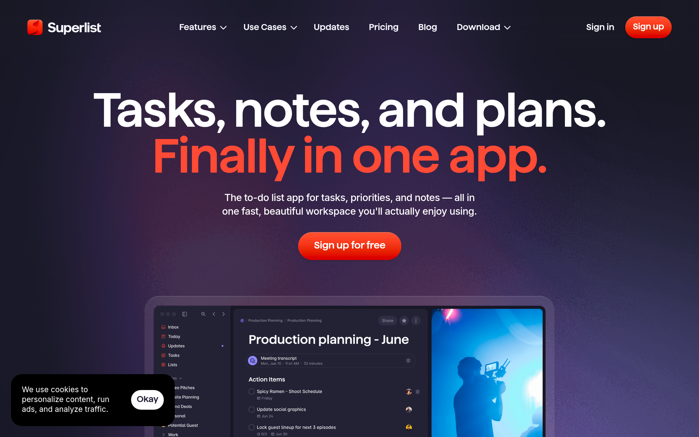

# superlist Design System

You are building UI for **superlist**. Light-themed, neutral palette, monospace typography (Jersey 10), compact density on a 4px grid, flat elevation (no shadows).

## Visual Reference

**IMPORTANT**: Study ALL screenshots below before writing any UI. Match colors, typography, spacing, layout, and motion exactly as shown.

### Homepage



> Read `references/DESIGN.md` for full token details.

## Design Philosophy

- **Solid colors only** — no gradients anywhere. Every surface is a single flat color.
- **Single typeface** — Jersey 10 carries all text. Hierarchy comes from size, weight, and color — never font mixing.
- **compact density** — 4px base grid. Every dimension is a multiple of 4.
- **neutral palette** — the color temperature runs neutral, matching the monospace typography.
- **Restrained accent** — `#f739f7` is the only pop of color. Used exclusively for CTAs, links, focus rings, and active states.
- **Subtle motion** — transitions smooth state changes. Keep durations under 300ms, use ease-out curves.

## Color System

### Core Palette

| Role | Token | Hex | Use |
|------|-------|-----|-----|
| Background | `--background` | `#f7f7ff` | Page/app background |
| Surface | `--surface` | `#eeeeee` | Cards, panels, modals |
| Text Primary | `--text-primary` | `#000000` | Headings, body text |
| Text Muted | `--text-muted` | `#8e8da0` | Captions, placeholders |
| Accent | `--accent` | `#f739f7` | CTAs, links, focus rings |

### Status Colors

| Status | Hex | Use |
|--------|-----|-----|
| Success | `#22c55e` | Confirmations, positive trends |
| Warning | `#fbe74e` | Caution states, pending items |
| Danger | `#ff4a36` | Errors, destructive actions |

### Extended Palette

- **framer-link-text-color:** `#0099ff`
- `#191c2b`
- `#6b66da`
- `#696f81`
- `#2590f1`
- `#f866db`
- `#8f89fa`
- `#26253b`

### CSS Variable Tokens

```css
--framer-text-background-color: initial;
--framer-text-background-radius: initial;
--framer-text-background-corner-shape: initial;
--framer-text-background-padding: initial;
--framer-text-background-color: initial;
--framer-text-background-radius: initial;
--framer-text-background-corner-shape: initial;
--framer-text-background-padding: initial;
--framer-text-background-color: initial;
--framer-text-background-radius: initial;
--framer-text-background-corner-shape: initial;
--framer-text-background-padding: initial;
--border-bottom-width: 1.5px;
--border-left-width: 1.5px;
--border-right-width: 1.5px;
--border-style: solid;
--border-top-width: 1.5px;
--framer-text-background-color: initial;
--framer-text-background-radius: initial;
--framer-text-background-corner-shape: initial;
```

## Typography

### Font Stack

- **Jersey 10** — Heading 1, Heading 2, Heading 3
- **Fragment Mono** — Body, Caption, Code

### Font Sources

```css
@font-face {
  font-family: "Fragment Mono";
  src: url("fonts/FragmentMono-Regular.ttf") format("truetype");
  font-weight: 400;
}
@font-face {
  font-family: "Jersey 10";
  src: url("fonts/Jersey10-Regular.ttf") format("truetype");
  font-weight: 400;
}
@font-face {
  font-family: "Haffer XH SemiBold";
  src: url("fonts/HafferXHSemiBold-Regular.woff2") format("woff2");
  font-weight: 400;
}
@font-face {
  font-family: "Haffer XH SemiBold Italic";
  src: url("fonts/HafferXHSemiBoldItalic-600.woff2") format("woff2");
  font-weight: 600;
}
@font-face {
  font-family: "Haffer XH Regular";
  src: url("fonts/HafferXHRegular-Regular.woff2") format("woff2");
  font-weight: 400;
}
@font-face {
  font-family: "Haffer XH Bold";
  src: url("fonts/HafferXHBold-Regular.woff2") format("woff2");
  font-weight: 400;
}
@font-face {
  font-family: "Haffer XH Bold Italic";
  src: url("fonts/HafferXHBoldItalic-700.woff2") format("woff2");
  font-weight: 700;
}
@font-face {
  font-family: "Haffer XH Regular Italic";
  src: url("fonts/HafferXHRegularItalic-Regular.woff2") format("woff2");
  font-weight: 400;
}
@font-face {
  font-family: "Inter";
  src: url("fonts/Inter-Bold.ttf") format("truetype");
  font-weight: 700;
}
@font-face {
  font-family: "Inter";
  src: url("fonts/Inter-Regular.ttf") format("truetype");
  font-weight: 400;
}
@font-face {
  font-family: "Inter Variable";
  src: url("fonts/InterVariable-Regular.woff2") format("woff2");
  font-weight: 400;
}
@font-face {
  font-family: "Inter Display";
  src: url("fonts/InterDisplay-Regular.woff2") format("woff2");
  font-weight: 400;
}
@font-face {
  font-family: "Inter Display";
  src: url("fonts/InterDisplay-700.woff2") format("woff2");
  font-weight: 700;
}
@font-face {
  font-family: "Satoshi";
  src: url("fonts/Satoshi-500.woff2") format("woff2");
  font-weight: 500;
}
```

### Type Scale

| Role | Family | Size | Weight |
|------|--------|------|--------|
| Heading 1 | Jersey 10 | calc(var(--framer-blockquote-font-size,var(--framer-font-size,16px))*var(--framer-font-size-scale,1)) | 700 |
| Heading 2 | Jersey 10 | calc(var(--framer-link-hover-font-size,var(--framer-blockquote-font-size,var(--framer-font-size,16px)))*var(--framer-font-size-scale,1)) | 700 |
| Heading 3 | Jersey 10 | calc(var(--framer-link-current-font-size,var(--framer-link-font-size,var(--framer-font-size,16px)))*var(--framer-font-size-scale,1)) | 700 |
| Body | Fragment Mono | calc(var(--framer-link-hover-font-size,var(--framer-link-current-font-size,var(--framer-link-font-size,var(--framer-font-size,16px))))*var(--framer-font-size-scale,1)) | 400 |
| Caption | Fragment Mono | var(--framer-font-size,16px) | 400 |
| Code | Fragment Mono | 14px | 400 |

### Typography Rules

- All text uses **Jersey 10** — never add another font family
- Max 3-4 font sizes per screen
- Headings: weight 600-700, body: weight 400
- Use color and opacity for text hierarchy, not additional font sizes
- Line height: 1.5 for body, 1.2 for headings

## Spacing & Layout

### Base Grid: 4px

Every dimension (margin, padding, gap, width, height) must be a multiple of **4px**.

### Spacing Scale

`2, 4, 6, 8, 10, 12, 14, 16, 18, 20, 22, 24` px

### Spacing as Meaning

| Spacing | Use |
|---------|-----|
| 4-8px | Tight: related items (icon + label, avatar + name) |
| 12-16px | Medium: between groups within a section |
| 24-32px | Wide: between distinct sections |
| 48px+ | Vast: major page section breaks |

### Border Radius

Scale: `inherit, 1px, 6px, 10px, 14px, 20px, 999px`
Default: `10px`

### Container

Max-width: `1199px`, centered with auto margins.

### Breakpoints

| Name | Value |
|------|-------|
| lg | 809px |
| lg | 809.98px |
| lg | 810px |
| xl | 1199px |
| xl | 1199.98px |
| xl | 1200px |
| xl | 1259.98px |
| xl | 1260px |
| 2xl | 1399px |
| 2xl | 1399.98px |
| 2xl | 1400px |

Mobile-first: design for small screens, layer on responsive overrides.

## Component Patterns

### Card

```css
.card {
  background: #eeeeee;
  border-radius: 10px;
  padding: 16px;
}
```

```html
<div class="card">
  <h3>Card Title</h3>
  <p>Card content goes here.</p>
</div>
```

### Button

```css
/* Primary */
.btn-primary {
  background: #f739f7;
  color: #000000;
  border-radius: 10px;
  padding: 8px 16px;
  font-weight: 500;
  transition: opacity 150ms ease;
}
.btn-primary:hover { opacity: 0.9; }

/* Ghost */
.btn-ghost {
  background: transparent;
  border: 1px solid #cccccc;
  color: #000000;
  border-radius: 10px;
  padding: 8px 16px;
}
```

```html
<button class="btn-primary">Get Started</button>
<button class="btn-ghost">Learn More</button>
```

### Input

```css
.input {
  background: #f7f7ff;
  border: 1px solid #cccccc;
  border-radius: 10px;
  padding: 8px 12px;
  color: #000000;
  font-size: 14px;
}
.input:focus { border-color: #f739f7; outline: none; }
```

```html
<input class="input" type="text" placeholder="Search..." />
```

### Badge / Chip

```css
.badge {
  display: inline-flex;
  align-items: center;
  padding: 4px 8px;
  border-radius: 9999px;
  font-size: 12px;
  font-weight: 500;
  background: #eeeeee;
  color: #8e8da0;
}
```

```html
<span class="badge">New</span>
<span class="badge">Beta</span>
```

### Modal / Dialog

```css
.modal-backdrop { background: rgba(0, 0, 0, 0.6); }
.modal {
  background: #eeeeee;
  border-radius: 999px;
  padding: 24px;
  max-width: 480px;
  width: 90vw;
}
```

```html
<div class="modal-backdrop">
  <div class="modal">
    <h2>Dialog Title</h2>
    <p>Dialog content.</p>
    <button class="btn-primary">Confirm</button>
    <button class="btn-ghost">Cancel</button>
  </div>
</div>
```

### Table

```css
.table { width: 100%; border-collapse: collapse; }
.table th {
  text-align: left;
  padding: 8px 12px;
  font-weight: 500;
  font-size: 12px;
  color: #8e8da0;
  text-transform: uppercase;
  letter-spacing: 0.05em;
  border-bottom: 1px solid #cccccc;
}
.table td {
  padding: 12px;
  border-bottom: 1px solid #cccccc;
}
```

```html
<table class="table">
  <thead><tr><th>Name</th><th>Status</th><th>Date</th></tr></thead>
  <tbody>
    <tr><td>Item One</td><td>Active</td><td>Jan 1</td></tr>
    <tr><td>Item Two</td><td>Pending</td><td>Jan 2</td></tr>
  </tbody>
</table>
```

### Navigation

```css
.nav {
  display: flex;
  align-items: center;
  gap: 8px;
  padding: 12px 16px;
}
.nav-link {
  color: #8e8da0;
  padding: 8px 12px;
  border-radius: 10px;
  transition: color 150ms;
}
.nav-link:hover { color: #000000; }
.nav-link.active { color: #f739f7; }
```

```html
<nav class="nav">
  <a href="/" class="nav-link active">Home</a>
  <a href="/about" class="nav-link">About</a>
  <a href="/pricing" class="nav-link">Pricing</a>
  <button class="btn-primary" style="margin-left: auto">Get Started</button>
</nav>
```

### Extracted Components

These components were found in the codebase:

**Navigation** (`html`)

**Footer** (`html`)

## Page Structure

The following page sections were detected:

- **Navigation** — Top navigation bar (9 items)
- **Hero** — Hero section (detected from heading structure)
- **Faq** — FAQ/accordion section
- **Footer** — Page footer with links and info (29 items)

When building pages, follow this section order and structure.

## Animation & Motion

This project uses **subtle motion**. Transitions smooth state changes without calling attention.

### Motion Tokens

- **Duration scale:** `100ms`, `200ms`
- **Easing functions:** `cubic-bezier(.44,0,.56,1)`, `cubic-bezier(.12,.23,.5,1)`
- **Animated properties:** `color`

### Motion Guidelines

- **Duration:** Use values from the duration scale above. Short (100ms) for micro-interactions, long (200ms) for page transitions
- **Easing:** Use `cubic-bezier(.44,0,.56,1)` as the default easing curve
- **Direction:** Elements enter from bottom/right, exit to top/left
- **Reduced motion:** Always respect `prefers-reduced-motion` — disable animations when set

## Depth & Elevation

This design uses **flat elevation** — no box-shadows anywhere.

### Elevation Strategy

| Level | Technique | Use |
|-------|-----------|-----|
| 0 — Base | Background color | Page background |
| 1 — Raised | Lighter surface + subtle border | Cards, panels |
| 2 — Floating | Even lighter surface + stronger border | Dropdowns, popovers |
| 3 — Overlay | Backdrop + modal surface | Modals, dialogs |

### Z-Index Scale

`0, 1, 2, 8, 9, 10`

Use these exact values — never invent z-index values.

## Anti-Patterns (Never Do)

- **No box-shadow** on any element — use borders and surface colors for depth
- **No gradients** — solid colors only, everywhere
- **No blur effects** — no backdrop-blur, no filter: blur()
- **No zebra striping** — tables and lists use borders for separation
- **No invented colors** — every hex value must come from the palette above
- **No arbitrary spacing** — every dimension is a multiple of 4px
- **No extra fonts** — only Jersey 10 and Fragment Mono are allowed
- **No arbitrary border-radius** — use the scale: 1px, 6px, 10px, 14px, 20px, 999px
- **No opacity for disabled states** — use muted colors instead
- **No pill shapes** — this design doesn't use rounded-full / 9999px radius

## Workflow

1. **Read** `references/DESIGN.md` before writing any UI code
2. **Pick colors** from the Color System section — never invent new ones
3. **Set typography** — Jersey 10, Fragment Mono only, using the type scale
4. **Build layout** on the 4px grid — check every margin, padding, gap
5. **Match components** to patterns above before creating new ones
6. **Apply elevation** — flat, surface color shifts only
7. **Validate** — every value traces back to a design token. No magic numbers.

## Brand Spec

- **Favicon:** `https://framerusercontent.com/images/bI0E6AOBvqILIpkzDCXQ2HSjAFQ.png`
- **Site URL:** `https://superlist.com`
- **Brand color:** `#f739f7`
- **Brand typeface:** Jersey 10

## Quick Reference

```
Background:     #f7f7ff
Surface:        #eeeeee
Text:           #000000 / #8e8da0
Accent:         #f739f7
Border:         (not extracted)
Font:           Jersey 10
Spacing:        4px grid
Radius:         10px
Components:     6 detected
```

## When to Trigger

Activate this skill when:
- Creating new components, pages, or visual elements for superlist
- Writing CSS, Tailwind classes, styled-components, or inline styles
- Building page layouts, templates, or responsive designs
- Reviewing UI code for design consistency
- The user mentions "superlist" design, style, UI, or theme
- Generating mockups, wireframes, or visual prototypes

---

# Full Reference Files

> Every output file is embedded below. Claude has full design system context from /skills alone.

## Design System Tokens (DESIGN.md)

# superlist DESIGN.md

> Auto-generated design system — reverse-engineered via static analysis by skillui.
> Frameworks: None detected
> Colors: 20 · Fonts: 2 · Components: 6
> Icon library: not detected · State: not detected
> Primary theme: light · Dark mode toggle: no · Motion: subtle

## Visual Reference

**Match this design exactly** — study colors, fonts, spacing, and component shapes before writing any UI code.


---

## 1. Visual Theme & Atmosphere

This is a **light-themed** interface with a neutral, approachable feel. The light background emphasizes content clarity. Typography uses **Jersey 10** throughout — a technical, developer-focused choice that maintains consistency. Spacing follows a **4px base grid** (compact density), with scale: 2, 4, 6, 8, 10, 12, 14, 16px. The accent color **#f739f7** anchors interactive elements (buttons, links, focus rings). Motion is subtle — smooth transitions (150-300ms) ease state changes without drawing attention.

---

## 2. Color Palette & Roles

| Token | Hex | Role | Use |
|---|---|---|---|
| framer-link-hover-text-color | `#f7f7ff` | background | Page background, darkest surface |
| surface | `#eeeeee` | surface | Card and panel backgrounds |
| framer-text-color | `#000000` | text-primary | Headings and body text |
| framer-link-current-text-color | `#8e8da0` | text-muted | Captions, placeholders, secondary info |
| accent | `#f739f7` | accent | CTAs, links, focus rings, active states |
| danger | `#ff4a36` | danger | Error states, destructive actions |
| success | `#22c55e` | success | Success states, positive indicators |
| warning | `#fbe74e` | warning | Warning states, caution indicators |
| framer-link-text-color | `#0099ff` | info | Informational highlights |
| unknown | `#191c2b` | unknown | Palette color |
| unknown | `#6b66da` | unknown | Palette color |
| unknown | `#696f81` | unknown | Palette color |
| unknown | `#2590f1` | unknown | Palette color |
| unknown | `#f866db` | unknown | Palette color |
| unknown | `#8f89fa` | unknown | Palette color |
| unknown | `#26253b` | unknown | Palette color |
| unknown | `#413f73` | unknown | Palette color |
| unknown | `#33b887` | unknown | Palette color |
| unknown | `#7577e0` | unknown | Palette color |
| unknown | `#363955` | unknown | Palette color |

### CSS Variable Tokens

```css
--framer-text-background-color: initial;
--framer-text-background-radius: initial;
--framer-text-background-corner-shape: initial;
--framer-text-background-padding: initial;
--framer-text-background-color: initial;
--framer-text-background-radius: initial;
--framer-text-background-corner-shape: initial;
--framer-text-background-padding: initial;
--framer-text-background-color: initial;
--framer-text-background-radius: initial;
--framer-text-background-corner-shape: initial;
--framer-text-background-padding: initial;
--border-bottom-width: 1.5px;
--border-left-width: 1.5px;
--border-right-width: 1.5px;
--border-style: solid;
--border-top-width: 1.5px;
--framer-text-background-color: initial;
--framer-text-background-radius: initial;
--framer-text-background-corner-shape: initial;
```


---

## 3. Typography Rules

**Font Stack:**
- **Jersey 10** — Heading 1, Heading 2, Heading 3
- **Fragment Mono** — Body, Caption, Code

**Font Sources:**

```css
@font-face {
  font-family: "Fragment Mono";
  src: url("fonts/FragmentMono-Regular.ttf") format("truetype");
  font-weight: 400;
}
@font-face {
  font-family: "Jersey 10";
  src: url("fonts/Jersey10-Regular.ttf") format("truetype");
  font-weight: 400;
}
@font-face {
  font-family: "Haffer XH SemiBold";
  src: url("fonts/HafferXHSemiBold-Regular.woff2") format("woff2");
  font-weight: 400;
}
@font-face {
  font-family: "Haffer XH SemiBold Italic";
  src: url("fonts/HafferXHSemiBoldItalic-600.woff2") format("woff2");
  font-weight: 600;
}
@font-face {
  font-family: "Haffer XH Regular";
  src: url("fonts/HafferXHRegular-Regular.woff2") format("woff2");
  font-weight: 400;
}
@font-face {
  font-family: "Haffer XH Bold";
  src: url("fonts/HafferXHBold-Regular.woff2") format("woff2");
  font-weight: 400;
}
@font-face {
  font-family: "Haffer XH Bold Italic";
  src: url("fonts/HafferXHBoldItalic-700.woff2") format("woff2");
  font-weight: 700;
}
@font-face {
  font-family: "Haffer XH Regular Italic";
  src: url("fonts/HafferXHRegularItalic-Regular.woff2") format("woff2");
  font-weight: 400;
}
@font-face {
  font-family: "Inter";
  src: url("fonts/Inter-Bold.ttf") format("truetype");
  font-weight: 700;
}
@font-face {
  font-family: "Inter";
  src: url("fonts/Inter-Regular.ttf") format("truetype");
  font-weight: 400;
}
@font-face {
  font-family: "Inter Variable";
  src: url("fonts/InterVariable-Regular.woff2") format("woff2");
  font-weight: 400;
}
@font-face {
  font-family: "Inter Display";
  src: url("fonts/InterDisplay-Regular.woff2") format("woff2");
  font-weight: 400;
}
@font-face {
  font-family: "Inter Display";
  src: url("fonts/InterDisplay-700.woff2") format("woff2");
  font-weight: 700;
}
@font-face {
  font-family: "Satoshi";
  src: url("fonts/Satoshi-500.woff2") format("woff2");
  font-weight: 500;
}
```

| Role | Font | Size | Weight |
|---|---|---|---|
| Heading 1 | Jersey 10 | calc(var(--framer-blockquote-font-size,var(--framer-font-size,16px))*var(--framer-font-size-scale,1)) | 700 |
| Heading 2 | Jersey 10 | calc(var(--framer-link-hover-font-size,var(--framer-blockquote-font-size,var(--framer-font-size,16px)))*var(--framer-font-size-scale,1)) | 700 |
| Heading 3 | Jersey 10 | calc(var(--framer-link-current-font-size,var(--framer-link-font-size,var(--framer-font-size,16px)))*var(--framer-font-size-scale,1)) | 700 |
| Body | Fragment Mono | calc(var(--framer-link-hover-font-size,var(--framer-link-current-font-size,var(--framer-link-font-size,var(--framer-font-size,16px))))*var(--framer-font-size-scale,1)) | 400 |
| Caption | Fragment Mono | var(--framer-font-size,16px) | 400 |
| Code | Fragment Mono | 14px | 400 |

**Typographic Rules:**
- Use **Jersey 10** for all text — do not mix font families
- Maintain consistent hierarchy: no more than 3-4 font sizes per screen
- Headings use bold (600-700), body uses regular (400)
- Line height: 1.5 for body text, 1.2 for headings
- Use color and opacity for secondary hierarchy, not additional font sizes


---

## 4. Component Stylings

### Layout (1)

**Footer** — `html`

### Navigation (1)

**Navigation** — `html`

### Data Input (1)

**Button** — `html`

### Media (3)

**Image** — `html`

**Icon** — `html`

**Map/Canvas** — `html`


---

## 5. Layout Principles

- **Base spacing unit:** 4px
- **Spacing scale:** 2, 4, 6, 8, 10, 12, 14, 16, 18, 20, 22, 24
- **Border radius:** inherit, 1px, 6px, 10px, 14px, 20px, 999px
- **Max content width:** 1199px

**Spacing as Meaning:**
| Spacing | Use |
|---|---|
| 4-8px | Tight: related items within a group |
| 12-16px | Medium: between groups |
| 24-32px | Wide: between sections |
| 48px+ | Vast: major section breaks |


---

## 6. Depth & Elevation

No box-shadow values detected. The design appears to use a flat visual style.

**Z-Index Scale:** `0, 1, 2, 8, 9, 10`


---

## 7. Animation & Motion

This project uses **subtle motion**. Transitions smooth state changes without demanding attention.

### Motion Guidelines

- Duration: 150-300ms for micro-interactions, 300-500ms for page transitions
- Easing: `ease-out` for enters, `ease-in` for exits
- Always respect `prefers-reduced-motion`


---

## 8. Do's and Don'ts

### Do's

- Use `#f739f7` for interactive elements (buttons, links, focus rings)
- Use `#f7f7ff` as the primary page background
- Use **Jersey 10** for all UI text
- Follow the **4px** spacing grid for all margins, padding, and gaps
- Use border and background shifts for elevation — not shadows
- Use border-radius from the scale: inherit, 1px, 6px, 10px, 14px
- Reuse existing components from Section 4 before creating new ones

### Don'ts

- Don't introduce colors outside this palette — extend the design tokens first
- Don't mix font families — use Jersey 10 consistently
- Don't use arbitrary spacing values — stick to multiples of 4px
- Don't add box-shadow — this design system uses flat elevation
- Don't use gradients — the design uses solid colors only
- Don't use arbitrary border-radius values — pick from the defined scale
- Don't duplicate component patterns — check Section 4 first
- Don't use backdrop-blur or blur effects

### Anti-Patterns (detected from codebase)

- No box-shadow on any element
- No gradient backgrounds
- No blur or backdrop-blur effects
- No zebra striping on tables/lists


---

## 9. Responsive Behavior

| Name | Value | Source |
|---|---|---|
| lg | 809px | css |
| lg | 809.98px | css |
| lg | 810px | css |
| xl | 1199px | css |
| xl | 1199.98px | css |
| xl | 1200px | css |
| xl | 1259.98px | css |
| xl | 1260px | css |
| 2xl | 1399px | css |
| 2xl | 1399.98px | css |
| 2xl | 1400px | css |

**Approach:** Use `@media (min-width: ...)` queries matching the breakpoints above.


---

## 10. Agent Prompt Guide

Use these as starting points when building new UI:

### Build a Card

```
Background: #eeeeee
Border: 1px solid var(--border)
Radius: 10px
Padding: 16px
Font: Jersey 10
No shadows — use borders and surface colors for depth.
```

### Build a Button

```
Primary: bg #f739f7, text white
Ghost: bg transparent, border var(--border)
Padding: 8px 16px
Radius: 10px
Hover: opacity 0.9 or lighter shade
Focus: ring with #f739f7
```

### Build a Page Layout

```
Background: #f7f7ff
Max-width: 1199px, centered
Grid: 4px base
Responsive: mobile-first, breakpoints from Section 9
```

### Build a Stats Card

```
Surface: #eeeeee
Label: #8e8da0 (muted, 12px, uppercase)
Value: #000000 (primary, 24-32px, bold)
Status: use success/warning/danger from Section 2
```

### Build a Form

```
Input bg: #f7f7ff
Input border: 1px solid var(--border)
Focus: border-color #f739f7
Label: #8e8da0 12px
Spacing: 16px between fields
Radius: 10px
```

### General Component

```
1. Read DESIGN.md Sections 2-6 for tokens
2. Colors: only from palette
3. Font: Jersey 10, type scale from Section 3
4. Spacing: 4px grid
5. Components: match patterns from Section 4
6. Elevation: flat, surface shifts
```

## Bundled Fonts (fonts/)

The following font files are bundled in the `fonts/` directory:

- `fonts/FragmentMono-Regular.ttf`
- `fonts/HafferXHBold-Regular.woff2`
- `fonts/HafferXHBoldItalic-700.woff2`
- `fonts/HafferXHRegular-Regular.woff2`
- `fonts/HafferXHRegularItalic-Regular.woff2`
- `fonts/HafferXHSemiBold-Regular.woff2`
- `fonts/HafferXHSemiBoldItalic-600.woff2`
- `fonts/Inter-Black.ttf`
- `fonts/Inter-Bold.ttf`
- `fonts/Inter-ExtraBold.ttf`
- `fonts/Inter-ExtraLight.ttf`
- `fonts/Inter-Light.ttf`
- `fonts/Inter-Medium.ttf`
- `fonts/Inter-Regular.ttf`
- `fonts/Inter-SemiBold.ttf`
- `fonts/Inter-Thin.ttf`
- `fonts/InterDisplay-100.woff2`
- `fonts/InterDisplay-200.woff2`
- `fonts/InterDisplay-300.woff2`
- `fonts/InterDisplay-500.woff2`
- `fonts/InterDisplay-600.woff2`
- `fonts/InterDisplay-700.woff2`
- `fonts/InterDisplay-800.woff2`
- `fonts/InterDisplay-900.woff2`
- `fonts/InterDisplay-Regular.woff2`
- `fonts/InterVariable-Regular.woff2`
- `fonts/Jersey10-Regular.ttf`
- `fonts/Satoshi-500.woff2`

Use these local font files in `@font-face` declarations instead of fetching from Google Fonts.

## Homepage Screenshots (screenshots/)


