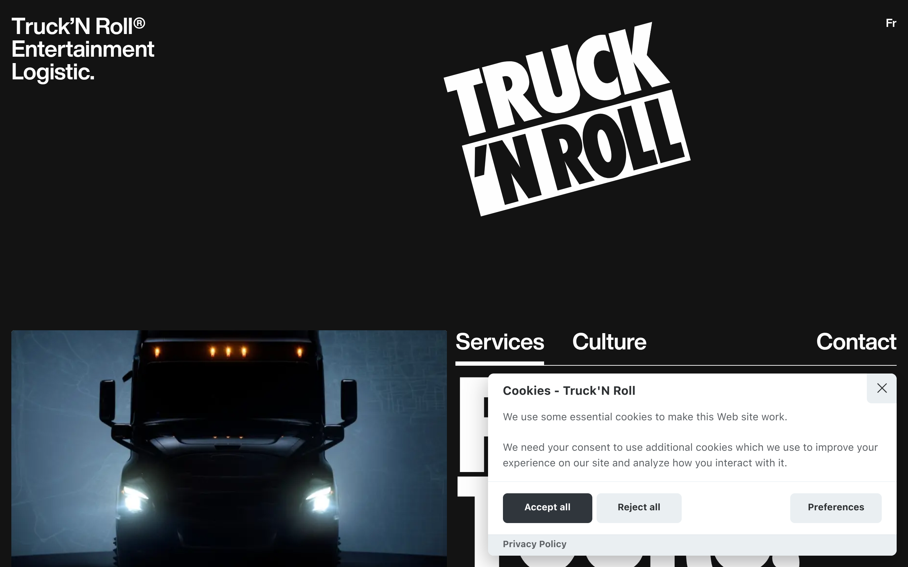
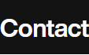
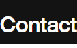

# trucknroll Design System

You are building UI for **trucknroll**. Light-themed, cool palette, sans-serif typography (National 2 Condensed), compact density on a 4px grid, expressive motion.

## Visual Reference

**IMPORTANT**: Study ALL screenshots below before writing any UI. Match colors, typography, spacing, layout, and motion exactly as shown.

### Homepage



### Scroll Journey (Cinematic Visual States)

> These screenshots capture the website at different scroll depths. The design changes dramatically as you scroll — each frame shows a different cinematic state. Replicate these exact visual transitions.

#### 0% — Hero / Above the fold


#### 17% — Mid-page at 17% scroll


#### 33% — Mid-page at 33% scroll


#### 50% — Mid-page at 50% scroll


#### 67% — Mid-page at 67% scroll


#### 83% — Mid-page at 83% scroll


#### 100% — Footer / End of page


> Read `references/DESIGN.md` for full token details. Read `references/ANIMATIONS.md` for motion specs. Read `references/LAYOUT.md` for layout structure. Read `references/COMPONENTS.md` for component patterns.

## Ultra Reference Files

This package includes extended documentation. **Read these files before implementing:**

| File | Contents |
|------|----------|
| `references/DESIGN.md` | Full design system tokens, colors, typography, spacing |
| `references/VISUAL_GUIDE.md` | **START HERE** — Master visual guide with all screenshots embedded |
| `references/ANIMATIONS.md` | CSS keyframes, scroll triggers, motion library stack, video specs |
| `references/LAYOUT.md` | Flex/grid containers, page structure, spacing relationships |
| `references/COMPONENTS.md` | DOM component patterns, HTML structure, class fingerprints |
| `references/INTERACTIONS.md` | Hover/focus states with before/after style diffs |
| `screens/scroll/` | 7 scroll journey screenshots showing cinematic states |

### Animation Stack Detected

- **Web Animations API (2 active)** — animation

## Design Philosophy

- **Layered depth** — use shadow tokens to create a sense of physical layering. Each elevation level has a specific shadow.
- **Gradient accents** — gradients are used thoughtfully for emphasis, not decoration.
- **Type pairing** — National 2 Condensed for body/UI text, Helvetica Now Display for headings/display. Never introduce a third typeface.
- **compact density** — 4px base grid. Every dimension is a multiple of 4.
- **cool palette** — the color temperature runs cool, matching the sans-serif typography.
- **Restrained accent** — `#4e37ff` is the only pop of color. Used exclusively for CTAs, links, focus rings, and active states.
- **Expressive motion** — animations are an integral part of the experience. Use spring physics and layout animations.

## Color System

### Core Palette

| Role | Token | Hex | Use |
|------|-------|-----|-----|
| Background | `--background` | `#ffffff` | Page/app background |
| Surface | `--surface` | `#eaeff2` | Cards, panels, modals |
| Text Primary | `--text-primary` | `#131313` | Headings, body text |
| Text Muted | `--text-muted` | `#5e6266` | Captions, placeholders |
| Accent | `--accent` | `#4e37ff` | CTAs, links, focus rings |
| Border | `--border` | `#2c2f31` | Dividers, card borders |

### Status Colors

| Status | Hex | Use |
|--------|-----|-----|
| Success | `#369763` | Confirmations, positive trends |
| Danger | `#de3e3e` | Errors, destructive actions |

### Extended Palette

- **color-gray:** `#d8d3d3`
- **cc-btn-primary-hover-bg:** `#000000` — Deep background layer or shadow color
- **cc-btn-secondary-hover-bg:** `#d4dae0` — Secondary text, placeholder text
- **cc-btn-secondary-hover-bg:** `#353d43` — Secondary text, placeholder text
- **cc-section-category-border:** `#1e2428`
- **cc-btn-primary-bg:** `#c2d0e0`
- `#c1c1c1`
- `#4f4f4f`

### CSS Variable Tokens

```css
--cc-modal-border-radius: .5rem;
--cc-btn-border-radius: .4rem;
--cc-primary-color: #2c2f31;
--cc-secondary-color: #5e6266;
--cc-btn-primary-bg: #30363c;
--cc-btn-primary-color: #fff;
--cc-btn-primary-border-color: var(--cc-btn-primary-bg);
--cc-btn-primary-hover-bg: #000;
--cc-btn-primary-hover-color: #fff;
--cc-btn-primary-hover-border-color: var(--cc-btn-primary-hover-bg);
--cc-btn-secondary-bg: #eaeff2;
--cc-btn-secondary-color: var(--cc-primary-color);
--cc-btn-secondary-border-color: var(--cc-btn-secondary-bg);
--cc-btn-secondary-hover-bg: #d4dae0;
--cc-btn-secondary-hover-color: #000;
--cc-btn-secondary-hover-border-color: #d4dae0;
--cc-separator-border-color: #f0f4f7;
--cc-section-category-border: var(--cc-cookie-category-block-bg);
--cc-cookie-category-block-border: #f0f4f7;
--cc-cookie-category-block-hover-border: #e9eff4;
```

## Typography

### Font Stack

- **National 2 Condensed** — Heading 1, Heading 2, Heading 3
- **Helvetica Now Display** — Body, Caption
- **SFMono-Regular** — Code

### Font Sources

```css
@font-face {
  font-family: "National 2 Condensed";
  src: url("fonts/National2Condensed-900.woff2") format("woff2");
  font-weight: 900;
}
@font-face {
  font-family: "Helvetica Now Display";
  src: url("https://trucknroll.com/fonts/HelveticaNowDisplay-Bold.woff2") format("woff2");
  font-weight: 700;
}
```

### Type Scale

| Role | Family | Size | Weight |
|------|--------|------|--------|
| Heading 1 | National 2 Condensed | 16px | 700 |
| Heading 2 | National 2 Condensed | clamp(1rem,.6604rem + .3774vw,1.25rem) | 700 |
| Heading 3 | National 2 Condensed | 1rem | 700 |
| Body | Helvetica Now Display | 11px | 400 |
| Caption | Helvetica Now Display | 100% | 400 |
| Code | SFMono-Regular | 14px | 400 |

### Typography Rules

- Body/UI: **National 2 Condensed**, Headings: **Helvetica Now Display** — these are the only display fonts
- Max 3-4 font sizes per screen
- Headings: weight 600-700, body: weight 400
- Use color and opacity for text hierarchy, not additional font sizes
- Line height: 1.5 for body, 1.2 for headings

## Spacing & Layout

### Base Grid: 4px

Every dimension (margin, padding, gap, width, height) must be a multiple of **4px**.

### Spacing Scale

`2, 4, 6, 8, 10, 12, 14, 16, 18, 20, 22, 24` px

### Spacing as Meaning

| Spacing | Use |
|---------|-----|
| 4-8px | Tight: related items (icon + label, avatar + name) |
| 12-16px | Medium: between groups within a section |
| 24-32px | Wide: between distinct sections |
| 48px+ | Vast: major page section breaks |

### Border Radius

Scale: `1rem, unset, .25rem, .5em, 2px, 4.00024px, 5em, 8.00048px, 14.0008px, 37.0022px, 100%, inherit, 40.0024px`
Default: `5em`

### Container

Max-width: `1600px`, centered with auto margins.

### Breakpoints

| Name | Value |
|------|-------|
| xs | 340px |
| sm | 500px |
| sm | 640px |
| md | 700px |
| lg | 1000px |
| xl | 1200px |
| 2xl | 1400px |
| 2xl | 1440px |
| 2xl | 1600px |
| 2xl | 1800px |
| 2xl | 2000px |
| 2xl | 2400px |

Mobile-first: design for small screens, layer on responsive overrides.

## Component Patterns

### Card

```css
.card {
  background: #eaeff2;
  border: 1px solid #2c2f31;
  border-radius: 5em;
  padding: 16px;
  box-shadow: 0 .625em 1.875em #0000024d;
}
```

```html
<div class="card">
  <h3>Card Title</h3>
  <p>Card content goes here.</p>
</div>
```

### Button

```css
/* Primary */
.btn-primary {
  background: #4e37ff;
  color: #131313;
  border-radius: 5em;
  padding: 8px 16px;
  font-weight: 500;
  transition: opacity 150ms ease;
}
.btn-primary:hover { opacity: 0.9; }

/* Ghost */
.btn-ghost {
  background: transparent;
  border: 1px solid #2c2f31;
  color: #131313;
  border-radius: 5em;
  padding: 8px 16px;
}
```

```html
<button class="btn-primary">Get Started</button>
<button class="btn-ghost">Learn More</button>
```

### Input

```css
.input {
  background: #ffffff;
  border: 1px solid #2c2f31;
  border-radius: 5em;
  padding: 8px 12px;
  color: #131313;
  font-size: 14px;
}
.input:focus { border-color: #4e37ff; outline: none; }
```

```html
<input class="input" type="text" placeholder="Search..." />
```

### Badge / Chip

```css
.badge {
  display: inline-flex;
  align-items: center;
  padding: 4px 8px;
  border-radius: 9999px;
  font-size: 12px;
  font-weight: 500;
  background: #eaeff2;
  color: #5e6266;
}
```

```html
<span class="badge">New</span>
<span class="badge">Beta</span>
```

### Modal / Dialog

```css
.modal-backdrop { background: rgba(0, 0, 0, 0.6); }
.modal {
  background: #eaeff2;
  border: 1px solid #2c2f31;
  border-radius: 40.0024px;
  padding: 24px;
  max-width: 480px;
  width: 90vw;
  box-shadow: 0 0 100px 20px var(--bg-color) inset;
}
```

```html
<div class="modal-backdrop">
  <div class="modal">
    <h2>Dialog Title</h2>
    <p>Dialog content.</p>
    <button class="btn-primary">Confirm</button>
    <button class="btn-ghost">Cancel</button>
  </div>
</div>
```

### Table

```css
.table { width: 100%; border-collapse: collapse; }
.table th {
  text-align: left;
  padding: 8px 12px;
  font-weight: 500;
  font-size: 12px;
  color: #5e6266;
  text-transform: uppercase;
  letter-spacing: 0.05em;
  border-bottom: 1px solid #2c2f31;
}
.table td {
  padding: 12px;
  border-bottom: 1px solid #2c2f31;
}
```

```html
<table class="table">
  <thead><tr><th>Name</th><th>Status</th><th>Date</th></tr></thead>
  <tbody>
    <tr><td>Item One</td><td>Active</td><td>Jan 1</td></tr>
    <tr><td>Item Two</td><td>Pending</td><td>Jan 2</td></tr>
  </tbody>
</table>
```

### Navigation

```css
.nav {
  display: flex;
  align-items: center;
  gap: 8px;
  padding: 12px 16px;
  border-bottom: 1px solid #2c2f31;
}
.nav-link {
  color: #5e6266;
  padding: 8px 12px;
  border-radius: 5em;
  transition: color 150ms;
}
.nav-link:hover { color: #131313; }
.nav-link.active { color: #4e37ff; }
```

```html
<nav class="nav">
  <a href="/" class="nav-link active">Home</a>
  <a href="/about" class="nav-link">About</a>
  <a href="/pricing" class="nav-link">Pricing</a>
  <button class="btn-primary" style="margin-left: auto">Get Started</button>
</nav>
```

### Extracted Components

These components were found in the codebase:

**Button** (`html`)

**Card** (`html`)
- Variants: `cta`, `cta_inner`, `cta_head`, `cta_main`, `cta_list`

**Navigation** (`html`)

**Modal** (`html`)

## Page Structure

The following page sections were detected:

- **Navigation** — Top navigation bar (2 items)
- **Hero** — Hero/banner section with headline and CTAs
- **Faq** — FAQ/accordion section
- **Footer** — Page footer with links and info (12 items)
- **Cta** — Call-to-action section
- **Cards** — Grid of 16 card elements (16 items)

When building pages, follow this section order and structure.

## Animation & Motion

This project uses **expressive motion**. Animations are part of the design language.

### CSS Animations

- `spin`
- `slideInUp`
- `rail`
- `rotate`
- `fade`

### Motion Tokens

- **Duration scale:** `0ms`, `0s`, `.6s`, `125ms`, `150ms`, `250ms`, `5000000ms`
- **Easing functions:** `ease`, `ease-in-out`, `ease-out`, `ease-in`
- **Animated properties:** `background-size`, `color`

### Motion Guidelines

- **Duration:** Use values from the duration scale above. Short (0ms) for micro-interactions, long (5000000ms) for page transitions
- **Easing:** Use `ease` as the default easing curve
- **Direction:** Elements enter from bottom/right, exit to top/left
- **Reduced motion:** Always respect `prefers-reduced-motion` — disable animations when set

## Depth & Elevation

### Shadow Tokens

- Subtle: `0 0 0 1px var(--cc-toggle-off-bg)`
- Subtle: `0 1px 2px #1820035c`
- Subtle: `0 0 0 1px var(--cc-toggle-on-bg)`
- Subtle: `0 0 0 1px var(--cc-toggle-readonly-bg)`
- Subtle: `oklab(0.997019 0.0000453591 0.0000199676 / 0.1) 0px 0px 0px 1px inset`
- Subtle: `oklab(0.997019 0.0000453591 0.0000199676 / 0.8) 0px 0px 0px 1px inset`

### Z-Index Scale

`0, 1, 2, 3, 5, 6, 7, 100, 101, 102, 103, 2147483647`

Use these exact values — never invent z-index values.

## Anti-Patterns (Never Do)

- **No blur effects** — no backdrop-blur, no filter: blur()
- **No zebra striping** — tables and lists use borders for separation
- **No invented colors** — every hex value must come from the palette above
- **No arbitrary spacing** — every dimension is a multiple of 4px
- **No extra fonts** — only National 2 Condensed and Helvetica Now Display and SFMono-Regular are allowed
- **No arbitrary border-radius** — use the scale: 1rem, .25rem, .5em, 2px, 4.00024px, 5em, 8.00048px, 14.0008px, 37.0022px, 40.0024px
- **No opacity for disabled states** — use muted colors instead

## Workflow

1. **Read** `references/DESIGN.md` before writing any UI code
2. **Pick colors** from the Color System section — never invent new ones
3. **Set typography** — National 2 Condensed, Helvetica Now Display, SFMono-Regular only, using the type scale
4. **Build layout** on the 4px grid — check every margin, padding, gap
5. **Match components** to patterns above before creating new ones
6. **Apply elevation** — use shadow tokens
7. **Validate** — every value traces back to a design token. No magic numbers.

## Brand Spec

- **Favicon:** `/favicons/favicon-96x96.png`
- **Site URL:** `https://trucknroll.com/`
- **Brand color:** `#4e37ff`
- **Brand typeface:** National 2 Condensed

## Quick Reference

```
Background:     #ffffff
Surface:        #eaeff2
Text:           #131313 / #5e6266
Accent:         #4e37ff
Border:         #2c2f31
Font:           National 2 Condensed
Spacing:        4px grid
Radius:         5em
Components:     10 detected
```

## When to Trigger

Activate this skill when:
- Creating new components, pages, or visual elements for trucknroll
- Writing CSS, Tailwind classes, styled-components, or inline styles
- Building page layouts, templates, or responsive designs
- Reviewing UI code for design consistency
- The user mentions "trucknroll" design, style, UI, or theme
- Generating mockups, wireframes, or visual prototypes

---

# Full Reference Files

> Every output file is embedded below. Claude has full design system context from /skills alone.

## Design System Tokens (DESIGN.md)

# trucknroll DESIGN.md

> Auto-generated design system — reverse-engineered via static analysis by skillui.
> Frameworks: None detected
> Colors: 20 · Fonts: 3 · Components: 10
> Icon library: not detected · State: not detected
> Primary theme: light · Dark mode toggle: no · Motion: expressive

## Visual Reference

**Match this design exactly** — study colors, fonts, spacing, and component shapes before writing any UI code.


---

## 1. Visual Theme & Atmosphere

This is a **light-themed** interface with a cool, approachable feel. The light background emphasizes content clarity. Typography pairs **Helvetica Now Display** for display/headings with **National 2 Condensed** for body text, creating clear visual hierarchy through type contrast. Spacing follows a **4px base grid** (compact density), with scale: 2, 4, 6, 8, 10, 12, 14, 16px. The accent color **#4e37ff** anchors interactive elements (buttons, links, focus rings). Motion is expressive — spring physics, layout animations, and staggered reveals are part of the visual language.

---

## 2. Color Palette & Roles

| Token | Hex | Role | Use |
|---|---|---|---|
| cc-btn-primary-color | `#ffffff` | background | Page background, darkest surface |
| cc-btn-secondary-bg | `#eaeff2` | surface | Card and panel backgrounds |
| color-black | `#131313` | text-primary | Headings and body text |
| cc-secondary-color | `#5e6266` | text-muted | Captions, placeholders, secondary info |
| cc-secondary-color | `#aebbc5` | text-muted | Captions, placeholders, secondary info |
| cc-btn-primary-hover-bg | `#98a7b6` | text-muted | Captions, placeholders, secondary info |
| cc-primary-color | `#2c2f31` | border | Dividers, card borders, outlines |
| color-accent | `#4e37ff` | accent | CTAs, links, focus rings, active states |
| accent | `#c44e47` | accent | CTAs, links, focus rings, active states |
| color-feedback-error | `#de3e3e` | danger | Error states, destructive actions |
| success | `#369763` | success | Success states, positive indicators |
| cc-btn-primary-bg | `#c2d0e0` | info | Informational highlights |
| color-gray | `#d8d3d3` | unknown | Palette color |
| cc-btn-primary-hover-bg | `#000000` | unknown | Palette color |
| cc-btn-secondary-hover-bg | `#d4dae0` | unknown | Palette color |
| cc-btn-secondary-hover-bg | `#353d43` | unknown | Palette color |
| cc-section-category-border | `#1e2428` | unknown | Palette color |
| unknown | `#c1c1c1` | unknown | Palette color |
| unknown | `#4f4f4f` | unknown | Palette color |
| unknown | `#a7a4a4` | unknown | Palette color |

### CSS Variable Tokens

```css
--cc-modal-border-radius: .5rem;
--cc-btn-border-radius: .4rem;
--cc-primary-color: #2c2f31;
--cc-secondary-color: #5e6266;
--cc-btn-primary-bg: #30363c;
--cc-btn-primary-color: #fff;
--cc-btn-primary-border-color: var(--cc-btn-primary-bg);
--cc-btn-primary-hover-bg: #000;
--cc-btn-primary-hover-color: #fff;
--cc-btn-primary-hover-border-color: var(--cc-btn-primary-hover-bg);
--cc-btn-secondary-bg: #eaeff2;
--cc-btn-secondary-color: var(--cc-primary-color);
--cc-btn-secondary-border-color: var(--cc-btn-secondary-bg);
--cc-btn-secondary-hover-bg: #d4dae0;
--cc-btn-secondary-hover-color: #000;
--cc-btn-secondary-hover-border-color: #d4dae0;
--cc-separator-border-color: #f0f4f7;
--cc-section-category-border: var(--cc-cookie-category-block-bg);
--cc-cookie-category-block-border: #f0f4f7;
--cc-cookie-category-block-hover-border: #e9eff4;
```


---

## 3. Typography Rules

**Font Stack:**
- **National 2 Condensed** — Heading 1, Heading 2, Heading 3
- **Helvetica Now Display** — Body, Caption
- **SFMono-Regular** — Code

**Font Sources:**

```css
@font-face {
  font-family: "National 2 Condensed";
  src: url("fonts/National2Condensed-900.woff2") format("woff2");
  font-weight: 900;
}
@font-face {
  font-family: "Helvetica Now Display";
  src: url("https://trucknroll.com/fonts/HelveticaNowDisplay-Bold.woff2") format("woff2");
  font-weight: 700;
}
```

| Role | Font | Size | Weight |
|---|---|---|---|
| Heading 1 | National 2 Condensed | 16px | 700 |
| Heading 2 | National 2 Condensed | clamp(1rem,.6604rem + .3774vw,1.25rem) | 700 |
| Heading 3 | National 2 Condensed | 1rem | 700 |
| Body | Helvetica Now Display | 11px | 400 |
| Caption | Helvetica Now Display | 100% | 400 |
| Code | SFMono-Regular | 14px | 400 |

**Typographic Rules:**
- Limit to 3 font families max per screen
- Use **National 2 Condensed** for body/UI text, **Helvetica Now Display** for display/headings
- Maintain consistent hierarchy: no more than 3-4 font sizes per screen
- Headings use bold (600-700), body uses regular (400)
- Line height: 1.5 for body text, 1.2 for headings
- Use color and opacity for secondary hierarchy, not additional font sizes


---

## 4. Component Stylings

### Layout (1)

**Footer** — `html`

### Navigation (1)

**Navigation** — `html`

### Data Display (2)

**Card** — `html`
- Variants: `cta`, `cta_inner`, `cta_head`, `cta_main`, `cta_list`

**List** — `html`

### Data Input (2)

**Button** — `html`
- Animation: 

**Input** — `html`
- State: :focus, :placeholder

### Overlay (1)

**Modal** — `html`

### Media (3)

**Image** — `html`

**Icon** — `html`

**Map/Canvas** — `html`


---

## 5. Layout Principles

- **Base spacing unit:** 4px
- **Spacing scale:** 2, 4, 6, 8, 10, 12, 14, 16, 18, 20, 22, 24
- **Border radius:** 1rem, unset, .25rem, .5em, 2px, 4.00024px, 5em, 8.00048px, 14.0008px, 37.0022px, 100%, inherit, 40.0024px
- **Max content width:** 1600px

**Spacing as Meaning:**
| Spacing | Use |
|---|---|
| 4-8px | Tight: related items within a group |
| 12-16px | Medium: between groups |
| 24-32px | Wide: between sections |
| 48px+ | Vast: major section breaks |


---

## 6. Depth & Elevation

### Flat — subtle depth hints

- `0 0 0 1px var(--cc-toggle-off-bg)`
- `0 1px 2px #1820035c`
- `0 0 0 1px var(--cc-toggle-on-bg)`

### Raised — cards, buttons, interactive elements

- `0 .625em 1.875em #0000024d`
- `inset 0 0 0 var(--spinner-stroke-width) var(--spinner-stroke-color)`
- `inset 0 0 0 var(--spinner-stroke-width) color-mix(in oklab,var(--spinner-stroke-color) 10%,transparent)`

### Overlay — full-screen overlays, top-level dialogs

- `0 0 100px 20px var(--bg-color) inset`
- `inset 0 0 0 1000px #0000`

### Z-Index Scale

`0, 1, 2, 3, 5, 6, 7, 100, 101, 102, 103, 2147483647`


---

## 7. Animation & Motion

This project uses **expressive motion**. Animations are an integral part of the experience.

### CSS Animations

- `@keyframes spin`
- `@keyframes slideInUp`
- `@keyframes rail`
- `@keyframes rotate`
- `@keyframes fade`
- `@keyframes fade-in`
- `@keyframes shake`
- `@keyframes fall`

### Animated Components

- **Button**: 

### Motion Guidelines

- Duration: 150-300ms for micro-interactions, 300-500ms for page transitions
- Easing: `ease-out` for enters, `ease-in` for exits
- Always respect `prefers-reduced-motion`


---

## 8. Do's and Don'ts

### Do's

- Use `#4e37ff` for interactive elements (buttons, links, focus rings)
- Use `#ffffff` as the primary page background
- Pair **National 2 Condensed** (body) with **Helvetica Now Display** (display) — these are the only allowed fonts
- Follow the **4px** spacing grid for all margins, padding, and gaps
- Use the defined shadow tokens for elevation — see Section 6
- Use border-radius from the scale: 1rem, unset, .25rem, .5em, 2px
- Reuse existing components from Section 4 before creating new ones

### Don'ts

- Don't introduce colors outside this palette — extend the design tokens first
- Don't introduce additional font families beyond National 2 Condensed and Helvetica Now Display and SFMono-Regular
- Don't use arbitrary spacing values — stick to multiples of 4px
- Don't create custom box-shadow values outside the system tokens
- Don't use arbitrary border-radius values — pick from the defined scale
- Don't duplicate component patterns — check Section 4 first
- Don't use backdrop-blur or blur effects

### Anti-Patterns (detected from codebase)

- No blur or backdrop-blur effects
- No zebra striping on tables/lists


---

## 9. Responsive Behavior

| Name | Value | Source |
|---|---|---|
| xs | 340px | css |
| sm | 500px | css |
| sm | 640px | css |
| md | 700px | css |
| lg | 1000px | css |
| xl | 1200px | css |
| 2xl | 1400px | css |
| 2xl | 1440px | css |
| 2xl | 1600px | css |
| 2xl | 1800px | css |
| 2xl | 2000px | css |
| 2xl | 2400px | css |

**Approach:** Use `@media (min-width: ...)` queries matching the breakpoints above.


---

## 10. Agent Prompt Guide

Use these as starting points when building new UI:

### Build a Card

```
Background: #eaeff2
Border: 1px solid #2c2f31
Radius: 5em
Padding: 16px
Font: National 2 Condensed
Use shadow tokens from Section 6.
```

### Build a Button

```
Primary: bg #4e37ff, text white
Ghost: bg transparent, border #2c2f31
Padding: 8px 16px
Radius: 5em
Hover: opacity 0.9 or lighter shade
Focus: ring with #4e37ff
```

### Build a Page Layout

```
Background: #ffffff
Max-width: 1600px, centered
Grid: 4px base
Responsive: mobile-first, breakpoints from Section 9
```

### Build a Stats Card

```
Surface: #eaeff2
Label: #5e6266 (muted, 12px, uppercase)
Value: #131313 (primary, 24-32px, bold)
Status: use success/warning/danger from Section 2
```

### Build a Form

```
Input bg: #ffffff
Input border: 1px solid #2c2f31
Focus: border-color #4e37ff
Label: #5e6266 12px
Spacing: 16px between fields
Radius: 5em
```

### General Component

```
1. Read DESIGN.md Sections 2-6 for tokens
2. Colors: only from palette
3. Font: National 2 Condensed, type scale from Section 3
4. Spacing: 4px grid
5. Components: match patterns from Section 4
6. Elevation: shadow tokens
```

## Visual Guide — Screenshots (VISUAL_GUIDE.md)

# trucknroll — Visual Guide

> Master visual reference. Study every screenshot carefully before implementing any UI.
> Match colors, layout, typography, spacing, and motion states exactly.

**Motion Stack:** **Web Animations API (2 active)**

## Scroll Journey

The page has cinematic scroll animations. Each screenshot below shows the exact visual state at that scroll depth.
**Replicate these transitions precisely** — the design changes dramatically as you scroll.

### Hero — Above the fold

*Scroll position: 0px of 11161px total*


### 17% scroll depth

*Scroll position: 1744px of 11161px total*


### 33% scroll depth

*Scroll position: 3386px of 11161px total*


### 50% scroll depth

*Scroll position: 5131px of 11161px total*


### 67% scroll depth

*Scroll position: 6875px of 11161px total*


### 83% scroll depth

*Scroll position: 8517px of 11161px total*


### Footer — End of page

*Scroll position: 10259px of 11161px total*


## Full Page Screenshots

### Entertainment logistics - Truck'N Roll

*URL: `https://trucknroll.com/`*


### Culture - Truck'N Roll

*URL: `https://trucknroll.com/culture`*


### Entertainment logistics - Truck'N Roll

*URL: `https://trucknroll.com/fr/`*


### Contact us - Truck'N Roll

*URL: `https://trucknroll.com/contact`*


### Truck'N Roll - English - Truck'N Roll

*URL: `https://trucknroll.com/privacy-policy`*


## Section Screenshots

Clipped sections showing individual components in context.

### Section 1 — `section`

*1440×618px*


### Section 10 — `header`

*1440×466px*


### Section 1 — `section`

*1440×618px*


### Section 9 — `header`

*1440×466px*


### Section 1 — `section`

*1440×618px*


### Section 10 — `header`

*1440×466px*


### Section 1 — `section`

*1440×319px*


### Section 2 — `section`

*1440×1200px*


### Section 3 — `header`

*1440×466px*


### Section 1 — `section`

*1440×426px*


### Section 3 — `header`

*1440×466px*


## Animations & Motion (ANIMATIONS.md)

# Animation Reference

> Cinematic motion design extracted from live DOM. Follow these specs exactly to recreate the experience.

## Motion Technology Stack

| Library | Type | Notes |
|---------|------|-------|
| **Web Animations API (2 active)** | animation |  |

## Scroll Journey

The page is **11.161px** tall. Each frame below shows what the user sees at that scroll depth.

> **Use these screenshots to understand WHAT animates, WHEN it animates, and HOW it moves.**

### 0% — Top / Hero
Scroll position: 0px


### 17% — Opening Section
Scroll position: 1744px


### 33% — First Feature Section
Scroll position: 3386px


### 50% — Mid-Page
Scroll position: 5131px


### 67% — Lower Content
Scroll position: 6875px


### 83% — Near Footer
Scroll position: 8517px


### 100% — Bottom / Footer
Scroll position: 10.259px


## Scroll Animation Patterns

| Pattern | Library | Element Count | Duration | Delay | Easing |
|---------|---------|---------------|----------|-------|--------|
| scroll-reveal | Locomotive Scroll | 28 | — | — | — |
| parallax / sticky scroll | CSS | 16 | — | — | — |

### Locomotive Scroll Implementation

### CSS Implementation

## Motion Tokens (CSS Variables)

### Duration Tokens

```css
--cc-modal-transition-duration: .25s;
--transition-duration-slower: .8s;
--transition-duration-slow: .6s;
--transition-duration-fast: .25s;
--transition-duration: .4s;
```

### Easing Tokens

```css
--ease-power3-out: cubic-bezier(.165,.84,.44,1);
--ease: cubic-bezier(.3,.4,0,1);
--ease-out: cubic-bezier(0,0,.2,1);
--ease-power4-out: cubic-bezier(.23,1,.32,1);
--ease-power3-inOut: cubic-bezier(.77,0,.175,1);
```

### Other Tokens

```css
--z-index-transition: 1000;
```

## Global Transition Declarations

These `transition` values were extracted from CSS rules across the site:

```css
transition: unset;
transition: initial;
transition: revert;
transition: background-size 0.25s, color 0.25s;
transition: stroke 0.15s;
transition: opacity var(--cc-modal-transition-duration) ease,visibility var(--cc-modal-transition-duration) ease,transform var(--cc-modal-transition-duration) ease;
transition: background-color 0.15s, border-color 0.15s, color 0.15s;
transition: 0.15s;
transition: background-color 0.25s, border-color 0.25s;
transition: 0.25s;
transition: transform 0.25s, background-color 0.25s;
transition: opacity 0.15s;
```

## How to Recreate This Motion Design

### Step 1 — Install Dependencies

```bash
```

### Step 2 — Scroll-Reveal Pattern

Elements that animate into view follow this pattern:

```css
/* Initial hidden state */
.reveal {
  opacity: 0;
  transform: translateY(40px);
  transition: opacity .25s cubic-bezier(.165,.84,.44,1),
              transform .25s cubic-bezier(.165,.84,.44,1);
}
.reveal.visible {
  opacity: 1;
  transform: translateY(0);
}
```

### Step 3 — Key Motion Principles

- **Duration scale:** `.25s` · `.8s` · `.6s` · `.4s` · `0.25s` · `0.15s` — use these values, never invent new durations
- **Always add** `@media (prefers-reduced-motion: reduce) { * { animation-duration: 0.01ms !important; transition-duration: 0.01ms !important; } }`

### Step 4 — Scroll Journey Reference

Match what happens at each scroll position:

- **0%** (`0px`) → `screens/scroll/scroll-000.png`
- **17%** (`1744px`) → `screens/scroll/scroll-017.png`
- **33%** (`3386px`) → `screens/scroll/scroll-033.png`
- **50%** (`5131px`) → `screens/scroll/scroll-050.png`
- **67%** (`6875px`) → `screens/scroll/scroll-067.png`
- **83%** (`8517px`) → `screens/scroll/scroll-083.png`
- **100%** (`10259px`) → `screens/scroll/scroll-100.png`

## Layout & Grid (LAYOUT.md)

# Layout Reference

> Auto-extracted from live DOM. Use this to understand how the site is structured spatially.

## Spacing System

**Base grid:** 4px

**Scale:** `2, 4, 6, 8, 10, 12, 14, 16, 18, 20, 22, 24, 26, 28, 32` px

| Spacing | Semantic Use |
|---------|-------------|
| 4px | Tight — within a component |
| 8px | Medium — between sibling items |
| 16px | Wide — between sections |
| 32px | Vast — major section breaks |

## Flex Layouts

| Element | Direction | Justify | Align | Gap | Children |
|---------|-----------|---------|-------|-----|----------|
| `section.container.my-fluid-3xl` | column | — | — | 40.0024px normal | 2 |
| `div.c-modal-video_container.modal_container` | row | center | — | — | 2 |
| `div.c-modal-contact_container.modal_container` | row | end | end | — | 2 |
| `a.c-button.-color-accent` | row | — | — | — | 1 |
| `div.c-header_col` | row | — | — | — | 1 |
| `div.c-header_col` | row | space-between | — | — | 2 |
| `div.c-hero_col` | column | — | — | 8.00048px normal | 2 |
| `div.c-hero_col` | column | space-between | — | 8.00048px normal | 2 |
| `div.c-grid-list_item.inview-border` | column | start | start | 20.0012px normal | 5 |
| `div.c-grid-list_item.inview-border` | column | start | start | 20.0012px normal | 5 |
| `div.c-grid-list_item.inview-border` | column | start | start | 20.0012px normal | 5 |
| `div.flex.justify-between` | row | space-between | — | 20.0012px 10px | 1 |
| `div.md:col-start-1.md:col-end-2` | row | — | end | — | 1 |

## Grid Layouts

| Element | Template Columns | Gap | Children |
|---------|-----------------|-----|----------|
| `header.c-header.pb-fluid-3xl` | `698px 698px` | normal 12.0007px | 2 |
| `section.c-hero.container` | `698px 698px` | normal 12.0007px | 2 |
| `div.grid.md:grid-cols-12` | `108.156px 108.156px 108.156px 108.156px 108.156px ` | 40.0024px 10px | 1 |
| `div.grid.md:grid-cols-12` | `108.156px 108.156px 108.156px 108.156px 108.156px ` | 40.0024px 10px | 2 |
| `div.c-grid-list` | `698px 698px` | 12.0007px | 3 |
| `div.grid.md:grid-cols-2` | `699px 699px` | 10px | 3 |
| `div.c-pre-footer_content.container` | `106.328px 106.328px 106.328px 106.328px 106.328px ` | 12.0007px | 2 |

## Structural Containers

### `<header>` (`header.c-header.pb-fluid-3xl`)

```
display:          grid
grid-template-columns: 698px 698px
gap:              normal 12.0007px
padding:          20.0012px 16.001px 150.009px
children:         2
```

### `<main>` 

```
display:          block
children:         8
```

### `<footer>` (`footer.c-footer.theme-dark`)

```
display:          block
children:         1
```

### `<nav>` (`nav.c-nav.c-sticky-header_nav`)

```
display:          block
children:         1
```

### `<section>` (`section.c-hero.container`)

```
display:          grid
grid-template-columns: 698px 698px
gap:              normal 12.0007px
padding:          0px 16.001px
children:         2
```

### `<section>` (`section.container.my-fluid-3xl`)

```
display:          flex
flex-direction:   column
justify-content:  —
align-items:      —
gap:              40.0024px normal
padding:          0px 16.001px
children:         2
```

### `<section>` (`section.container.my-fluid-3xl`)

```
display:          block
padding:          0px 16.001px
children:         2
```

### `<section>` (`section.container.my-fluid-3xl`)

```
display:          block
padding:          0px 16.001px
children:         1
```

### `<section>` (`section.container`)

```
display:          block
padding:          0px 16.001px
children:         1
```

### `<section>` (`section.container.my-5`)

```
display:          block
padding:          0px 16.001px
children:         2
```

### `<nav>` (`nav.c-modal-contact_nav`)

```
display:          block
children:         1
```

### `<section>` (`section.py-fluid-xl`)

```
display:          block
padding:          56.0034px 0px
children:         1
```

## Layout Rules

- Primary layout system: **Flexbox**
- Secondary layout system: **CSS Grid** (used for card grids and multi-column layouts)
- Every spacing value must be a multiple of **4px**
- Never use arbitrary margin/padding values outside the spacing scale

## Component Patterns (COMPONENTS.md)

# Component Reference

> Repeated DOM patterns detected by structural analysis. Each component appeared 3+ times.

## Detected Components

| Component | Category | Instances | Key Classes |
|-----------|----------|-----------|-------------|
| **C Image Inner** | unknown | 11× | `.c-image_inner` |
| **C Image Img** | unknown | 11× | `.c-image_img` |
| **Color Accent** | button | 9× | `.-color-accent`, `.c-button` |
| **C Button Inner** | button | 7× | `.c-button_inner` |
| **C Icon** | unknown | 7× | `.c-icon` |
| **Svg Logo** | unknown | 7× | `.svg-logo` |
| **Cover** | unknown | 6× | `.-cover`, `.-lazy-load`, `.-parallax` |
| **C Image Parallax** | unknown | 6× | `.c-image_parallax` |
| **C Accordion** | unknown | 5× | `.c-accordion` |
| **C Accordion Details** | unknown | 5× | `.c-accordion_details` |
| **C Accordion Summary** | unknown | 5× | `.c-accordion_summary` |
| **C Accordion Title** | unknown | 5× | `.c-accordion_title` |
| **C Nav Item** | card | 4× | `.c-nav_item` |
| **C Nav Link** | unknown | 4× | `.c-nav_link` |
| **C Heading Media Line Container** | unknown | 4× | `.c-heading-media_line-container`, `.heading-huge`, `.max-md:heading-lg` |
| **C Hero Title Line** | unknown | 3× | `.c-hero_title_line` |
| **C Heading Media Line** | unknown | 3× | `.c-heading-media_line` |
| **C Grid List Item** | card | 3× | `.c-grid-list_item`, `.inview-border` |
| **C Grid List Title** | unknown | 3× | `.c-grid-list_title`, `.heading-xs` |
| **C Grid List Image** | unknown | 3× | `.c-grid-list_image` |

## Cards

### C Nav Item

**Instances found:** 4

**CSS classes:** `.c-nav_item`

**HTML structure:**

```html
<li class="c-nav_item is-active"> <a href="https://trucknroll.com/" class="c-nav_link"> Services </a> </li>
```

**Base styles (from design tokens):**

```css
.c-nav_item {
  background: #eaeff2;
  border: 1px solid #2c2f31;
  border-radius: 5em;
  padding: 8px;
}```

### C Grid List Item

**Instances found:** 3

**CSS classes:** `.c-grid-list_item` `.inview-border`

**HTML structure:**

```html
<div class="c-grid-list_item inview-border" data-scroll=""> <div class="c-grid-list_title heading-xs"> <span>(&nbsp;1&nbsp;)</span> <h3>Flawless Execution</h3> </div> <p class="c-grid-list_text"></p><p class="c-grid-list_text">Every detail is handled. Every deadline met. No stress. No scrambling<strong>.</strong> Just a team that makes sure everything rolls exactly as planned. Every time.&nbsp;<br>&nbsp;</p><p></p> <div class="c-grid-list_image"> <div class="c-image -rounded -cover -parallax -lazy-load"> <c-parallax-image id="parallaximage-3" style="--parallax-scale: 1.1547213114754098;"> <div
```

**Base styles (from design tokens):**

```css
.c-grid-list_item {
  background: #eaeff2;
  border: 1px solid #2c2f31;
  border-radius: 5em;
  padding: 8px;
}```

## Buttons

### Color Accent

**Instances found:** 9

**CSS classes:** `.-color-accent` `.c-button`

**HTML structure:**

```html
<a class="c-button -color-accent" href="#page-heading" aria-label="Access to main content"><span class="c-button_inner"> <span class="c-button_label-container" data-label="Access to main content"> <span class="c-button_label">Access to main content</span> </span> </span> </a>
```

**Base styles (from design tokens):**

```css
.-color-accent {
  background: #4e37ff;
  color: #131313;
  border-radius: 5em;
  padding: 4px 8px;
  cursor: pointer;
}```

### C Button Inner

**Instances found:** 7

**CSS classes:** `.c-button_inner`

**HTML structure:**

```html
<span class="c-button_inner"> <span class="c-button_label-container" data-label="Access to main content"> <span class="c-button_label">Access to main content</span> </span> </span>
```

**Base styles (from design tokens):**

```css
.c-button_inner {
  background: #4e37ff;
  color: #131313;
  border-radius: 5em;
  padding: 4px 8px;
  cursor: pointer;
}```

## Other Components

### C Image Inner

**Instances found:** 11

**CSS classes:** `.c-image_inner`

**HTML structure:**

```html
<picture class="c-image_inner">  </picture>
```

**Base styles (from design tokens):**

```css
.c-image_inner {
  background: #eaeff2;
  padding: 4px;
}```

### C Image Img

**Instances found:** 11

**CSS classes:** `.c-image_img`

**HTML structure:**

```html

```

**Base styles (from design tokens):**

```css
.c-image_img {
  background: #eaeff2;
  padding: 4px;
}```

### C Icon

**Instances found:** 7

**CSS classes:** `.c-icon`

**HTML structure:**

```html
<span class="c-icon"> <svg class="svg-logo" focusable="false" aria-hidden="true"> <use xlink:href="/dist/sprite.svg?v=1782496061#logo"></use> </svg> </span>
```

**Base styles (from design tokens):**

```css
.c-icon {
  background: #eaeff2;
  padding: 4px;
}```

### Svg Logo

**Instances found:** 7

**CSS classes:** `.svg-logo`

**HTML structure:**

```html
<svg class="svg-logo" focusable="false" aria-hidden="true"> <use xlink:href="/dist/sprite.svg?v=1782496061#logo"></use> </svg>
```

**Base styles (from design tokens):**

```css
.svg-logo {
  background: #eaeff2;
  padding: 4px;
}```

### Cover

**Instances found:** 6

**CSS classes:** `.-cover` `.-lazy-load` `.-parallax` `.c-image`

**HTML structure:**

```html
<div class="c-image -cover -parallax -lazy-load"> <c-parallax-image id="parallaximage-1" style="--parallax-scale: 1.6365957446808512;"> <div class="c-image_parallax is-inview is-loaded" data-scroll="" data-scroll-speed="-0.1" data-scroll-ignore-fold="true" style="transform: translate3d(0px, -30.7663px, 0px);"> <picture class="c-image_inner">  <picture class="c-image_inner">  </picture> </div>
```

**Base styles (from design tokens):**

```css
.c-image_parallax {
  background: #eaeff2;
  padding: 4px;
}```

### C Accordion

**Instances found:** 5

**CSS classes:** `.c-accordion`

**HTML structure:**

```html
<c-accordion class="c-accordion" style="--index:0" id="accordion-7"> <details class="c-accordion_details"> <summary class="c-accordion_summary"> <span class="c-accordion_title"> <span class="c-accordion_label body-lg">Night Shift?</span> <span class="c-accordion_label body-lg opacity-50">It's what we do!</span> </span> <span class="c-accordion_icon-container" aria-hidden="true"> <span class="c-icon -open c-accordion_icon"> <svg class="svg-plus" focusable="false" aria-hidden="true"> <use xlink:href="/dist/sprite.svg?v=1782496061#plus"></use> </svg> </span> <span class="c-icon -close c-accordion
```

**Base styles (from design tokens):**

```css
.c-accordion {
  background: #eaeff2;
  padding: 4px;
}```

### C Accordion Details

**Instances found:** 5

**CSS classes:** `.c-accordion_details`

**HTML structure:**

```html
<details class="c-accordion_details"> <summary class="c-accordion_summary"> <span class="c-accordion_title"> <span class="c-accordion_label body-lg">Night Shift?</span> <span class="c-accordion_label body-lg opacity-50">It's what we do!</span> </span> <span class="c-accordion_icon-container" aria-hidden="true"> <span class="c-icon -open c-accordion_icon"> <svg class="svg-plus" focusable="false" aria-hidden="true"> <use xlink:href="/dist/sprite.svg?v=1782496061#plus"></use> </svg> </span> <span class="c-icon -close c-accordion_icon"> <svg class="svg-minus" focusable="false" aria-hidden="true"> 
```

**Base styles (from design tokens):**

```css
.c-accordion_details {
  background: #eaeff2;
  padding: 4px;
}```

### C Accordion Summary

**Instances found:** 5

**CSS classes:** `.c-accordion_summary`

**HTML structure:**

```html
<summary class="c-accordion_summary"> <span class="c-accordion_title"> <span class="c-accordion_label body-lg">Night Shift?</span> <span class="c-accordion_label body-lg opacity-50">It's what we do!</span> </span> <span class="c-accordion_icon-container" aria-hidden="true"> <span class="c-icon -open c-accordion_icon"> <svg class="svg-plus" focusable="false" aria-hidden="true"> <use xlink:href="/dist/sprite.svg?v=1782496061#plus"></use> </svg> </span> <span class="c-icon -close c-accordion_icon"> <svg class="svg-minus" focusable="false" aria-hidden="true"> <use xlink:href="/dist/sprite.svg?v=17
```

**Base styles (from design tokens):**

```css
.c-accordion_summary {
  background: #eaeff2;
  padding: 4px;
}```

### C Accordion Title

**Instances found:** 5

**CSS classes:** `.c-accordion_title`

**HTML structure:**

```html
<span class="c-accordion_title"> <span class="c-accordion_label body-lg">Night Shift?</span> <span class="c-accordion_label body-lg opacity-50">It's what we do!</span> </span>
```

**Base styles (from design tokens):**

```css
.c-accordion_title {
  background: #eaeff2;
  padding: 4px;
}```

### C Nav Link

**Instances found:** 4

**CSS classes:** `.c-nav_link`

**HTML structure:**

```html
<a href="https://trucknroll.com/" class="c-nav_link"> Services </a>
```

**Base styles (from design tokens):**

```css
.c-nav_link {
  background: #eaeff2;
  padding: 4px;
}```

### C Heading Media Line Container

**Instances found:** 4

**CSS classes:** `.c-heading-media_line-container` `.heading-huge` `.max-md:heading-lg`

**HTML structure:**

```html
<div class="c-heading-media_line-container heading-huge max-md:heading-lg" data-scroll="" data-scroll-ignore-fold="" data-scroll-css-progress="" data-scroll-offset="-20%, 60%"> <div class="c-heading-media_line"> <div aria-hidden="true"> We …</div> </div> </div>
```

**Base styles (from design tokens):**

```css
.c-heading-media_line-container {
  background: #eaeff2;
  padding: 4px;
}```

### C Hero Title Line

**Instances found:** 3

**CSS classes:** `.c-hero_title_line`

**HTML structure:**

```html
<span class="c-hero_title_line" style="--index: 0"> <span> FULL …</span> </span>
```

**Base styles (from design tokens):**

```css
.c-hero_title_line {
  background: #eaeff2;
  padding: 4px;
}```

### C Heading Media Line

**Instances found:** 3

**CSS classes:** `.c-heading-media_line`

**HTML structure:**

```html
<div class="c-heading-media_line"> <div aria-hidden="true"> We …</div> </div>
```

**Base styles (from design tokens):**

```css
.c-heading-media_line {
  background: #eaeff2;
  padding: 4px;
}```

### C Grid List Title

**Instances found:** 3

**CSS classes:** `.c-grid-list_title` `.heading-xs`

**HTML structure:**

```html
<div class="c-grid-list_title heading-xs"> <span>(&nbsp;1&nbsp;)</span> <h3>Flawless Execution</h3> </div>
```

**Base styles (from design tokens):**

```css
.c-grid-list_title {
  background: #eaeff2;
  padding: 4px;
}```

### C Grid List Image

**Instances found:** 3

**CSS classes:** `.c-grid-list_image`

**HTML structure:**

```html
<div class="c-grid-list_image"> <div class="c-image -rounded -cover -parallax -lazy-load"> <c-parallax-image id="parallaximage-3" style="--parallax-scale: 1.1547213114754098;"> <div class="c-image_parallax" data-scroll="" data-scroll-speed="-.03" data-scroll-ignore-fold="true"> <picture class="c-image_inner">  Micro-interactions extracted from live DOM. Recreate these exactly for authentic feel.

## Coverage

| Component Type | Count | States Captured |
|----------------|-------|----------------|
| Button | 3 | default, focus, hover |
| Link | 3 | default, focus |

## Transition System

These transition declarations were extracted from interactive elements:

```css
transition: all;
```

Apply these to all interactive elements. Never invent new durations or easings.

## Button Interactions

### Button 1 — `Open contact modal`

**States:**

- Default: `../screens/states/button-1-default.png`
- Focus: `../screens/states/button-1-focus.png`

**Transition:** `all`

_No visible style changes detected for this element._

### Button 2 — `Contact`

**States:**

- Default: `../screens/states/button-2-default.png`
- Hover: `../screens/states/button-2-hover.png`
- Focus: `../screens/states/button-2-focus.png`

**On focus:**

```css
/* outline: rgb(254, 254, 254) none 3px → */ outline: rgb(78, 55, 255) auto 10px;
/* outline-color: rgb(254, 254, 254) → */ outline-color: rgb(78, 55, 255);
```

**Transition:** `all`

### Button 3 — `Watch video`

**States:**

- Default: `../screens/states/button-3-default.png`
- Hover: `../screens/states/button-3-hover.png`
- Focus: `../screens/states/button-3-focus.png`

**On focus:**

```css
/* outline: rgb(254, 254, 254) none 3px → */ outline: rgb(78, 55, 255) auto 10px;
/* outline-color: rgb(254, 254, 254) → */ outline-color: rgb(78, 55, 255);
```

**Transition:** `all`

## Link Interactions

### Link 1 — `a`

**States:**

- Default: `../screens/states/link-1-default.png`
- Focus: `../screens/states/link-1-focus.png`

**Transition:** `all`

_No visible style changes detected for this element._

### Link 2 — `a`

**States:**

- Default: `../screens/states/link-2-default.png`
- Focus: `../screens/states/link-2-focus.png`

**Transition:** `all`

_No visible style changes detected for this element._

### Link 3 — `a`

**States:**

- Default: `../screens/states/link-3-default.png`
- Focus: `../screens/states/link-3-focus.png`

**Transition:** `all`

_No visible style changes detected for this element._

## Interaction Rules

- Accent color `#4e37ff` is used for focus rings, active states, and hover highlights
- Focus states use **outline** (not box-shadow) — always match the extracted focus ring
- Always respect `prefers-reduced-motion` — set all transitions to `0s` when enabled

## Design Tokens — JSON Files

### tokens/colors.json
```json
{
  "$schema": "https://design-tokens.github.io/community-group/format/",
  "core": {
    "background": {
      "value": "#ffffff",
      "role": "background",
      "name": "cc-btn-primary-color"
    },
    "text-primary": {
      "value": "#131313",
      "role": "text-primary",
      "name": "color-black"
    },
    "surface": {
      "value": "#eaeff2",
      "role": "surface",
      "name": "cc-btn-secondary-bg"
    },
    "border": {
      "value": "#2c2f31",
      "role": "border",
      "name": "cc-primary-color"
    },
    "accent": {
      "value": "#c44e47",
      "role": "accent"
    },
    "text-muted": {
      "value": "#98a7b6",
      "role": "text-muted",
      "name": "cc-btn-primary-hover-bg"
    }
  },
  "status": {
    "danger": {
      "value": "#de3e3e",
      "role": "danger",
      "name": "color-feedback-error"
    },
    "success": {
      "value": "#369763",
      "role": "success"
    }
  },
  "extended": {
    "color-gray": {
      "value": "#d8d3d3",
      "role": "unknown",
      "name": "color-gray"
    },
    "cc-btn-primary-hover-bg": {
      "value": "#000000",
      "role": "unknown",
      "name": "cc-btn-primary-hover-bg"
    },
    "cc-btn-secondary-hover-bg": {
      "value": "#353d43",
      "role": "unknown",
      "name": "cc-btn-secondary-hover-bg"
    },
    "cc-section-category-border": {
      "value": "#1e2428",
      "role": "unknown",
      "name": "cc-section-category-border"
    },
    "cc-btn-primary-bg": {
      "value": "#c2d0e0",
      "role": "info",
      "name": "cc-btn-primary-bg"
    },
    "color-c1c1c1": {
      "value": "#c1c1c1",
      "role": "unknown"
    },
    "color-4f4f4f": {
      "value": "#4f4f4f",
      "role": "unknown"
    },
    "color-a7a4a4": {
      "value": "#a7a4a4",
      "role": "unknown"
    }
  },
  "meta": {
    "theme": "light",
    "extracted": "2026-06-26"
  }
}
```

### tokens/spacing.json
```json
{
  "base": {
    "value": "4px",
    "description": "Grid unit — all spacing must be multiples of this"
  },
  "unit": "px",
  "scale": {
    "xs": {
      "value": "2px",
      "px": 2
    },
    "sm": {
      "value": "4px",
      "px": 4
    },
    "md": {
      "value": "6px",
      "px": 6
    },
    "lg": {
      "value": "8px",
      "px": 8
    },
    "xl": {
      "value": "10px",
      "px": 10
    },
    "2xl": {
      "value": "12px",
      "px": 12
    },
    "3xl": {
      "value": "14px",
      "px": 14
    },
    "4xl": {
      "value": "16px",
      "px": 16
    },
    "5xl": {
      "value": "18px",
      "px": 18
    },
    "6xl": {
      "value": "20px",
      "px": 20
    }
  },
  "multipliers": {
    "1x": {
      "value": "4px",
      "raw": 4
    },
    "2x": {
      "value": "8px",
      "raw": 8
    },
    "3x": {
      "value": "12px",
      "raw": 12
    },
    "4x": {
      "value": "16px",
      "raw": 16
    },
    "5x": {
      "value": "20px",
      "raw": 20
    },
    "6x": {
      "value": "24px",
      "raw": 24
    },
    "7x": {
      "value": "28px",
      "raw": 28
    },
    "8x": {
      "value": "32px",
      "raw": 32
    },
    "9x": {
      "value": "36px",
      "raw": 36
    },
    "10x": {
      "value": "40px",
      "raw": 40
    },
    "11x": {
      "value": "44px",
      "raw": 44
    },
    "12x": {
      "value": "48px",
      "raw": 48
    },
    "13x": {
      "value": "52px",
      "raw": 52
    },
    "14x": {
      "value": "56px",
      "raw": 56
    },
    "15x": {
      "value": "60px",
      "raw": 60
    },
    "16x": {
      "value": "64px",
      "raw": 64
    }
  },
  "meta": {
    "totalValues": 15,
    "min": 2,
    "max": 32
  }
}
```

### tokens/typography.json
```json
{
  "families": [
    "National 2 Condensed",
    "Helvetica Now Display",
    "SFMono-Regular"
  ],
  "scale": {
    "heading-1": {
      "fontFamily": "National 2 Condensed",
      "fontSize": "16px",
      "fontWeight": "700",
      "lineHeight": null,
      "source": "css"
    },
    "heading-2": {
      "fontFamily": "National 2 Condensed",
      "fontSize": "clamp(1rem,.6604rem + .3774vw,1.25rem)",
      "fontWeight": "700",
      "lineHeight": null,
      "source": "css"
    },
    "heading-3": {
      "fontFamily": "National 2 Condensed",
      "fontSize": "1rem",
      "fontWeight": "700",
      "lineHeight": null,
      "source": "css"
    },
    "body": {
      "fontFamily": "Helvetica Now Display",
      "fontSize": "11px",
      "fontWeight": "400",
      "lineHeight": null,
      "source": "css"
    },
    "caption": {
      "fontFamily": "Helvetica Now Display",
      "fontSize": "100%",
      "fontWeight": "400",
      "lineHeight": null,
      "source": "css"
    },
    "code": {
      "fontFamily": "SFMono-Regular",
      "fontSize": "14px",
      "fontWeight": "400",
      "lineHeight": null,
      "source": "css"
    }
  },
  "fontFaces": [
    {
      "family": "Helvetica Now Display",
      "src": "https://trucknroll.com/fonts/HelveticaNowDisplay-Bold.woff2",
      "format": "woff2",
      "weight": "700"
    },
    {
      "family": "National 2 Condensed",
      "src": "https://trucknroll.com/fonts/national-2-condensed-extrabold.woff2",
      "format": "woff2",
      "weight": "900"
    }
  ],
  "rules": {
    "maxSizesPerScreen": 4,
    "headingWeightRange": "600-700",
    "bodyWeight": 400,
    "lineHeightBody": 1.5,
    "lineHeightHeading": 1.2
  }
}
```

## Bundled Fonts (fonts/)

The following font files are bundled in the `fonts/` directory:

- `fonts/National2Condensed-900.woff2`

Use these local font files in `@font-face` declarations instead of fetching from Google Fonts.

## Screenshots Inventory (screens/)

> Study all screenshots carefully before implementing any UI. Match every visual detail exactly.

### Scroll Journey (screens/scroll/)

*Cinematic scroll states — page visual at each scroll depth*


### Full Page Screenshots (screens/pages/)

*Full-page screenshots of each crawled URL*


### Section Clips (screens/sections/)

*Clipped individual sections and components*


### Interaction States (screens/states/)

*Hover, focus, and active state captures*







### Screenshot Index (screens/INDEX.md)

# Screenshot Index

## Scroll Journey

> Shows the cinematic state at each point of the page

| Scroll | Y Position | File |
|--------|-----------|------|
| 0% | 0px | `screens/scroll/scroll-000.png` |
| 17% | 1744px | `screens/scroll/scroll-017.png` |
| 33% | 3386px | `screens/scroll/scroll-033.png` |
| 50% | 5131px | `screens/scroll/scroll-050.png` |
| 67% | 6875px | `screens/scroll/scroll-067.png` |
| 83% | 8517px | `screens/scroll/scroll-083.png` |
| 100% | 10259px | `screens/scroll/scroll-100.png` |

## Pages

| Page | URL | File |
|------|-----|------|
| Entertainment logistics - Truck'N Roll | `https://trucknroll.com/` | `screens/pages/home.png` |
| Culture - Truck'N Roll | `https://trucknroll.com/culture` | `screens/pages/culture.png` |
| Entertainment logistics - Truck'N Roll | `https://trucknroll.com/fr/` | `screens/pages/fr.png` |
| Contact us - Truck'N Roll | `https://trucknroll.com/contact` | `screens/pages/contact.png` |
| Truck'N Roll - English - Truck'N Roll | `https://trucknroll.com/privacy-policy` | `screens/pages/privacy-policy.png` |

## Sections

| Page | Section | File |
|------|---------|------|
| home | #1 (section) | `screens/sections/home-section-1.png` |
| home | #10 (header) | `screens/sections/home-section-10.png` |
| culture | #1 (section) | `screens/sections/culture-section-1.png` |
| culture | #9 (header) | `screens/sections/culture-section-9.png` |
| fr | #1 (section) | `screens/sections/fr-section-1.png` |
| fr | #10 (header) | `screens/sections/fr-section-10.png` |
| contact | #1 (section) | `screens/sections/contact-section-1.png` |
| contact | #2 (section) | `screens/sections/contact-section-2.png` |
| contact | #3 (header) | `screens/sections/contact-section-3.png` |
| privacy-policy | #1 (section) | `screens/sections/privacy-policy-section-1.png` |
| privacy-policy | #3 (header) | `screens/sections/privacy-policy-section-3.png` |

## Homepage Screenshots (screenshots/)


