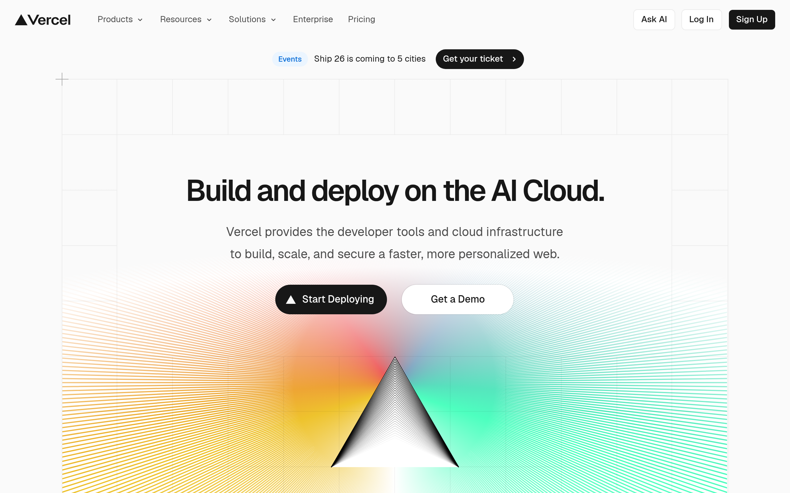

# vercel Design System

You are building UI for **vercel**. Light-themed, cool palette, monospace typography (Geist), compact density on a 4px grid, expressive motion.

## Visual Reference

**IMPORTANT**: Study ALL screenshots below before writing any UI. Match colors, typography, spacing, layout, and motion exactly as shown.

### Homepage



> Read `references/DESIGN.md` for full token details.

## Design Philosophy

- **Layered depth** — use shadow tokens to create a sense of physical layering. Each elevation level has a specific shadow.
- **Gradient accents** — gradients are used thoughtfully for emphasis, not decoration.
- **Single typeface** — Geist carries all text. Hierarchy comes from size, weight, and color — never font mixing.
- **compact density** — 4px base grid. Every dimension is a multiple of 4.
- **cool palette** — the color temperature runs cool, matching the monospace typography.
- **Restrained accent** — `#52aeff` is the only pop of color. Used exclusively for CTAs, links, focus rings, and active states.
- **Expressive motion** — animations are an integral part of the experience. Use spring physics and layout animations.

## Color System

### Core Palette

| Role | Token | Hex | Use |
|------|-------|-----|-----|
| Background | `--background` | `#fafafa` | Page/app background |
| Text Primary | `--text-primary` | `#000000` | Headings, body text |
| Text Muted | `--text-muted` | `#404040` | Captions, placeholders |
| Accent | `--accent` | `#52aeff` | CTAs, links, focus rings |
| Border | `--border` | `#333333` | Dividers, card borders |

### Status Colors

| Status | Hex | Use |
|--------|-----|-----|
| Danger | `#ffcade` | Errors, destructive actions |

### Extended Palette

- `#2c8ce1`
- **color-zinc-900:** `#18181b` — Deep background layer or shadow color
- **leaderboard-chart-cursor-fill:** `#ececee` — Light surface or highlight color
- **geist-success-lighter:** `#d3e5ff` — Confirmations, positive trend indicators
- **color-violet-100:** `#ede9fe` — Light surface or highlight color
- `#e9d3ff` — Light surface or highlight color
- `#e5484d` — Warm accent — hover glow or decorative highlight
- **color-neutral-800:** `#262626`

### CSS Variable Tokens

```css
--color-background-100: var(--ds-background-100);
--themed-border: var(--custom-border-color);
--themed-border: var(--custom-border-hover-color);
--border-color: var(--accents-2);
--context-card-tip-stroke: #dbdbdb;
--geist-background: var(--cf-accent-foreground);
--offset-factor-secondary: calc(1 - var(--offset-factor));
--themed-border: transparent;
--themed-border: var(--ds-gray-400);
--themed-border: none;
--themed-border: var(--ds-gray-400);
--themed-border: var(--ds-gray-alpha-200);
--context-card-tip-stroke: #252525;
--ds-background-100: #fff;
--ds-background-200: #fafafa;
--ds-background-100: lab(100%0 0);
--ds-background-200: lab(98.144%0-.0000119209);
--ds-background-100: #000;
--ds-background-200: #000;
--ds-background-100: lab(0%0 0);
```

## Typography

### Font Stack

- **Geist** — Heading 1, Heading 2, Heading 3
- **Roboto Mono** — Body, Caption, Code

### Font Sources

```css
@font-face {
  font-family: "Roboto Mono";
  src: url("fonts/RobotoMono-Bold.ttf") format("truetype");
  font-weight: 700;
}
@font-face {
  font-family: "Roboto Mono";
  src: url("fonts/RobotoMono-Regular.ttf") format("truetype");
  font-weight: 400;
}
@font-face {
  font-family: "Geist";
  src: url("fonts/Geist-Bold.ttf") format("truetype");
  font-weight: 700;
}
@font-face {
  font-family: "Geist";
  src: url("fonts/Geist-Regular.ttf") format("truetype");
  font-weight: 400;
}
@font-face {
  font-family: "geistMonoFont";
  src: url("fonts/geistMonoFont-100.woff2") format("woff2");
  font-weight: 100;
}
@font-face {
  font-family: "GeistPixelSquare";
  src: url("fonts/GeistPixelSquare-500.woff2") format("woff2");
  font-weight: 500;
}
@font-face {
  font-family: "GeistPixelGrid";
  src: url("fonts/GeistPixelGrid-500.woff2") format("woff2");
  font-weight: 500;
}
@font-face {
  font-family: "GeistPixelCircle";
  src: url("fonts/GeistPixelCircle-500.woff2") format("woff2");
  font-weight: 500;
}
@font-face {
  font-family: "GeistPixelTriangle";
  src: url("fonts/GeistPixelTriangle-500.woff2") format("woff2");
  font-weight: 500;
}
@font-face {
  font-family: "GeistPixelLine";
  src: url("fonts/GeistPixelLine-500.woff2") format("woff2");
  font-weight: 500;
}
@font-face {
  font-family: "KaTeX_AMS";
  src: url("fonts/KaTeX_AMS-Regular.woff2") format("woff2");
  font-weight: 400;
}
@font-face {
  font-family: "KaTeX_Caligraphic";
  src: url("fonts/KaTeX_Caligraphic-700.woff2") format("woff2");
  font-weight: 700;
}
@font-face {
  font-family: "KaTeX_Caligraphic";
  src: url("fonts/KaTeX_Caligraphic-Regular.woff2") format("woff2");
  font-weight: 400;
}
@font-face {
  font-family: "KaTeX_Fraktur";
  src: url("fonts/KaTeX_Fraktur-700.woff2") format("woff2");
  font-weight: 700;
}
@font-face {
  font-family: "KaTeX_Fraktur";
  src: url("fonts/KaTeX_Fraktur-Regular.woff2") format("woff2");
  font-weight: 400;
}
@font-face {
  font-family: "KaTeX_Main";
  src: url("fonts/KaTeX_Main-700.woff2") format("woff2");
  font-weight: 700;
}
@font-face {
  font-family: "KaTeX_Main";
  src: url("fonts/KaTeX_Main-Regular.woff2") format("woff2");
  font-weight: 400;
}
@font-face {
  font-family: "KaTeX_Math";
  src: url("fonts/KaTeX_Math-700.woff2") format("woff2");
  font-weight: 700;
}
@font-face {
  font-family: "KaTeX_Math";
  src: url("fonts/KaTeX_Math-Regular.woff2") format("woff2");
  font-weight: 400;
}
@font-face {
  font-family: "KaTeX_SansSerif";
  src: url("fonts/KaTeX_SansSerif-700.woff2") format("woff2");
  font-weight: 700;
}
@font-face {
  font-family: "KaTeX_SansSerif";
  src: url("fonts/KaTeX_SansSerif-Regular.woff2") format("woff2");
  font-weight: 400;
}
@font-face {
  font-family: "KaTeX_Script";
  src: url("fonts/KaTeX_Script-Regular.woff2") format("woff2");
  font-weight: 400;
}
@font-face {
  font-family: "KaTeX_Size1";
  src: url("fonts/KaTeX_Size1-Regular.woff2") format("woff2");
  font-weight: 400;
}
@font-face {
  font-family: "KaTeX_Size2";
  src: url("fonts/KaTeX_Size2-Regular.woff2") format("woff2");
  font-weight: 400;
}
@font-face {
  font-family: "KaTeX_Size3";
  src: url("fonts/KaTeX_Size3-Regular.woff2") format("woff2");
  font-weight: 400;
}
@font-face {
  font-family: "KaTeX_Size4";
  src: url("fonts/KaTeX_Size4-Regular.woff2") format("woff2");
  font-weight: 400;
}
@font-face {
  font-family: "KaTeX_Typewriter";
  src: url("fonts/KaTeX_Typewriter-Regular.woff2") format("woff2");
  font-weight: 400;
}
@font-face {
  font-family: "DSEG7 Classic";
  src: url("https://lishhsx6kmthaacj.public.blob.vercel-storage.com/fonts/dseg7classic-bold.counter.woff2") format("woff2");
  font-weight: 700;
}
```

### Type Scale

| Role | Family | Size | Weight |
|------|--------|------|--------|
| Heading 1 | Geist | 110px | 700 |
| Heading 2 | Geist | 100px | 700 |
| Heading 3 | Geist | 80px | 700 |
| Body | Roboto Mono | 14px | 400 |
| Caption | Roboto Mono | 16px | 400 |
| Code | Roboto Mono | 14px | 400 |

### Typography Rules

- All text uses **Geist** — never add another font family
- Max 3-4 font sizes per screen
- Headings: weight 600-700, body: weight 400
- Use color and opacity for text hierarchy, not additional font sizes
- Line height: 1.5 for body, 1.2 for headings

## Spacing & Layout

### Base Grid: 4px

Every dimension (margin, padding, gap, width, height) must be a multiple of **4px**.

### Spacing Scale

`2, 4, 6, 8, 10, 12, 14, 16, 18, 20, 22, 24` px

### Spacing as Meaning

| Spacing | Use |
|---------|-----|
| 4-8px | Tight: related items (icon + label, avatar + name) |
| 12-16px | Medium: between groups within a section |
| 24-32px | Wide: between distinct sections |
| 48px+ | Vast: major page section breaks |

### Border Radius

Scale: `.125rem, .25rem, .375rem, .5rem, .75rem, .8cqw, 1rem, 1px, 1.25cqw, 1.5cqw, 2px, 2.5px, 3px, 4px, 5px, 6px, 6.5px, 8px, 9px, 10px, 12px, 14px, 15cqw, 16px, 20px, 24px, 26px, 32px, 40px, 44px, 48px, 52px, 64px, 99px, inherit, 100px, 100%, 128px, 218.427px, 999px, unset`
Default: `12px`

### Container

Max-width: `1150px`, centered with auto margins.

### Breakpoints

| Name | Value |
|------|-------|
| lg | 60rem |
| xs | 370px |
| xs | 374px |
| xs | 375px |
| xs | 383px |
| xs | 384px |
| xs | 400px |
| xs | 401px |
| xs | 427px |
| xs | 440px |
| xs | 450px |
| xs | 470px |
| xs | 480px |
| sm | 500px |
| sm | 540px |
| sm | 600px |
| sm | 601px |
| sm | 610px |
| sm | 640px |
| md | 650px |
| md | 660px |
| md | 670px |
| md | 750px |
| md | 768px |
| lg | 769px |
| lg | 800px |
| lg | 860px |
| lg | 893px |
| lg | 960px |
| lg | 961px |
| lg | 992px |
| lg | 1000px |
| lg | 1020px |
| lg | 1024px |
| xl | 1036px |
| xl | 1050px |
| xl | 1100px |
| xl | 1108px |
| xl | 1120px |
| xl | 1150px |
| xl | 1151px |
| xl | 1200px |
| xl | 1201px |
| xl | 1240px |
| 2xl | 1400px |
| 2xl | 1496px |
| 2xl | 1600px |
| 2xl | 2300px |

Mobile-first: design for small screens, layer on responsive overrides.

## Component Patterns

### Card

```css
.card {
  background: #fafafa;
  border: 1px solid #333333;
  border-radius: 12px;
  padding: 16px;
  box-shadow: var(--ds-shadow-border);
}
```

```html
<div class="card">
  <h3>Card Title</h3>
  <p>Card content goes here.</p>
</div>
```

### Button

```css
/* Primary */
.btn-primary {
  background: #52aeff;
  color: #000000;
  border-radius: 12px;
  padding: 8px 16px;
  font-weight: 500;
  transition: opacity 150ms ease;
}
.btn-primary:hover { opacity: 0.9; }

/* Ghost */
.btn-ghost {
  background: transparent;
  border: 1px solid #333333;
  color: #000000;
  border-radius: 12px;
  padding: 8px 16px;
}
```

```html
<button class="btn-primary">Get Started</button>
<button class="btn-ghost">Learn More</button>
```

### Input

```css
.input {
  background: #fafafa;
  border: 1px solid #333333;
  border-radius: 12px;
  padding: 8px 12px;
  color: #000000;
  font-size: 14px;
}
.input:focus { border-color: #52aeff; outline: none; }
```

```html
<input class="input" type="text" placeholder="Search..." />
```

### Badge / Chip

```css
.badge {
  display: inline-flex;
  align-items: center;
  padding: 4px 8px;
  border-radius: 9999px;
  font-size: 12px;
  font-weight: 500;
  background: #fafafa;
  color: #404040;
}
```

```html
<span class="badge">New</span>
<span class="badge">Beta</span>
```

### Modal / Dialog

```css
.modal-backdrop { background: rgba(0, 0, 0, 0.6); }
.modal {
  background: #fafafa;
  border: 1px solid #333333;
  border-radius: unset;
  padding: 24px;
  max-width: 480px;
  width: 90vw;
  box-shadow: 0 0 10px var(--geist-foreground),0 0 5px var(--geist-foreground);
}
```

```html
<div class="modal-backdrop">
  <div class="modal">
    <h2>Dialog Title</h2>
    <p>Dialog content.</p>
    <button class="btn-primary">Confirm</button>
    <button class="btn-ghost">Cancel</button>
  </div>
</div>
```

### Table

```css
.table { width: 100%; border-collapse: collapse; }
.table th {
  text-align: left;
  padding: 8px 12px;
  font-weight: 500;
  font-size: 12px;
  color: #404040;
  text-transform: uppercase;
  letter-spacing: 0.05em;
  border-bottom: 1px solid #333333;
}
.table td {
  padding: 12px;
  border-bottom: 1px solid #333333;
}
```

```html
<table class="table">
  <thead><tr><th>Name</th><th>Status</th><th>Date</th></tr></thead>
  <tbody>
    <tr><td>Item One</td><td>Active</td><td>Jan 1</td></tr>
    <tr><td>Item Two</td><td>Pending</td><td>Jan 2</td></tr>
  </tbody>
</table>
```

### Navigation

```css
.nav {
  display: flex;
  align-items: center;
  gap: 8px;
  padding: 12px 16px;
  border-bottom: 1px solid #333333;
}
.nav-link {
  color: #404040;
  padding: 8px 12px;
  border-radius: 12px;
  transition: color 150ms;
}
.nav-link:hover { color: #000000; }
.nav-link.active { color: #52aeff; }
```

```html
<nav class="nav">
  <a href="/" class="nav-link active">Home</a>
  <a href="/about" class="nav-link">About</a>
  <a href="/pricing" class="nav-link">Pricing</a>
  <button class="btn-primary" style="margin-left: auto">Get Started</button>
</nav>
```

### Extracted Components

These components were found in the codebase:

**Button** (`html`)

**Navigation** (`html`)

**Footer** (`html`)

**List** (`html`)

## Page Structure

The following page sections were detected:

- **Navigation** — Top navigation bar (41 items)
- **Hero** — Hero/banner section with headline and CTAs
- **Features** — Feature/benefit cards grid
- **Footer** — Page footer with links and info (61 items)
- **Cta** — Call-to-action section
- **Testimonials** — Testimonials/reviews section
- **Faq** — FAQ/accordion section

When building pages, follow this section order and structure.

## Animation & Motion

This project uses **expressive motion**. Animations are part of the design language.

### CSS Animations

- `soft-fade-in`
- `show`
- `hide`
- `fade-in`
- `fade-out`

### Motion Tokens

- **Duration scale:** `0s`, `.1s`, `.15s`, `.16s`, `.18s`, `.2s`, `.225s`, `.25s`, `.3s`, `.35s`, `.4s`, `.5s`, `.6s`, `.7s`, `.75s`, `.8s`, `.95s`, `1s`, `1.2s`, `2s`, `90ms`, `100ms`, `125ms`, `150ms`, `200ms`, `250ms`, `300ms`, `400ms`, `500ms`, `700ms`, `1000ms`, `2000ms`, `3000ms`
- **Easing functions:** `cubic-bezier(.6,.3,.98,.5)`, `cubic-bezier(.25,1,.5,1)`, `cubic-bezier(.32,.72,0,1)`, `cubic-bezier(.455,.03,.515,.955)`, `cubic-bezier(0,0,.2,1)`, `cubic-bezier(.3,.57,.07,.95)`, `cubic-bezier(.25,.57,.45,.94)`, `cubic-bezier(.25,.75,.6,.98)`, `cubic-bezier(.29,.31,.05,.96)`, `ease`, `linear`, `cubic-bezier(.2,-.5,0,1.5)`, `cubic-bezier(.4,.04,.04,1)`, `cubic-bezier(.22,.61,.36,1)`, `cubic-bezier(.77,0,.175,1)`, `ease-out`, `cubic-bezier(.4,0,.2,1),cubic-bezier(.4,0,.2,1)`, `cubic-bezier(.8,0,1,1)`, `ease-in-out`, `cubic-bezier(.645,.045,.355,1)`, `cubic-bezier(.33,.01,.63,1.01)`, `cubic-bezier(.39,.18,.17,.99)`, `cubic-bezier(.14,.55,.3,.92)`, `cubic-bezier(.5,.25,.35,1)`, `cubic-bezier(.31,.05,.43,1.02)`

### Motion Guidelines

- **Duration:** Use values from the duration scale above. Short (0s) for micro-interactions, long (3000ms) for page transitions
- **Easing:** Use `cubic-bezier(.6,.3,.98,.5)` as the default easing curve
- **Direction:** Elements enter from bottom/right, exit to top/left
- **Reduced motion:** Always respect `prefers-reduced-motion` — disable animations when set

## Depth & Elevation

### Shadow Tokens

- Subtle: `0 0 0 1px var(--ds-gray-alpha-400)`
- Subtle: `0 0 0 1px var(--ds-gray-alpha-100),var(--ds-shadow-tooltip)`
- Subtle: `0 0 0 1px var(--accents-2)`
- Subtle: `0 0 0 1px var(--themed-border)`
- Subtle: `0 0 0 2px var(--theme-color,--ds-blue-900)`
- Subtle: `inset 2px 0 0 0 var(--ds-blue-900)`

### Z-Index Scale

`0, 1, 2, 3, 4, 5, 9, 10, 15, 20, 25, 26, 30, 40, 50, 80, 100, 101, 200, 211, 500, 1000, 2000, 2001, 4999, 5000, 9998, 9999, 99998, 99999, 100000, 1000000, 99999999, 999999999`

Use these exact values — never invent z-index values.

## Anti-Patterns (Never Do)

- **No blur effects** — no backdrop-blur, no filter: blur()
- **No zebra striping** — tables and lists use borders for separation
- **No invented colors** — every hex value must come from the palette above
- **No arbitrary spacing** — every dimension is a multiple of 4px
- **No extra fonts** — only Geist and Roboto Mono are allowed
- **No arbitrary border-radius** — use the scale: .125rem, .25rem, .375rem, .5rem, .75rem, 1rem, 1px, 2px, 2.5px, 3px
- **No opacity for disabled states** — use muted colors instead

## Workflow

1. **Read** `references/DESIGN.md` before writing any UI code
2. **Pick colors** from the Color System section — never invent new ones
3. **Set typography** — Geist, Roboto Mono only, using the type scale
4. **Build layout** on the 4px grid — check every margin, padding, gap
5. **Match components** to patterns above before creating new ones
6. **Apply elevation** — use shadow tokens
7. **Validate** — every value traces back to a design token. No magic numbers.

## Brand Spec

- **Favicon:** `https://assets.vercel.com/image/upload/q_auto/front/favicon/vercel/favicon.ico`
- **Site URL:** `https://vercel.com`
- **Brand color:** `#52aeff`
- **Brand typeface:** Geist

## Quick Reference

```
Background:     #fafafa
Surface:        (not extracted)
Text:           #000000 / #404040
Accent:         #52aeff
Border:         #333333
Font:           Geist
Spacing:        4px grid
Radius:         12px
Components:     8 detected
```

## When to Trigger

Activate this skill when:
- Creating new components, pages, or visual elements for vercel
- Writing CSS, Tailwind classes, styled-components, or inline styles
- Building page layouts, templates, or responsive designs
- Reviewing UI code for design consistency
- The user mentions "vercel" design, style, UI, or theme
- Generating mockups, wireframes, or visual prototypes

---

# Full Reference Files

> Every output file is embedded below. Claude has full design system context from /skills alone.

## Design System Tokens (DESIGN.md)

# vercel DESIGN.md

> Auto-generated design system — reverse-engineered via static analysis by skillui.
> Frameworks: None detected
> Colors: 20 · Fonts: 2 · Components: 8
> Icon library: not detected · State: not detected
> Primary theme: light · Dark mode toggle: no · Motion: expressive

## Visual Reference

**Match this design exactly** — study colors, fonts, spacing, and component shapes before writing any UI code.


---

## 1. Visual Theme & Atmosphere

This is a **light-themed** interface with a cool, approachable feel. The light background emphasizes content clarity. Typography uses **Geist** throughout — a technical, developer-focused choice that maintains consistency. Spacing follows a **4px base grid** (compact density), with scale: 2, 4, 6, 8, 10, 12, 14, 16px. The palette is predominantly monochromatic with **#52aeff** as the single accent color — used sparingly for interactive elements and emphasis. Motion is expressive — spring physics, layout animations, and staggered reveals are part of the visual language.

---

## 2. Color Palette & Roles

| Token | Hex | Role | Use |
|---|---|---|---|
| theme-color | `#fafafa` | background | Page background, darkest surface |
| ds-background-100 | `#000000` | text-primary | Headings and body text |
| color-neutral-700 | `#404040` | text-muted | Captions, placeholders, secondary info |
| accents-7 | `#333333` | border | Dividers, card borders, outlines |
| accent | `#52aeff` | accent | CTAs, links, focus rings, active states |
| danger | `#ffcade` | danger | Error states, destructive actions |
| info | `#2c8ce1` | info | Informational highlights |
| color-zinc-900 | `#18181b` | unknown | Palette color |
| leaderboard-chart-cursor-fill | `#ececee` | unknown | Palette color |
| geist-success-lighter | `#d3e5ff` | unknown | Palette color |
| color-violet-100 | `#ede9fe` | unknown | Palette color |
| unknown | `#e9d3ff` | unknown | Palette color |
| unknown | `#e5484d` | unknown | Palette color |
| color-neutral-800 | `#262626` | unknown | Palette color |
| unknown | `#cdcdcd` | unknown | Palette color |
| geist-success | `#0070f3` | unknown | Palette color |
| geist-violet-background-secondary | `#291c3a` | unknown | Palette color |
| accents-5 | `#666666` | unknown | Palette color |
| unknown | `#77b8ff` | unknown | Palette color |
| color-slate-300 | `#cad5e2` | unknown | Palette color |

### CSS Variable Tokens

```css
--tw-border-style: solid;
--color-background-100: var(--ds-background-100);
--tw-border-style: solid;
--tw-border-style: none;
--tw-border-style: dashed;
--tw-border-style: none;
--tw-border-style: none;
--tw-border-style: solid;
--themed-border: var(--custom-border-color);
--themed-border: var(--custom-border-hover-color);
--border-color: var(--accents-2);
--context-card-tip-stroke: #dbdbdb;
--geist-background: var(--cf-accent-foreground);
--offset-factor-secondary: calc(1 - var(--offset-factor));
--themed-border: transparent;
--themed-border: var(--ds-gray-400);
--tw-border-style: solid;
--tw-border-style: none;
--tw-border-style: solid;
--themed-border: none;
```


---

## 3. Typography Rules

**Font Stack:**
- **Geist** — Heading 1, Heading 2, Heading 3
- **Roboto Mono** — Body, Caption, Code

**Font Sources:**

```css
@font-face {
  font-family: "Roboto Mono";
  src: url("fonts/RobotoMono-Bold.ttf") format("truetype");
  font-weight: 700;
}
@font-face {
  font-family: "Roboto Mono";
  src: url("fonts/RobotoMono-Regular.ttf") format("truetype");
  font-weight: 400;
}
@font-face {
  font-family: "Geist";
  src: url("fonts/Geist-Bold.ttf") format("truetype");
  font-weight: 700;
}
@font-face {
  font-family: "Geist";
  src: url("fonts/Geist-Regular.ttf") format("truetype");
  font-weight: 400;
}
@font-face {
  font-family: "geistMonoFont";
  src: url("fonts/geistMonoFont-100.woff2") format("woff2");
  font-weight: 100;
}
@font-face {
  font-family: "GeistPixelSquare";
  src: url("fonts/GeistPixelSquare-500.woff2") format("woff2");
  font-weight: 500;
}
@font-face {
  font-family: "GeistPixelGrid";
  src: url("fonts/GeistPixelGrid-500.woff2") format("woff2");
  font-weight: 500;
}
@font-face {
  font-family: "GeistPixelCircle";
  src: url("fonts/GeistPixelCircle-500.woff2") format("woff2");
  font-weight: 500;
}
@font-face {
  font-family: "GeistPixelTriangle";
  src: url("fonts/GeistPixelTriangle-500.woff2") format("woff2");
  font-weight: 500;
}
@font-face {
  font-family: "GeistPixelLine";
  src: url("fonts/GeistPixelLine-500.woff2") format("woff2");
  font-weight: 500;
}
@font-face {
  font-family: "KaTeX_AMS";
  src: url("fonts/KaTeX_AMS-Regular.woff2") format("woff2");
  font-weight: 400;
}
@font-face {
  font-family: "KaTeX_Caligraphic";
  src: url("fonts/KaTeX_Caligraphic-700.woff2") format("woff2");
  font-weight: 700;
}
@font-face {
  font-family: "KaTeX_Caligraphic";
  src: url("fonts/KaTeX_Caligraphic-Regular.woff2") format("woff2");
  font-weight: 400;
}
@font-face {
  font-family: "KaTeX_Fraktur";
  src: url("fonts/KaTeX_Fraktur-700.woff2") format("woff2");
  font-weight: 700;
}
@font-face {
  font-family: "KaTeX_Fraktur";
  src: url("fonts/KaTeX_Fraktur-Regular.woff2") format("woff2");
  font-weight: 400;
}
@font-face {
  font-family: "KaTeX_Main";
  src: url("fonts/KaTeX_Main-700.woff2") format("woff2");
  font-weight: 700;
}
@font-face {
  font-family: "KaTeX_Main";
  src: url("fonts/KaTeX_Main-Regular.woff2") format("woff2");
  font-weight: 400;
}
@font-face {
  font-family: "KaTeX_Math";
  src: url("fonts/KaTeX_Math-700.woff2") format("woff2");
  font-weight: 700;
}
@font-face {
  font-family: "KaTeX_Math";
  src: url("fonts/KaTeX_Math-Regular.woff2") format("woff2");
  font-weight: 400;
}
@font-face {
  font-family: "KaTeX_SansSerif";
  src: url("fonts/KaTeX_SansSerif-700.woff2") format("woff2");
  font-weight: 700;
}
@font-face {
  font-family: "KaTeX_SansSerif";
  src: url("fonts/KaTeX_SansSerif-Regular.woff2") format("woff2");
  font-weight: 400;
}
@font-face {
  font-family: "KaTeX_Script";
  src: url("fonts/KaTeX_Script-Regular.woff2") format("woff2");
  font-weight: 400;
}
@font-face {
  font-family: "KaTeX_Size1";
  src: url("fonts/KaTeX_Size1-Regular.woff2") format("woff2");
  font-weight: 400;
}
@font-face {
  font-family: "KaTeX_Size2";
  src: url("fonts/KaTeX_Size2-Regular.woff2") format("woff2");
  font-weight: 400;
}
@font-face {
  font-family: "KaTeX_Size3";
  src: url("fonts/KaTeX_Size3-Regular.woff2") format("woff2");
  font-weight: 400;
}
@font-face {
  font-family: "KaTeX_Size4";
  src: url("fonts/KaTeX_Size4-Regular.woff2") format("woff2");
  font-weight: 400;
}
@font-face {
  font-family: "KaTeX_Typewriter";
  src: url("fonts/KaTeX_Typewriter-Regular.woff2") format("woff2");
  font-weight: 400;
}
@font-face {
  font-family: "DSEG7 Classic";
  src: url("https://lishhsx6kmthaacj.public.blob.vercel-storage.com/fonts/dseg7classic-bold.counter.woff2") format("woff2");
  font-weight: 700;
}
```

| Role | Font | Size | Weight |
|---|---|---|---|
| Heading 1 | Geist | 110px | 700 |
| Heading 2 | Geist | 100px | 700 |
| Heading 3 | Geist | 80px | 700 |
| Body | Roboto Mono | 14px | 400 |
| Caption | Roboto Mono | 16px | 400 |
| Code | Roboto Mono | 14px | 400 |

**Typographic Rules:**
- Use **Geist** for all text — do not mix font families
- Maintain consistent hierarchy: no more than 3-4 font sizes per screen
- Headings use bold (600-700), body uses regular (400)
- Line height: 1.5 for body text, 1.2 for headings
- Use color and opacity for secondary hierarchy, not additional font sizes


---

## 4. Component Stylings

### Layout (1)

**Footer** — `html`

### Navigation (1)

**Navigation** — `html`

### Data Display (2)

**Badge** — `html`

**List** — `html`

### Data Input (1)

**Button** — `html`
- Animation: 

### Overlay (1)

**Modal** — `html`

### Media (2)

**Image** — `html`

**Icon** — `html`


---

## 5. Layout Principles

- **Base spacing unit:** 4px
- **Spacing scale:** 2, 4, 6, 8, 10, 12, 14, 16, 18, 20, 22, 24
- **Border radius:** .125rem, .25rem, .375rem, .5rem, .75rem, .8cqw, 1rem, 1px, 1.25cqw, 1.5cqw, 2px, 2.5px, 3px, 4px, 5px, 6px, 6.5px, 8px, 9px, 10px, 12px, 14px, 15cqw, 16px, 20px, 24px, 26px, 32px, 40px, 44px, 48px, 52px, 64px, 99px, inherit, 100px, 100%, 128px, 218.427px, 999px, unset
- **Max content width:** 1150px

**Spacing as Meaning:**
| Spacing | Use |
|---|---|
| 4-8px | Tight: related items within a group |
| 12-16px | Medium: between groups |
| 24-32px | Wide: between sections |
| 48px+ | Vast: major section breaks |


---

## 6. Depth & Elevation

### Flat — subtle depth hints

- `0 0 0 1px var(--ds-gray-alpha-400)`
- `0 0 0 1px var(--ds-gray-alpha-100),var(--ds-shadow-tooltip)`
- `0 0 0 1px var(--accents-2)`

### Raised — cards, buttons, interactive elements

- `var(--ds-shadow-border)`
- `var(--ds-shadow-fullscreen)`
- `var(--ds-shadow-border-large)`

### Floating — dropdowns, popovers, modals

- `0 0 10px var(--geist-foreground),0 0 5px var(--geist-foreground)`
- `0 0 10px var(--ds-blue-200),0 0 20px var(--ds-blue-100)`

### Overlay — full-screen overlays, top-level dialogs

- `0 0 30px var(--ds-blue-400),0 0 60px var(--ds-blue-200)`
- `0 1.8px 3.6px #0000000d,0 10.8px 21.6px #00000014,inset 0-.9px #0000001a,inset 0 1.8px 1.8px #ffffff1a,inset 3.6px 0 3.6px #0000001a`
- `0px 0px 40px 20px --var(--border-bg)`

### Z-Index Scale

`0, 1, 2, 3, 4, 5, 9, 10, 15, 20, 25, 26, 30, 40, 50, 80, 100, 101, 200, 211, 500, 1000, 2000, 2001, 4999, 5000, 9998, 9999, 99998, 99999, 100000, 1000000, 99999999, 999999999`


---

## 7. Animation & Motion

This project uses **expressive motion**. Animations are an integral part of the experience.

### CSS Animations

- `@keyframes soft-fade-in`
- `@keyframes show`
- `@keyframes hide`
- `@keyframes fade-in`
- `@keyframes fade-out`
- `@keyframes spinner-opacity`
- `@keyframes slide-in`
- `@keyframes fade-slide-in`

### Animated Components

- **Button**: 

### Motion Guidelines

- Duration: 150-300ms for micro-interactions, 300-500ms for page transitions
- Easing: `ease-out` for enters, `ease-in` for exits
- Always respect `prefers-reduced-motion`


---

## 8. Do's and Don'ts

### Do's

- Use `#52aeff` for interactive elements (buttons, links, focus rings)
- Use `#fafafa` as the primary page background
- Use **Geist** for all UI text
- Follow the **4px** spacing grid for all margins, padding, and gaps
- Use the defined shadow tokens for elevation — see Section 6
- Use border-radius from the scale: .125rem, .25rem, .375rem, .5rem, .75rem
- Reuse existing components from Section 4 before creating new ones

### Don'ts

- Don't introduce colors outside this palette — extend the design tokens first
- Don't mix font families — use Geist consistently
- Don't use arbitrary spacing values — stick to multiples of 4px
- Don't create custom box-shadow values outside the system tokens
- Don't use arbitrary border-radius values — pick from the defined scale
- Don't duplicate component patterns — check Section 4 first
- Don't use backdrop-blur or blur effects

### Anti-Patterns (detected from codebase)

- No blur or backdrop-blur effects
- No zebra striping on tables/lists


---

## 9. Responsive Behavior

| Name | Value | Source |
|---|---|---|
| lg | 60rem | css |
| xs | 370px | css |
| xs | 374px | css |
| xs | 375px | css |
| xs | 383px | css |
| xs | 384px | css |
| xs | 400px | css |
| xs | 401px | css |
| xs | 427px | css |
| xs | 440px | css |
| xs | 450px | css |
| xs | 470px | css |
| xs | 480px | css |
| sm | 500px | css |
| sm | 540px | css |
| sm | 600px | css |
| sm | 601px | css |
| sm | 610px | css |
| sm | 640px | css |
| md | 650px | css |
| md | 660px | css |
| md | 670px | css |
| md | 750px | css |
| md | 768px | css |
| lg | 769px | css |
| lg | 800px | css |
| lg | 860px | css |
| lg | 893px | css |
| lg | 960px | css |
| lg | 961px | css |
| lg | 992px | css |
| lg | 1000px | css |
| lg | 1020px | css |
| lg | 1024px | css |
| xl | 1036px | css |
| xl | 1050px | css |
| xl | 1100px | css |
| xl | 1108px | css |
| xl | 1120px | css |
| xl | 1150px | css |
| xl | 1151px | css |
| xl | 1200px | css |
| xl | 1201px | css |
| xl | 1240px | css |
| 2xl | 1400px | css |
| 2xl | 1496px | css |
| 2xl | 1600px | css |
| 2xl | 2300px | css |

**Approach:** Use `@media (min-width: ...)` queries matching the breakpoints above.


---

## 10. Agent Prompt Guide

Use these as starting points when building new UI:

### Build a Card

```
Background: #fafafa
Border: 1px solid #333333
Radius: 12px
Padding: 16px
Font: Geist
Use shadow tokens from Section 6.
```

### Build a Button

```
Primary: bg #52aeff, text white
Ghost: bg transparent, border #333333
Padding: 8px 16px
Radius: 12px
Hover: opacity 0.9 or lighter shade
Focus: ring with #52aeff
```

### Build a Page Layout

```
Background: #fafafa
Max-width: 1150px, centered
Grid: 4px base
Responsive: mobile-first, breakpoints from Section 9
```

### Build a Stats Card

```
Surface: #fafafa
Label: #404040 (muted, 12px, uppercase)
Value: #000000 (primary, 24-32px, bold)
Status: use success/warning/danger from Section 2
```

### Build a Form

```
Input bg: #fafafa
Input border: 1px solid #333333
Focus: border-color #52aeff
Label: #404040 12px
Spacing: 16px between fields
Radius: 12px
```

### General Component

```
1. Read DESIGN.md Sections 2-6 for tokens
2. Colors: only from palette
3. Font: Geist, type scale from Section 3
4. Spacing: 4px grid
5. Components: match patterns from Section 4
6. Elevation: shadow tokens
```

## Bundled Fonts (fonts/)

The following font files are bundled in the `fonts/` directory:

- `fonts/Geist-Black.ttf`
- `fonts/Geist-Bold.ttf`
- `fonts/Geist-ExtraBold.ttf`
- `fonts/Geist-ExtraLight.ttf`
- `fonts/Geist-Light.ttf`
- `fonts/Geist-Medium.ttf`
- `fonts/Geist-Regular.ttf`
- `fonts/Geist-SemiBold.ttf`
- `fonts/Geist-Thin.ttf`
- `fonts/geistMonoFont-100.woff2`
- `fonts/GeistPixelCircle-500.woff2`
- `fonts/GeistPixelGrid-500.woff2`
- `fonts/GeistPixelLine-500.woff2`
- `fonts/GeistPixelSquare-500.woff2`
- `fonts/GeistPixelTriangle-500.woff2`
- `fonts/KaTeX_AMS-Regular.ttf`
- `fonts/KaTeX_AMS-Regular.woff`
- `fonts/KaTeX_AMS-Regular.woff2`
- `fonts/KaTeX_Caligraphic-700.ttf`
- `fonts/KaTeX_Caligraphic-700.woff`
- `fonts/KaTeX_Caligraphic-700.woff2`
- `fonts/KaTeX_Caligraphic-Regular.ttf`
- `fonts/KaTeX_Caligraphic-Regular.woff`
- `fonts/KaTeX_Caligraphic-Regular.woff2`
- `fonts/KaTeX_Fraktur-700.ttf`
- `fonts/KaTeX_Fraktur-700.woff`
- `fonts/KaTeX_Fraktur-700.woff2`
- `fonts/KaTeX_Fraktur-Regular.ttf`
- `fonts/KaTeX_Fraktur-Regular.woff`
- `fonts/KaTeX_Fraktur-Regular.woff2`
- `fonts/KaTeX_Main-700.ttf`
- `fonts/KaTeX_Main-700.woff`
- `fonts/KaTeX_Main-700.woff2`
- `fonts/KaTeX_Main-Regular.ttf`
- `fonts/KaTeX_Main-Regular.woff`
- `fonts/KaTeX_Main-Regular.woff2`
- `fonts/KaTeX_Math-700.ttf`
- `fonts/KaTeX_Math-700.woff`
- `fonts/KaTeX_Math-700.woff2`
- `fonts/KaTeX_Math-Regular.ttf`
- `fonts/KaTeX_Math-Regular.woff`
- `fonts/KaTeX_Math-Regular.woff2`
- `fonts/KaTeX_SansSerif-700.ttf`
- `fonts/KaTeX_SansSerif-700.woff`
- `fonts/KaTeX_SansSerif-700.woff2`
- `fonts/KaTeX_SansSerif-Regular.ttf`
- `fonts/KaTeX_SansSerif-Regular.woff`
- `fonts/KaTeX_SansSerif-Regular.woff2`
- `fonts/KaTeX_Script-Regular.ttf`
- `fonts/KaTeX_Script-Regular.woff`
- `fonts/KaTeX_Script-Regular.woff2`
- `fonts/KaTeX_Size1-Regular.ttf`
- `fonts/KaTeX_Size1-Regular.woff`
- `fonts/KaTeX_Size1-Regular.woff2`
- `fonts/KaTeX_Size2-Regular.ttf`
- `fonts/KaTeX_Size2-Regular.woff`
- `fonts/KaTeX_Size2-Regular.woff2`
- `fonts/KaTeX_Size3-Regular.ttf`
- `fonts/KaTeX_Size3-Regular.woff`
- `fonts/KaTeX_Size3-Regular.woff2`
- `fonts/KaTeX_Size4-Regular.ttf`
- `fonts/KaTeX_Size4-Regular.woff`
- `fonts/KaTeX_Size4-Regular.woff2`
- `fonts/KaTeX_Typewriter-Regular.ttf`
- `fonts/KaTeX_Typewriter-Regular.woff`
- `fonts/KaTeX_Typewriter-Regular.woff2`
- `fonts/RobotoMono-Bold.ttf`
- `fonts/RobotoMono-ExtraLight.ttf`
- `fonts/RobotoMono-Light.ttf`
- `fonts/RobotoMono-Medium.ttf`
- `fonts/RobotoMono-Regular.ttf`
- `fonts/RobotoMono-SemiBold.ttf`
- `fonts/RobotoMono-Thin.ttf`

Use these local font files in `@font-face` declarations instead of fetching from Google Fonts.

## Homepage Screenshots (screenshots/)


